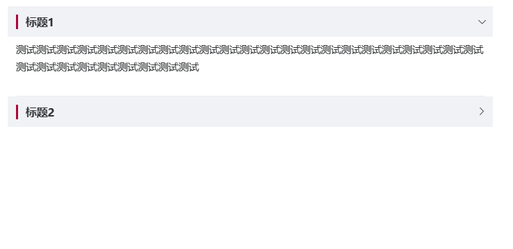

# 折叠面板

> 通过折叠面板收纳内容区域,可同时展开多个面板，面板之间不影响.


- 一致性 Consistency
- 反馈 Feedback
- 效率 Efficiency
- 可控 Controllability

## 基本用法

```js
{
  type: 'collapse',
  accordion: true,
  activeNames: [],
  items: [
    {id: 'group1', title: '面板1',items:[
      {
        type: 'input',
        text: '测试',
        name: 'a',
        placeholder: '请输入',
      }
    ]},
    {id: 'group2', title: '面板2',items:[
      {
        type: 'input',
        text: '测试',
        name: 'a',
        placeholder: '请输入',
      }
    ]},
  ]
}
```

## Collapse Attributes

| 属性名    | 说明           | 类型    | 可选值 | 默认值 |
| --------- | -------------- | ------- | ------ | ------ |
| accordion | 是否手风琴模式 | boolean | -      | true   |
| activeNames | 默认展开项的id | array | -      | []   |

## Collapse Item Attributes

| 属性名 | 说明       | 类型          | 可选值 | 默认值 |
| ------ | ---------- | ------------- | ------ | ------ |
| name   | 唯一标志符 | string/number | -      | -      |
| title  | 面板标题   | string        | -      | -      |

