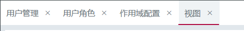
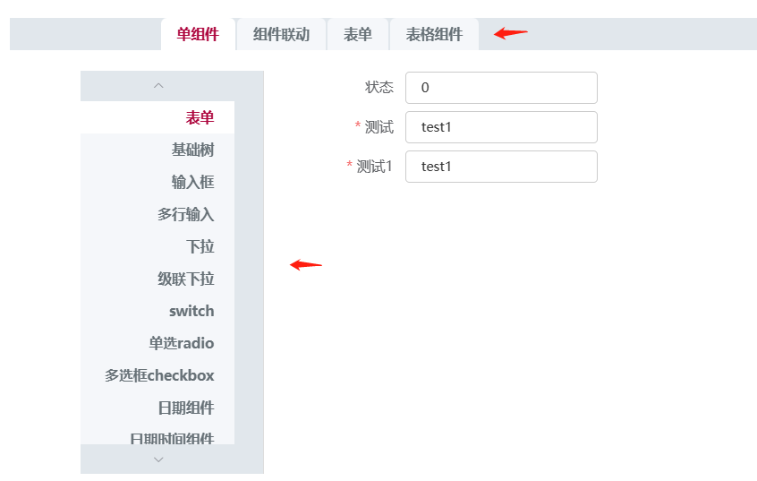

# 标签页

> 分隔显示内容上有关联但属于不同类别的数据集合。




## 基本用法

```js
{
  type: 'tabs',
  id: 'tabs_001',
  name: '标签页',
  activeId: '',
  keepAlive: true, // 保活
  items: [
    {
      id:'',
      displayName:'标签1', // 选项卡标题
      lazy:false, // Boolean标签是否延迟渲染
      disabled:false, // 是否禁用
      alwayMount:true // 保活的情况下一直挂载
      /**
       * // 此tab下显示的内容，任意组件内容
       * type:'container',
       * items:[]
      */
    }
  ],
  bind_on_goto: (params) => {
    const { self: vm } = params
  }
}
```

## Attributes

| 属性名 | 说明 | 类型 | 默认值 
| ----- |----- |----- |----- |
| id | 元素id,唯一标识 | String | -  |
| className | 类名 | String | -  |
| display | 类名 | Boolean、Function | -  |
| cacheTab | 点过的tab是否缓存起来 下次再点击时判断有没有缓存 有缓存就不重新请求数据 | Boolean | -  |
| activeWork | 点击tab时tab才去初始化请求数据 | Boolean | -  |
| activeId | 当前激活态Id | String | -  |
| items | 标签项 | Array | -  |
| onTabRemove | 点击 tab 移除按钮触发 | function(name) | -  |
| close | 是否可关闭 | Boolean | true  |
| keepAlive | 保活 | Boolean | false  |


## Tab-pane Attributes

| 属性名 | 说明 | 类型 | 默认值 
| ----- |----- |----- |----- |
| lazy  | 是否延迟渲染 | Boolean | false  |
| disabled  | 是否禁用 | Boolean | false  |
| closable  | 是否可关闭 | Boolean | false  |
| alwayMount| 保活的情况下一直挂载 | Boolean | false  |
