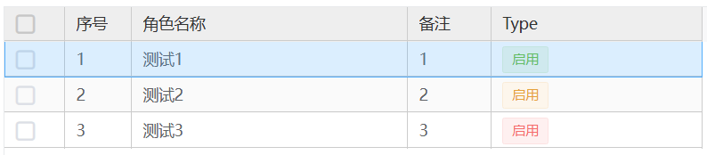

# 标签

> 用于标记和选择。
> 

## 基本用法

```js
{
  type: 'tags',
  id: 'tags',
  name: '标签',
  closable:true
  tags:[
    {name: "name",text: "角色名称",value: "123",closeable:false}
  ],
  tagType: 'success',
  bind_on_delTag:({self:vm,{tag,index}=value})=>{},
  bind_on_click:({self:vm,{tag}=value})=>{}

}
```

## Attributes

| 属性名   | 说明           | 类型    | 默认值                      |
| -------- | -------------- | ------- | --------------------------- | --- |
| closable | 是否有关闭按钮 | Boolean | false                       |
| tags     | 标签列表       | Array   | []                          |
| tagType  | 标签类型       | string  | success/info/warning/danger | —   |

## Events

| 事件名称 | 说明           | 回调参数        |
| -------- | -------------- | --------------- |
| delTag   | 关闭标签时触发 | (value: object) |
| click    | 点击标签时触发 | (value: object) |

### tags Attributes

| 属性名    | 说明                                              | 类型   | 默认值 |
| --------- | ------------------------------------------------- | ------ | ------ |
| name      | 数据的名称                                        | String | -      |
| text      | 标签中":"左侧文案                                 | String | -      |
| value     | 标签中":"右侧文案                                 | String | -      |
| closeable | 该标签是否有关闭按钮，比父级的 closeable 优先级高 | Boole  | -      |

#### grid 表格视图内字段配置 tags 类型，根据行数据显示不同的样式的标签


::: details 查看代码

```javascript

{
  "displayName": "类型",
  "name": "selectStatus",
  "type": "tags",
  "custom": true,
  formatItem: (row, item) => {
      // debugger;
      switch (row.remark) {
          case '1':
              item.tagType = "success";
              break;
          case '2':
              item.tagType = "warning";
              break;
          default:
              item.tagType = "danger";
              break;
      }
      return item;
  },
}
```

:::
