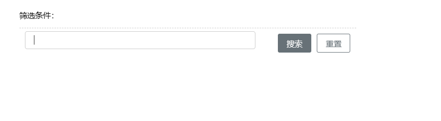

# 搜索



## 基本用法

```js
{
  type: 'search',
  id: 'search_001',
  name: '搜索',
  layout: [{
    type: 'row',
    items: [  {
    type: 'input',
    name: 'name',
    text: '名称'
}]
  }],
  labelWidth: '100px',
  showSearchNum: 3,
  formConfig: {
    initValues: {}, // 赋值视图初始值
    searchBtn: {
      style: {},
      name: '搜索' // 默认叫搜索
    },
    resetBtn: {
      style: {},
      name: '重置' // 默认叫重置
    }
  },
  searchHandler: () => {}
}
```

## Attributes

| 属性名        | 说明               | 类型                   | 默认值 |
| ------------- | ------------------ | ---------------------- | ------ |
| layout        | 表单项             | array                  | -      |
| labelWidth    | 表单域标签的宽度   | string                 | -      |
| selfAdaptionW | 是否自适应         | boolean                | true   |
| minWidth      | 最小宽度           | number                 | 380    |
| formConfig    | 搜索配置           | object                 | -      |
| showSearchNum | 上方显示表单项数量 | number                 | 3      |

## Events

| 事件名称          | 说明                                       | 回调参数                     |
| -----------------| ------------------------------------------ | ----------------------------|
| searchHandler    | 点击搜索按钮触发                             | function(vm, formData)      |
