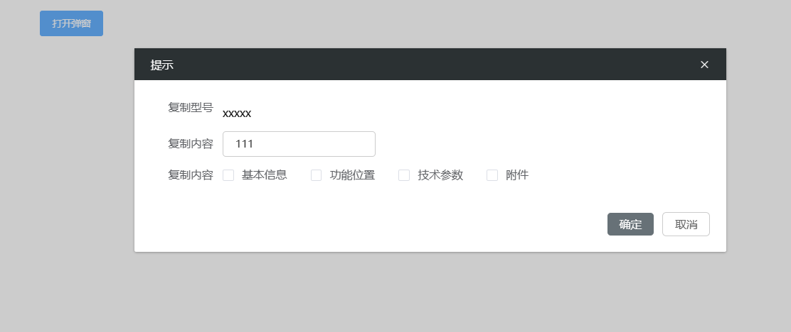

# 弹窗



> 在保留当前页面状态的情况下，弹出一个对话框告知用户并承载相关操作。

## 基本用法

```js
{
  type: 'dialog',
  id: 'dialog_001',
  width: '45%',
  title: '提示',
  display: true,
  bodyStyle: {
      'min-height': '300px',
      'max-height': '600px',
  },
  customButtons: [{//自定义按钮（确认按钮前）
      text: '保存',
      action: 'save'
  }],
  customMiddleButtons: [//自定义按钮（确认按钮和取消按钮中间）
      {//自定义按钮
          text: '下发',
          action: 'distribute'
      }
  ],
  showClose: true,//配置是否显示右上角的关闭按钮
  showCancel: true,//配置是否显示取消按钮
  showConfirm: true,//配置是否显示确认按钮
  bind_on_operates: (params) => { // 点击按钮
      const { self: vm, value } = params;
      value.close(); // 关闭弹窗方法
  },
  items: [{
      id: 'id1',
      noPreType: false, // 是否不加组件类型前缀
      type: 'text' // 组件名
  }]
}
```

## Attributes

| 属性名              | 说明                                 | 类型    | 默认值 |
| ------------------- | ------------------------------------ | ------- | ------ |
| width               | 弹窗宽度                             | string  | 50%    |
| title               | 弹窗标题                             | string  | -      |
| display             | 是否显示弹窗                         | boolean | false  |
| hasFooter           | 是否有底部区域                       | boolean | true   |
| bodyStyle           | 弹窗内body元素样式                       | Object | -  |
| confirmText         | 底部确定按钮的文字                   | string  | 确定   |
| cancelText          | 底部取消按钮的文字                   | string  | 取消   |
| showClose          | 配置是否显示右上角的关闭按钮                   | boolean  | true   |
| showCancel          | 配置是否显示取消按钮                   | boolean  | true   |
| showConfirm          | 配置是否显示确认按钮                   | boolean  | true   |
| marginTop           | 弹窗的上边距                         | Number  | 130    |
| customButtons       | 自定义按钮（确认按钮前）             | Array   | -      |
| customMiddleButtons | 自定义按钮（确认按钮和取消按钮中间） | Array   | -      |

## Events

| 事件名称 | 说明       | 回调参数         |
| -------- | ---------- | ---------------- |
| operates | 点击时触发 | (params: object) |
