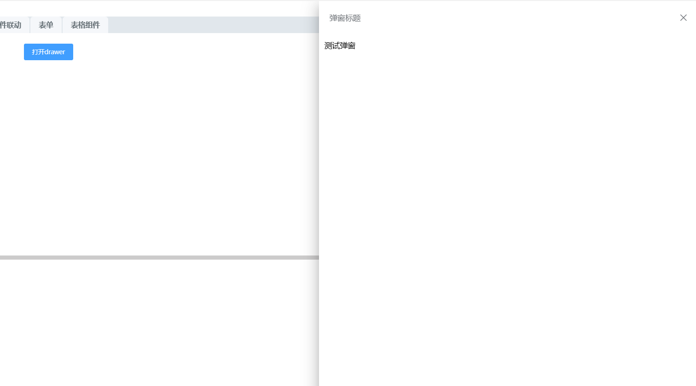

# 抽屉



## 基本用法
```js
{
  type: 'drawer',
  id: 'drawer',
  name: '抽屉弹窗',
  width: '45%',
  title:'弹窗标题',
  beforeClose: (done) => { done() },
  items: [{
    id: 'id1',
    noPreType: false, // 是否不加组件类型前缀
    type: 'text' // 组件名
  }]
}
```

## Attributes
| 属性名 | 说明 | 类型 | 默认值 |
| ----- |----- |----- |----- |
|title |弹窗标题 |String |-  |
|hasTitle |是否显示标题 |Boolean |true  |
|direction |弹窗的位置 |String |true  |
|visible |是否显示弹窗 |Boolean |true  |
|width |弹窗宽度 |String |45%  |
|drawerDrag |是否可以拖拽 |Boolean |true |
|showModal |是否显示遮罩 |Boolean |false |
|isDestroy |关闭后是否销毁 |Boolean |false  |
|wrapperClosable |点击外部是否关闭弹窗 |Boolean |true  |
|beforeClose |关闭前执行的方法,返回参数：close，关闭弹窗方法 |Function |-  |

## Methods
| 方法名 | 说明 | 参数 |
| ----- |----- |----- |
|close |关闭弹窗 |-  |
