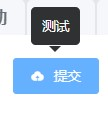

# 提示语

> 常用于展示鼠标 hover 时的提示信息。




## 基本用法

```js
{
  type: 'tooltip',
  content: '测试',
  placement: 'top',
  items:[
    {
      type: 'button',
      value:'提交',
      options:{
        type:'primary',
        size:'small',
        icon: 'el-icon-upload'
      }
    }
  ]
}

```

## Attributes
| 属性名      | 说明                  | 类型    | 默认值 |
| ---------- |  -------------------- | ------- |------ |
| content    |  提示语内容            | string  | -     |
| placement  |  提示语方向            | string  | top   |
| openDelay  |  延迟出现，单位毫秒     | number  | 300   |