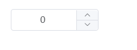

# InputNumber 数字输入框

> 仅允许输入标准的数字值，可定义范围



## 基本用法

```js
{
  type: 'number',
  text: '输入',
  display: false,
  // 绑定回车事件
  bind_on_keyupEnter: (data) => { console.log(data) },
  // 绑定change事件
  bind_on_changeHandler: (data) => { console.log(data) },
  // 绑定input事件
  bind_on_inputHandler: (data) => { console.log(data) },
  // 绑定离开焦点事件
  bind_on_blurHandler: (data) => { console.log(data) }
}
```

## Attributes

| 属性名      | 说明                                       | 类型    | 默认值 |
| ----------- | ------------------------------------------ | ------- | ------ |
| display     | 是否显示                                   | boolean | true   |
| placeholder | 输入框占位文本                             | string  | -      |
| inputType   | 输入框类型，与原生 HTML-input 的 type 一致 | string  | -      |
| readonly    | 是否只读                                   | boolean | false  |
| size        | 计数器尺寸                                 | string  |        |
| maxValue    | 设置计数器允许的最大值                     | number  |        |
| minValue    | 设置计数器允许的最小值                     | number  |        |
| step        | 计数器步长                                 | number  |        |
| step        | 计数器步长                                 | number  |        |
| controls    | 是否使用控制按钮                           | boolean | false  |


## Events

| 事件名称          | 说明                                       | 回调参数                     |
| -----------------| ------------------------------------------ | ----------------------------|
| changeHandler    |  在输入框失去焦点或用户按下回车时触发         | (value: string | number)    |
| keyupEnter       |  在输入框用户按下回车时触发                  | (value: string | number)    |
| inputHandler     |  在 InputNumber 值改变时触发                | (value: string | number)    |
