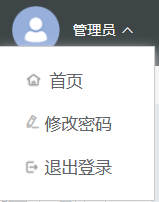

# 下拉菜单

> 将动作或菜单折叠到下拉菜单中。



## 基本用法

```js
{
                  type: 'meta-dropdown',
                  placement: 'bottom',
                  name: 'rBtns',
                  id: 'rBtns',
                  className: 'rBtns',
                  dropdownStyle: {
                    width: '1rem',
                    padding: '0.005rem 0',
                  },
                  items: [
                    {
                      name: 'defaultBtn', // 'customBtn',自定义的按钮，可以是任意的组件
                      id: 'toolbarBtn',
                      buttonClose: {
                        
                        text: '1',
                        icon: 'el-icon-arrow-down',
                      },
                      buttonOpen: {
                        text: '2',
                        icon: 'el-icon-arrow-up',
                      },
                    },
                    {
                      type: 'container',
                      name: 'btns',
                      id: 'btns',
                      className: 'btns',
                      style: {
                        'flex-grow': 1,
                        width: '100%',
                      },
                    },
                  ],
                },
```
## Attributes
| 属性名 | 说明 | 类型 | 默认值 |
| ----- |----- |----- |----- |
|placement |菜单弹出位置 |String |bottomRight  |
|buttonClose |默认展开菜单，可任意自定义 |Object |() => {return {  text: '展开',icon:'el-icon-arrow-down'  };}  |
|buttonOpen |默认收起菜单，可任意自定义 |Object |() => { return {text: '收起',icon: 'el-icon-arrow-up' };}  |
|dropdownStyle|子菜单盒子样式配置 |Object | () => ({})  |
|buttonControl |是否受按钮控制 |Boolean | false |
|contentStyle |	一级菜单样式配置|Object | () => ({  display: 'inline-block'  }) |
|hideOnClick |	是否在点击菜单项后隐藏菜单 |Boolean |true  |
|splitButton |	让触发下拉元素呈现为按钮组 |Boolean |false  |
|trigger |	设置触发方式	 |boolean |false  |
