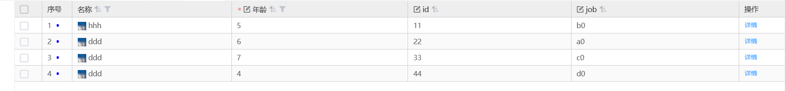

# 表格

> 用于展示多条结构类似的数据，可对数据进行排序、筛选、对比或其他自定义操作,基于 Vxe-grid。



> 示例配置

仅作参考

```js
 {
              type: 'container',
              id: 'table_demo',
              name: '表格组件',
              dataSource: { //定义表格数据
                tableData: [
                  {
                    id: '11',
                    name: 'hhh',
                    job: 'b',
                    age: '18'
                  },
                  {
                    id: '22',
                    name: 'ddd',
                    job: 'a',
                    age: '20'
                  },
                  {
                    id: '33',
                    name: 'ddd',
                    job: 'c',
                    age: '20'
                  },
                  {
                    id: '44',
                    name: 'ddd',
                    job: 'd',
                    age: '20'
                  }
                ]
              },
              items: [
                {
                  type: 'table',
                  name: '表格组件',
                  height: '300px',
                  checkbox: 'multiple',
                  created: (vm) => {
                    let timer,
                      num = 5;
                    function setTime() {
                      if (num === 0) {
                        clearTimeout(timer);
                      } else {
                        timer = setTimeout(function () {
                          num -= 1;
                          setTime();
                          vm.$ds.tableData = [
                            {
                              id: '11',
                              name: 'hhh',
                              job: 'b' + num,
                              age: (num + 1) * 5
                            },
                            {
                              id: '22',
                              name: 'ddd',
                              job: 'a' + num,
                              age: (num + 1) * 6
                            },
                            {
                              id: '33',
                              name: 'ddd',
                              job: 'c' + num,
                              age: (num + 1) * 7
                            },
                            {
                              id: '44',
                              name: 'ddd',
                              job: 'd' + num,
                              age: (num + 1) * 4
                            }
                          ];
                        }, 5000);
                      }
                    }
                    setTime();
                  },
                  gridOptions: {
                    'edit-config': {
                      trigger: 'click',
                      mode: 'cell', // 按单元格编辑
                      showStatus: true,
                      autoClear: false
                    },
                    // 详细配置说明：https://vxetable.cn/v3/#/table/api?filterName=loadMethod
                    'tree-config': {
                        expandAll: false,
                        transform: true,
                        rowField: 'id',
                        parentField: 'parentId',
                        lazy: true,
                        hasChildField: "hasChildren", // 只对 lazy 启用后有效，标识是否存在子节点，从而控制是否允许被点击
                        loadMethod: ({ row }) => { // 树表懒加载方法
                            if (row.children?.length) {
                                return Promise.resolve(row.children);
                            }
                            // 根据tab调不同的接口
                            const activeTab = tech_app.page.getNode('functional_permission_tab')?.data?.activeId ?? '"functional_tab"'
                            let tabValue = activeTab === 'functional_tab'
                            return window.Tech.httpMeta({
                                data: {
                                    params: {
                                        args: {
                                            filter: [],
                                            type: tabValue ? "function" : "custom_function",
                                            curNode: row.id,
                                            useDisplayForModel: true,
                                        },
                                        context: {
                                            uid: "",
                                            zoneOffset: 8,
                                            lang: "zh-CN",
                                        },
                                        model: "tenant_permission",
                                        tag: "master",
                                        service:
                                            "sie-snest-tenant.tenant_permission.tenant_permission_custom_grid.grid:master#searchNodesWildcardOfCustomPer",
                                        app: "sie-snest-tenant",
                                    },
                                },
                            }).then((res) => Promise.resolve(res.data))
                        }
                    }
                  },
                  isEdit: true,
                  id: 'table_demo_table',
                  bind_tableData: '$ds.tableData',
                  items: [
                    {
                      type: 'seq',
                      width: 60,
                      title: '序号',
                      seqHtml: (scope, item, pagingIndexStart) => {
                        let color = 'blue';
                        return `<div style="display:flex;align-items:center">
                                    <span>${scope.seq + pagingIndexStart}</span>
                                    <div style="width:5px;height:5px;background:${color};border-radius:50%;margin-left:10px"></div>
                                </div>`;
                      }
                    },
                    {
                      type: 'container',
                      field: 'name',
                      title: '名称',
                      sortable: true,
                      filter: {
                        type: 'input', // 输入框过滤情况
                        options: [{ data: '' }], // 过滤下拉选项
                        method: ({ option, row, column }) => {
                          // 过滤方法
                          console.log(' ==== filter name method === ', option, row, column);
                          return row.name === option.data;
                        }
                      },
                      items: [
                        {
                          type: 'icon',
                          iconType: 'url',
                          icon: 'https://fuss10.elemecdn.com/e/5d/4a731a90594a4af544c0c25941171jpeg.jpeg'
                        },
                        {
                          type: 'text',
                          value: ''
                        }
                      ]
                    },
                    {
                      type: 'text',
                      field: 'age',
                      title: '年龄',
                      editRender: {
                        configs: {
                          editType: 'input' // 写null会报错
                        }
                      },
                      filter: {
                        // 下拉过滤情况
                        options: [{ label: 'id大于10003', value: 10002 }], // 过滤下拉选项
                        multiple: false,
                        method: ({ value, row, column }) => {
                          return row.id >= value;
                        }
                      },
                      sortable: true
                    },
                    {
                      type: 'text',
                      field: 'id',
                      title: 'id',
                      editRender: {
                        configs: {
                          editType: 'input'
                        }
                      },
                      sortable: true
                    },
                    {
                      type: 'text',
                      field: 'job',
                      title: 'job',
                      editRender: {
                        configs: {
                          editType: 'input'
                        }
                        // enabled: false,
                      },
                      sortable: true
                    },
                    {
                      type: 'operation',
                      field: 'operate',
                      title: '操作',
                      fixed: 'right',
                      items: [
                        {
                          text: '详情',
                          options: {
                            type: 'text'
                          }
                        }
                      ]
                    }
                  ],
                  rules: {
                    age: [{ required: true, message: '年龄必须填写' }]
                  },
                  bind_on_clickOptionBtn: (param) => {
                    console.log(param, param.value);
                  }
                },
                {
                  type: 'container',
                  items: [
                    {
                      type: 'text',
                      bind_value: '$ds.tableData'
                    }
                  ]
                }
              ]
            }

```

## 基本用法

表格列支持 items 和 columns 两种写法，items 支持生命周期，推荐使用 items。

::: tip 提示
当表格数据量大，上下滚动出现白屏情况时可以设置 oSize 来指定每次渲染的数据偏移量，偏移量越大白屏几率越小，渲染次数就越少，但每次渲染耗时就越久。
:::

```js
// items写法
{
  type:'table',
  oSize: 200, // 纵向虚拟滚动偏移量 默认2
  oSizeX: 20, // 横向虚拟滚动偏移量 默认2
  tableData:[
    {id:1,name:'小明',gender:'男',age: 16},
    {id:2,name:'小花',gender:'女',age: 17}
  ],
  items:[
    {prop:'name',label:'姓名', type: 'text'}, // type设置为text 代表该列为文本列
    {prop:'gender',label:'性别', type: 'text'},
    {prop:'age',label:'年龄', type: 'tag'}, // type设置为text 代表该列为标签列
  ]
}
// columns写法
{
  type:'table',
  tableData:[
    {id:1,name:'小明',gender:'男'},
    {id:2,name:'小花',gender:'女'}
  ],
  columns:[
    {prop:'name',label:'姓名'},
    {prop:'gender',label:'性别'},
  ]
}
```

## 有操作栏

```js
{
  type:'table',
  tableData:[
    {id:1,name:'小明',gender:'男'},
    {id:2,name:'小花',gender:'女'}
  ],
  columns:[
    {prop:'name',label:'姓名'},
    {prop:'gender',label:'性别'},
    {
      prop:'operate',
      label:'操作',
      type:'operation',
      btns:[
        {
          text:'详情',
          options:{
            disabled:false,//是否可操作
            type:'primary',//按钮类型
            size:'small',//按钮大小
            icon:'',//按钮text前的图标
            plain:''
          }
        },
        {
          text:'跳转',
          showCondition: (row)=> {
            if (row.rowIndex == 0) { // 根据当前行数据是否显示跳转按钮
              return false  // 不展示
            } else {
              return true // 展示
            }
          },
          options:{
            disabled:false,//是否可操作
            type:'primary',//按钮类型
            size:'small',//按钮大小
            icon:'',//按钮text前的图标
            plain:''
          }
        },
        {
          text:'打开',
          enableCondition: (row)=> {
            if (row.rowIndex == 0) { // 根据当前行数据是否禁用打开按钮
              return false  // 禁用
            } else {
              return true // 不禁用
            }
          },
          options:{
            disabled:false,//是否可操作
            type:'primary',//按钮类型
            size:'small',//按钮大小
            icon:'',//按钮text前的图标
            plain:''
          }
        }
      ]
    }
  ],
  bind_on_clickOptionBtn: (btn, scope, event) => {//绑定操作栏按钮的点击事件
    //btn：当前按钮，相当于配置中的btns[0]
    //scope:{row，column，index}
    ...
  }
}
```

## 表头添加筛选

```js
{
  type: 'table',
  height: '500px',
  tableData: [{name: 'kk', id: 1, job: 'hhh'}],
  items: [
    {
      type: "container",
      prop: "name",
      label: "名称",
      sortable: true,
      filter: {
        type: "input", // 输入框过滤情况
        options: [{ data: "" }], // 过滤下拉选项
        method: ({ option, row, column }) => {
          // 过滤方法
          console.log(" ==== filter name method === ", option, row, column);
          return row.name === option.data;
        },
      },
      items: [
        {
          type: "icon",
          iconType: "url",
          icon: "https://fuss10.elemecdn.com/e/5d/4a731a90594a4af544c0c25941171jpeg.jpeg",
        },
        {
          type: "text",
          value: "",
        },
      ],
    },
    {
      type: "text",
      prop: "age",
      label: "年龄",
      treeNode: true,
      filter: {
        // 下拉过滤情况
        options: [{ label: "id大于10003", value: 10002 }], // 过滤下拉选项
        multiple: false,
        method: ({ value, row, column }) => {
          return row.id >= value;
        },
      },
      sortable: true,
    },
    {
      type: "text",
      prop: "id",
      label: "id",
      sortable: true,
    },
    {
      type: "text",
      prop: "job",
      label: "job",
      sortable: true,
    },
  ]
}
```

## 行内编辑

```js
{
  type: 'table',
  height: '500px',
  tableData: [{name: 'kk', id: 1, job: 'hhh'}],
  // 该方法的返回值用来决定单元格是否允许编辑
  beforeEditMethod: ({ row, column, rowIndex, columnIndex }) => {
    // 以下代码表示所在行的rowIndex=0时不允许编辑 可以结合column参数再进一步判断
    if(row.rowIndex === 0) {
      return false;
    }
    return true;
  },
  // 行内编辑 值变化时触发
  bind_on_editChange = (params) => {
    const {self: vm, value} = params
    console.log(value)
  },
  items: [
    {
      type: "seq",
      width: 60,
      label: "序号",
      seqHtml: (scope, item, pagingIndexStart) => {
        let color = "blue";
        return `<div style="display:flex;align-items:center">
                    <span>${Number(scope.seq) + pagingIndexStart}</span>
                    <div style="width:5px;height:5px;background:${color};border-radius:50%;margin-left:10px"></div>
                </div>`;
      },
    },
    {
      type: "container",
      prop: "name",
      label: "名称",
      sortable: true,
      items: [
        {
          type: "icon",
          iconType: "url",
          icon: "https://fuss10.elemecdn.com/e/5d/4a731a90594a4af544c0c25941171jpeg.jpeg",
        },
        {
          type: "text",
          value: "",
        },
      ],
    },
    {
      type: "text",
      prop: "age",
      label: "年龄",
      treeNode: true,
      editRender: { // 行内编辑
        configs: {
          editType: "input", // 写null会报错
        },
      },
      sortable: true,
    },
    {
      type: "text",
      prop: "id",
      label: "id",
      editRender: {
        configs: {
          editType: "input",
        },
      },
      sortable: true,
    },
    {
      type: "text",
      prop: "job",
      label: "job",
      editRender: {
        configs: {
          editType: "cascader",
          options: [
            { label: "qwer", value: "qwer" },
            { label: "asdf", value: "asdf" },
          ],
        },
        // enabled: false, 行内编辑是否可用
      },
      sortable: true,
    },
    {
      type: "operation",
      prop: "operate",
      label: "操作",
      fixed: "right",
      items: [
        {
          text: "详情",
          options: {
            type: "text",
          },
        },
      ],
    },
  ],
  // 行内编辑的校验规则
  rules:{
    name: [{ required: true, message: '请输入姓名' }, { validator: ({ cellValue }) => {
      if (cellValue && (cellValue.length < 3 || cellValue.length > 50)) {
        return new Error('名称长度在 3 到 50 个字符之间')
      }
    }}],
    age: [{pattern: /^[0,1]{1}$/, message: '格式不正确'}] // 支持正则
  },
  isEdit: true // 直接开启编辑态
}
```

### 行内编辑支持弹窗选择

```js
{
  type: 'table',
  columns: [
    // ...
    {
      "displayName": "人员",
      "name": "personal",
      "rowEditable": true,
      "custom": true,
      "editOpenView": {     // 配置编辑弹窗
        "openView": {
          "showType": "dialog",
          "notSave": true,
          "preId": "costComponentPopViewBJ",
          "model": "api_third_platform",
          "type": "dialog_third_platform_grid,dialog_third_platform_search",
          "checkbox": "single",
          "valueField": "id",
          "labelField": "name",
          "setRowFields": "sex,age",
          "getTableNames": "sex,age"
        }
      }
    },
    //...
  ]
}
```

## 自定义单元格

### 单元格核心渲染方式

表格单元格底层支持几种不同的核心渲染逻辑，主要通过列配置中的 `type` 属性以及特定方法来区分：

1. **动态组件渲染**：当 `type` 不是 `seq`、`html` 且不符合纯文本预览模式时，底层通过内置的动态组件引擎（`<tech-component>`）渲染。这种方式支持大多数复杂的业务组件（如 `input`、`select`、`operation`、`tag` 等）。
2. **纯文本渲染（`type: 'text'`）**：当配置为 `text` 时，渲染为一个纯文本的 `<span>` 标签。系统会自动提取显示值并应用相应的样式，性能比动态组件更好，适合仅作展示的纯文本列。
3. **自定义 HTML 渲染（`type: 'html'`）**：需要配合 `cellHtml` 方法使用，允许通过该方法直接返回 HTML 字符串来渲染单元格内容（通过 `v-html` 渲染）。
4. **序号渲染（`type: 'seq'`）**：默认渲染数字序号（结合分页 `pagingIndexStart`）；如果额外配置了 `seqHtml` 方法，则可以通过返回 HTML 字符串来自定义序号列的显示内容。

#### 自定义 HTML 渲染 (`type: 'html'`) 示例

```js
{
  type: 'table',
  tableData: [{ id: 1, name: '小明' }],
  items: [
    {
      type: 'html',
      prop: 'name',
      label: '自定义内容',s
      cellHtml: (scope, item) => {
        // scope 包含当前行数据、行索引等信息
        return `<span style="color: #409EFF; font-weight: bold;">自定义: ${scope.row.name}</span>`;
      }
    }
  ]
}
```

### 显示下拉框

```js
{
  type:'table',
  tableData: [
    { id: 1, name: '小明', gender: 1 },
    { id: 2, name: '小花', gender: 1 }
  ],
  items: [
    { prop: 'name', label: '姓名', type: 'text' },
    {
      type: 'select',
      prop: 'gender', // prop和name的值要相同
      name: 'gender',
      options: [
        { text: '男', value: 1, },
        { text: '女', value: 2, }
      ],
      model: {
        gender: 1 //该属性名需要与name属性的值一致，默认值支持String、Number、Boolean类型
      },
      label: '性别',
      bind_on_changeHandler: (data) => {
        const rowData = data.__scope.row // 所属行数据
        console.log(data, rowData)
      }
    }
  ]
}
```

### 显示标签 tag

```js
{
  type:'table',
  tableData:[
    {id:1,name:'小明',gender:'男'},
    {id:2,name:'小花',gender:'女'}
  ],
  columns:[
    {prop:'name', label:'姓名'},
    {prop:'gender', label:'性别', type:'tag'}
  ]
  // 或者使用items
  items: [
    {prop:'name', label:'姓名', type: 'text'},
    {prop:'gender', label:'性别', type:'tag', created: (vm) => {}}
  ]
}
```

### 显示图标 icon

::: tip 提示
当单元格数据有值才显示图标
:::

```js
{
  type:'table',
  tableData:[
    {id:1,name:'小明',gender:'男'},
    {id:2,name:'小花',gender:'女'}
  ],
  items:[
    {
      type:'icon',
      prop:'name',
      label:'姓名',
      iconType:'url',
      icon:'https://pic.616pic.com/ys_bnew_img/00/13/14/56S1GVSgRJ.jpg',
      fn: (prop, item, row) => {},
      created: (vm) => {}
    },
    {
      type:'icon',
      prop:'gender',
      label:'性别',
      iconType:'icon',
      icon:'el-icon-delete',
      fn: (prop, item, row) => {},
      style:{ color:'red' },
      created: (vm) => {}
    }
  ]
}
```

### 序号列

```js
{
  type: 'table',
  height: '500px',
  tableData: [{age: 18, job: 'hhh'}],
  items: [
    {
      type: "seq", // 序号列标识
      width: 60,
      label: "序号",
      // 不写seqHtml方法会显示默认的序号列 写了seqHtml方法会按照返回的内容进行渲染
      seqHtml: (scope, item, pagingIndexStart) => {
        let color = "blue";
        return `<div style="display:flex;align-items:center">
                    <span>${Number(scope.seq) + pagingIndexStart}</span>
                    <div style="width:5px;height:5px;background:${color};border-radius:50%;margin-left:10px"></div>
                </div>`;
      },
    },
    {
      type: "text",
      prop: "age",
      label: "年龄",
      sortable: true,
    },
    {
      type: "text",
      prop: "job",
      label: "job",
    },
  ],
}
```

<!-- - 其他案例请参考扩展表格[前端-扩展说明-新建扩展应用-扩展表格](/dev/extend/newExtend.html#_1-1-7、扩展表格) -->

## 添加分页

```js
{
  type:'container'//容器组件
  items:[//容器内部渲染的内容
    {
      type:'paging'//分页组件
      pageSize:30,//每次获取30条
      pageStart:0,//从第几条开始获取
      bind_on_changePageNumber:(res)=>{//绑定分页更改事件
        console.log(res)
        res.self.$ds.paging = res.value//更改dataSource的paging数据
      }
    },
    {
      type:'table',//table组件
      tableData:[
        {id:1,name:'小明',gender:'男'},
        {
          id:2,
          name:'小花',
          gender:'女',
          filter:{
            icon:''//图标
            type:'input'//筛选的类型
          }
        }
      ],
      columns:[
        {prop:'name',label:'姓名'},
        {prop:'gender',label:'性别'}
      ]
    }
  ]
}

```

## 合并单元格

```js
{
  type: 'table',
  height: '300px',
  // rowspan:2 跨两行  colspan:1 不跨列
  mergeMethod: ({ row, _rowIndex, _columnIndex, column, visibleData }) => {return { rowspan: 2, colspan: 1 }},
  // 如果值相同的时候合并行可以使用mergeRowList，指定列名
  mergeRowList: ['name'],
  tableData: [
    { id: 1, name: '1', chinese: '98', math: '60', english: '70' },
    { id: 2, name: '2', chinese: '98', math: '66', english: '89' },
    { id: 3, name: '3', chinese: '98', math: '90', english: '70' },
    { id: 4, name: '4', chinese: '88', math: '99', english: '89' },
  ],
  columns: [
    { prop: 'name', label: 'Chinese Score' },
    { prop: 'chinese', label: 'Chinese Score' },
    { prop: 'math', label: 'Math Score' },
    { prop: 'english', label: 'English Score' },
  ]
},

```

## 多列排序

```js
{
  type: 'table',
  height: '300px',
  sortMultiple: true, // 是否启用多列组合排序
  tableData: [
    { id: 1, name: '1', chinese: '98', math: '60', english: '70' },
    { id: 2, name: '2', chinese: '98', math: '66', english: '89' },
    { id: 3, name: '3', chinese: '98', math: '90', english: '70' },
    { id: 4, name: '4', chinese: '88', math: '99', english: '89' },
  ],
  columns: [
    { prop: 'name', label: 'Chinese Score' },
    { prop: 'chinese', label: 'Chinese Score', sortable: true },
    { prop: 'math', label: 'Math Score', sortable: true },
    { prop: 'english', label: 'English Score' },
  ]
},

```

## 自定义列头

通过 `customHeader` 可以将列头替换为任意组件节点，优先级高于默认文本、排序图标等内置渲染。

`customHeader` 接受标准组件节点配置，渲染时会额外注入 `scope`（vxe-table 列头作用域，含 `column`、`columnIndex` 等信息）。

```js
{
  type: 'table',
  tableData: [{ id: 1, name: '小明', age: 18 }],
  items: [
    {
      type: 'text',
      field: 'name',
      title: '姓名',
      customHeader: {
        // 可以是任意组件节点，此处示例：图标 + 文字
        type: 'container',
        style: { display: 'flex', alignItems: 'center', gap: '4px' },
        items: [
          { type: 'text', value: '姓名' },
          {
            type: 'icon',
            iconType: 'icon',
            icon: 'el-icon-question',
            style: { color: '#409EFF' }
          }
        ]
      }
    },
    { type: 'text', field: 'age', title: '年龄' }
  ]
}
```

## 表头分组

```js
{
  type: 'table',
  tableData: [
    { id: 10001, name: 'Test1', nickname: 'T1', role: 'Develop', sex: 'Man', age: 28, address: 'Shenzhen' },
    { id: 10002, name: 'Test2', nickname: 'T2', role: 'Test', sex: 'Women', age: 22, address: 'Guangzhou' },
    { id: 10003, name: 'Test3', nickname: 'T3', role: 'PM', sex: 'Man', age: 32, address: 'Shanghai' },
    { id: 10004, name: 'Test4', nickname: 'T4', role: 'Designer', sex: 'Women', age: 23, address: 'Shenzhen' },
  ],
   // 分组列头，通过 children 定义子列
  items: [
    {
      type: 'seq',
      width: 50,
      label: '序号',
      field: 'row_idx'
    },
    {
      label: '基本信息',
      children: [
        { field: 'name', label: 'Name', type: 'text' },
        {
          label: '其他信息',
          children: [
            { field: 'nickname', label: 'Nickname', type: 'text' },
            { field: 'age', label: 'Age', sortable: true, type: 'text' }
          ]
        },
        { field: 'sex', label: 'Sex', type: 'text' }
      ]
    },
    { field: 'address', label: 'Address', sortable: true, type: 'text' }
  ],
  height: '500px',
}
```

- 表头分组后端视图请看[在线视图-后端视图-表格-表头分组](/dev/document/5、在线视图/5.3、表格视图.html#\_ 1.3.8、表头分组)

## 表尾数据

```js
{
  type: 'table',
  tableData: [
    { id: 10001, info: 'Test1', address: 'Shenzhen' },
    { id: 10002, info: 'Test2', address: 'Guangzhou' },
  ],
  columns: [
    { type: 'seq', width: 50 },
    { prop: 'info',label: '基本信息' },
    { prop: 'address', label: '地址', sortable: true }
  ],
  height: '300px',
  // 表尾数据计算方法
  // 动态同步方法
  summaryMethod: ({ columns, data }) => {
      return [
        columns.map((column, columnIndex) => {
          if (columnIndex === 0) {
            return '平均';
          }
          return data.filter(item=>!!item[column.property]).length;
        })
      ];
  }
  // 异步方法 filterArr是筛选条件数组，可直接传到接口中
  // 返回的数据结构如下：[{header:'合计',data:{列名1:{header:'重量/t',value:1000},列名2:{header:'数量',value:1000},}}] 或 [{header:'合计',data:{列名1:1000,列名2:500}}]
  summaryMethod: async (vm, filterArr) => {
    let res = await window.Tech.httpMeta({
        data: {
            params: {
                args: {
                    useDisplayForModel: true,
                    order: '',
                    filter: filterArr,
                    limit: 0,
                    offset: 0,
                    properties: ['id', 'matchid', 'operatype']
                },
                service: 'statistics',
                model: 'LApplicationbillTP',
                app: 'newSdkLes'
            }
        }
    });
    return res.data
  },
}
```

## 展开行

```js
{
  type: 'table',
  height: '400px',
  isEdit: true,
  tableExpandConfig: { // 展开行配置项
    visibleMethod: ({ row, column }) => {
      // 返回值用来决定是否允许显示展开按钮
      return true;
    },
    toggleMethod: ({ expanded, column, columnIndex, row }) => {
      // 实现展开与关闭的细节处理，返回值用来决定是否允许继续执行
      return true;
    }
  },
  items: [
    {
      type: 'expand', // 展开行所在的列 需要配置type=expand
      width: 50,
      title: '',
      items: [
        {
          type: 'container',
          style: {
            overflow: 'auto',
            height: '2rem'
          },
          created: (vm) => { // 通过openView加载视图
            let rowId = vm.instance?.config?.row?.id; // 或者 tableVm.instance.currentRow.id
            let view = {
              created: {
                openView: {
                  preId: 'custom_rbac_user_001_' + rowId, // 全局业务唯一标识前缀
                  model: 'rbac_role', // 后端模型名
                  type: 'grid,form,search' // 后端视图类型 多个类型以,逗号隔开
                }
              }
            };
            vm.data.view = view;
          },
          items: []
        }
      ]
    },
    {
      type: 'text',
      field: 'test',
      title: '测试'
    },
    {
      type: 'text',
      field: 'name',
      title: '实体',
      editRender: {
        configs: {
          editType: 'input'
        }
      }
    }
  ],
  tableData: [
    { name: '实体1', id: 1, test: 'p' },
    { name: '实体2', id: 2, test: 'q' },
    { name: '实体3', id: 3, test: 'r' }
  ]
}
```

- 表尾数据后端视图请看[在线视图-后端视图-表格-表尾数据](/dev/document/5、在线视图/5.3、表格视图.html#\_ 1.3.9、表尾数据)

## Attributes

| 属性名            | 说明                                                                       | 类型     | 默认值                                                                                                                |
| ----------------- | -------------------------------------------------------------------------- | -------- | --------------------------------------------------------------------------------------------------------------------- | --- |
| type              | 容器类型：表格                                                             | String   | table                                                                                                                 |
| tableData         | 表格数据                                                                   | Object   | {}                                                                                                                    |
| items             | 表格列，兼容 columns                                                       | Array    | []                                                                                                                    |
| columns           | 表格列                                                                     | Array    | []                                                                                                                    |
| pagingIndexStart  | 序号的数字，分页的开始值                                                   | Number   | 0                                                                                                                     |
| checkbox          | 显示可选按钮列                                                             | String   | null                                                                                                                  |
| checkboxWidth     | 可选列的宽度                                                               | String   | 55                                                                                                                    |
| selectable        | 是否可选，checkbox 为 true 时有效                                          | Function | (row,index) => {<br/> return true<br/> }                                                                              |
| defaultCheck      | 默认选中的列表，选中的 rowKey 集合，[rowKey]。需要 checkbox 为 true 才有效 | Array    | []                                                                                                                    |
| rowStyle          | 行样式                                                                     | Object   | null                                                                                                                  |
| cellStyle         | 单元格样式                                                                 | Object   | {<br/> padding: '0',<br/> border: '0.01rem solid #ccc',<br/> 'border-top': 'none',<br/> 'border-left': 'none',<br/> } |
| headerCellStyle   | 表头单元格样式                                                             | Object   | {<br/> height: '0.29rem',<br/> padding: '0',<br/> borderColor: '#C8C8C8',<br/> }                                      |
| showSequenceNum   | 是否显示序号列                                                             | Boolean  | true                                                                                                                  |
| sequenceName      | 序号列的表头文本，showSequenceNum 为 true 时有用                           | String   | 序号                                                                                                                  |
| operateName       | 操作列的表头文本                                                           | String   | 操作                                                                                                                  |
| height            | 表格高度，超过高度会出现滚动条                                             | String   | undefined                                                                                                             |
| rowKey            | 行数据的 Key                                                               | String   | id                                                                                                                    |
| isEdit            | 表格是否处于编辑状态                                                       | Boolean  | false                                                                                                                 |
| rules             | 编辑状态下表格的校验规则                                                   | Object   | {}                                                                                                                    |
| summaryMethod     | 自定义的表尾数据计算方法                                                   | Function | -                                                                                                                     |
| gridOptions       | 更多表格设置 可参考https://vxetable.cn/v3/#/grid/api 的 vxe-grid           | Object   | -                                                                                                                     |
| tableExpandConfig | 展开行配置项                                                               | Object   | -                                                                                                                     |
| beforeEditMethod  | 返回值用来决定该单元格是否允许编辑                                         | Function | ({ row, column, rowIndex, columnIndex })=> {<br/> return true;<br/> }                                                 | -   |
| doubleclickAction | 双击触发的事件，可选 preview,edit                                          | String   | preview                                                                                                               |
| showCondition     | 根据当前行数据是否显示操作列按钮                                           | Function | (row)=> {<br/> return true;<br/> }                                                                                    |
| enableCondition   | 根据当前行数据是否禁用操作列按钮                                           | Function | (row)=> {<br/> return false;<br/> }                                                                                   |

### column Attributes

| 属性名       | 说明                                                                                                                         | 类型    | 默认值 |
| ------------ | ---------------------------------------------------------------------------------------------------------------------------- | ------- | ------ |
| label        | 表头的显示名                                                                                                                 | String  | -      |
| prop         | 表头的数据字段名                                                                                                             | String  | -      |
| width        | 列的宽度                                                                                                                     | String  | -      |
| minWidth     | 列的最小宽度                                                                                                                 | String  | -      |
| type         | 数据显示类型                                                                                                                 | String  | normal |
| iconType     | 列筛选，参考 table.column.filter 属性                                                                                        | String  | -      |
| icon         | <br/> 图标<br/> iconType == icon 时，填写 iconfont 的样式名字，<br/> iconType == url 时，填写 URL 地址<br/>                  | String  | -      |
| fn           | type 为 icon 时生效，内容为 function，<br/> 返回参数：<br/> prop - 当前数据的 prop<br/> item - 当前列<br/> row - 当前行<br/> | String  | -      |
| style        | type 为 icon 时生效                                                                                                          | Object  | -      |
| filter       | 列筛选，参考 table.column.filter 属性                                                                                        | Object  | null   |
| btns         | 操作栏按钮,button 组件的集合,<br/> 例:[{<br/> type:button,<br/> ...<br/> }]                                                  | Array   | null   |
| sortable     | 开启排序                                                                                                                     | Boolean | false  |
| sortMultiple | 多列排序优先级                                                                                                               | Number  | null   |
| hidden       | 列是否隐藏                                                                                                                   | Boolean | false  |
| fixed        | 将列固定在左侧或者右侧; 可选值: left（冻结左侧）, right（冻结右侧）                                                          | String  | -      |

### items Attributes

| 属性名       | 说明                                                                                                    | 类型         | 默认值 |
| ------------ | ------------------------------------------------------------------------------------------------------- | ------------ | ------ |
| type         | 组件名                                                                                                  | String       | text   |
| editRender   | 编辑配置                                                                                                | Object       | null   |
| filter       | 过滤配置                                                                                                | Object       | null   |
| label        | 表头的显示名                                                                                            | String       | -      |
| prop         | 表头的数据字段名                                                                                        | String       | -      |
| width        | 列的宽度                                                                                                | String       | -      |
| minWidth     | 列的最小宽度                                                                                            | String       | -      |
| btns         | 操作栏按钮,button 组件的集合                                                                            | Array        | null   |
| sortable     | 开启排序                                                                                                | Boolean      | false  |
| sortMultiple | 多列排序优先级                                                                                          | Number       | null   |
| hidden       | 列是否隐藏                                                                                              | Boolean      | false  |
| created      | 生命周期                                                                                                | Function(vm) | -      |
| customHeader | 自定义列头组件节点配置，优先级高于默认渲染。渲染时注入 `scope`（含 `column`、`columnIndex` 等列头信息） | Object       | -      |

### column.filter Attributes

| 属性名  | 说明         | 类型     | 默认值 |
| ------- | ------------ | -------- | ------ |
| method  | 过滤方法     | Function | null   |
| type    | 筛选类型     | String   | null   |
| options | 过滤下拉选项 | Object   | null   |

### column.btn Attributes

| 属性名          | 说明           | 类型    | 默认值  |
| --------------- | -------------- | ------- | ------- |
| text            | 按钮的文本     | String  | null    |
| options         | 按钮的配置属性 | Object  | -       |
| options.disable | 按钮是否禁用   | Boolean | -       |
| options.type    | 按钮类型       | String  | primary |
| options.size    | 按钮是大小     | String  | small   |

## Events

<!-- <tableComp :tableData="functionConfig" type="events"></tableComp> -->

| 事件名称          | 说明                 | 回调参数                                                                                                          |
| ----------------- | -------------------- | ----------------------------------------------------------------------------------------------------------------- |
| cellMouseEnter    | 鼠标进入单元格时触发 | row 行, column 列, cell 单元格, event 事件                                                                        |
| cellMouseLeave    | 鼠标离开单元格时触发 | row 行, column 列, cell 单元格, event 事件                                                                        |
| cellClick         | 点击单元格触发       | row 行, column 列, cell 单元格, event 事件                                                                        |
| rowDblclick       | 双击一行时触发       | row 行, column 列, event 事件                                                                                     |
| select            | 勾选 CheckBox 时触发 | type 'add'：选中,'remove'：取消选中; selection 选中的数据, row 行数据                                             |
| clickOptionBtn    | 点击列表操作栏的按钮 | btn 按钮配置, <br/>scope {<br/>row：行, <br/>column：列, <br/>$index：第几条数据<br/>},<br/> event 事件本身<br/>} |
| changeRowSelected | row 选中发生变化时   | selection 选中的 row 集合                                                                                         |

## 完整示例

```js
{
  type:"container", // 容器组件
  id:"tablefewCom",
  dataSource:{//数据源
    filter:[//筛选数据
      {text:'a',value:1,age:123},
      {text:'b345',value:2,project:'83245'},
      {text:'c',value:3,id:'238dk897'},
      {text:'d',value:4,type:'warning'},
    ],
    paging:{
      pageStart:0,//从第几条数据开始获取
      pageSize:30//每次数据的数量
    },
    tableData:[//表格数据
      {name:'包子',gender:'女',id:'1'},
      {name:'包子1',gender:'男',id:'2'},
      {name:'包子2',gender:'未知',id:'3'},
      {name:'包子3',gender:'',id:'4'},
    ]
  },
  items:[ // 子级
    {
      name:'filter-ctn',
      id:'filter-ctn',
      type:'container',
      style:{
        background:'#fff',
        'margin-bottom':'10px',
        padding:'10px'
      },
      items:[
        {
          type:'container',
          style:{
            margin:'10px 0',
            padding:'0 0 10px',
            'border-bottom': '0.01rem dashed #cccccc'
          },
          items:[
            {
              type:'text',
              text:'筛选条件：'
            },
            {
              type:'tags',//tags组件，显示筛选出来的数据
              closable:true,
              id:'tag-list',
              style:{
                display: 'inline-block'
              },
              bind_tags:'$ds.filter',
              bind_on_delTag:(data)=>{//绑定删除标签事件
                console.log('view',data.value)
              },
              bind_on_click:(data)=>{//绑定点击标签事件
                console.log('view',data.value)
              }
          }]
        },
        {
          type:'container',
          style:{
            display:'flex',
            position:'relative'
          },
          items:[
            {
              type:'form',//form组件，筛选table数据的表单
              id:"table-filter",
              style:{
                'flex-grow':1
              },
              formConfig:{
                inline:true,
                labelPosition:'right',
                labelWidth:'70px'
              },
              items:[
                {
                  type:'container',
                  style:{
                    display:'flex'
                  },
                  items:[
                    {
                      type:'text',
                      text:'模型名称',
                      name:'modal'
                    },
                    {
                      type:'text',
                      text:'模型ID',
                      name:'modalID'
                    },
                    {
                      type:'select',
                      text:'单选',
                      clearable:true,
                      placeholder:'选一个吧',
                      name:'select',
                      options:[
                        {text:'a',value:1},
                        {text:'b',value:2},
                        {text:'c',value:3},
                        {text:'d',value:4},
                      ],
                      t_req_data:{
                        type:"",
                        name:"",
                      }
                    },
                    {
                      type:'select',//from表单中的下拉组件
                      text:'分组',
                      clearable:true,
                      placeholder:'选一个吧',
                      name:'select',
                      group:true,
                      options:[
                        {
                          label: '热门城市',
                          options: [{
                            value: 'Shanghai',
                            label: '上海'
                          }]
                          }
                          , {
                          label: '城市名',
                          options: [{
                            value: 'Chengdu',
                            label: '成都'
                          }]
                        }
                      ],
                    }
                  ]
                },

              ]
            },
            {
              type:'container',
              name:'form-btns',
              style:{
                width:'200px',
                'text-align':'center'
              },
              items:[
                {
                  type:'button',
                  text:'提交',
                  options:{
                    type:'primary',
                    size:'small'
                  },
                  bind_on_click:(data)=>{//绑定按钮的点击事件
                      console.log(data)
                    }
                },{
                  type:'button',
                  text:'重置',
                  options:{
                    type:'default',
                    size:'small'
                  },
                  bind_on_click:(data)=>{
                    console.log(data)
                    console.log(data.self.$select('parent').$select('prev'))//根据点击元素的相对位置获取祖先节点（父亲的前一个）
                  }
                },
                {
                  type:'meta-dropdown',//下拉组件
                  style:{
                    margin:'0 0 0 10px',
                    display:'inline-block'
                  },
                  dropdownStyle:{//弹窗的style样式
                    width:'100%'
                  },
                  placement:'bottom-end',//弹窗的位置，top、top-start、top-end、bottom、bottom-start、bottom-end
                  items:[
                    // { //第一个元素为按钮
                    //   name:'defaultBtn',//默认按钮
                    //   buttonClose:{
                    //     text: '展开',
                    //     icon: 'el-icon-arrow-down'
                    //   },
                    //   buttonOpen:{
                    //     text: '收起',
                    //     icon: 'el-icon-arrow-up'
                    //   },
                    // },
                    {
                      name:'customBtn',//自定义的按钮，可以是任意的组件
                      type:'button',
                      text:'测试'
                    },
                    {//第二个元素为弹窗内容，正常写组件即可
                    type:'form',
                    id:"table-filter-pop",
                    style:{
                      'flex-grow':1
                    },
                    formConfig:{
                      inline:true,
                      labelPosition:'right',
                      labelWidth:'70px'
                    },
                    items:[
                      {
                        type:'container',
                        style:{
                          display:'flex'
                        },
                        items:[
                          {
                            type:'text',
                            text:'模型名称',
                            name:'modal'
                          },
                          {
                            type:'text',
                            text:'模型ID',
                            name:'modalID'
                          },
                          {
                            type:'select',
                            text:'单选',
                            clearable:true,
                            placeholder:'选一个吧',
                            name:'select',
                            options:[
                              {text:'a',value:1},
                              {text:'b',value:2},
                              {text:'c',value:3},
                              {text:'d',value:4},
                            ],
                            t_req_data:{
                              type:"",
                              name:"",
                            }
                          },
                          {
                            type:'select',
                            text:'分组',
                            clearable:true,
                            placeholder:'选一个吧',
                            name:'select',
                            group:true,
                            options:[
                              {
                                label: '热门城市',
                                options: [{
                                  value: 'Shanghai',
                                  label: '上海'
                                }]
                                }
                                , {
                                label: '城市名',
                                options: [{
                                  value: 'Chengdu',
                                  label: '成都'
                                }]
                              }
                            ],
                          }
                        ]
                      },

                    ]
                  },]
                }
              ]
            }
          ]
        },
      ]
    },
    {
      type:'container',
      name:'table-toolbar',
      style:{
        background:'#fff',
        padding:'5px',
        display:'flex'
      },
      items:[
        {
          type:'container',
          style:{
            'flex-grow':1,
            width:'100%'
          },
          // 按钮组
          items:[//工具栏的按钮
            {
              type:'button',
              text:'新增',
              style:{
                color:'#666'
              },
              options:{
                type:'text',
                icon:'iconfont icon-xinzeng',
                size:'medium'
              },
              bind_on_click:(data)=>{//绑定按钮事件
                console.log('新增')
              }
            },
            {
              type:'button',
              text:'删除',
              style:{
                color:'#666'
              },
              options:{
                type:'text',
                size:'medium',
                icon:'iconfont icon-shanchu'
              },
              bind_on_click:(data)=>{
                console.log('删除')
              }
            },
          ]
        },
        // 分页
        {
          type:'paging',
          bind_pageSize:'$ds_paging.pageSize',//绑定使用dataSource的分页数据
          bind_pageStart:'$ds_paging.pageStart',
          bind_on_changePageNumber:(res)=>{//绑定分页更改事件
            console.log(res)
            res.self.$ds.paging = res.value
          }
        },
        {
          type:'button',// 刷新按钮
          className:'icon-refresh',
          options:{
            type:'text'
          },
          bind_on_click:(data)=>{
            console.log(data)
          }
        },
        {
          type:'container',
          style:{
            display:'flex',
            'align-items': 'center'
          },
          items:[//拼接视图切换按钮组
            {
              type:'button',
              className:'group-btn',
              options:{
                icon:'iconfont icon-liebiao',
                size:'mini',
                type:'default'
              },
              bind_on_click:(res)=>{
                console.log('list')
                res.self.data.options.type = 'info'
                res.self.$select('next').data.options.type = 'default'
              }
            },
            {
              type:'button',
              className:'group-btn',
              options:{
                icon:'iconfont icon-tushi',
                size:'mini',
                type:'default'
              },
              bind_on_click:(res)=>{
                console.log(res)
                console.log('table')
                res.self.data.className = 'group-btn active'
                res.self.$select('prev').data.options.type = 'default'
              }
            }
          ]
        }
      ]
    },
    {
      type:'table',//table组件
      pagingIndexStart:1,
      checkbox:'multiple',// 单选：'single'，多选：'multiple'
      checkboxWidth:80,
      showEmpty:true,// 是否显示‘空数据’提示文案
      bind_pagingIndexStart:'$ds.paging.pageStart',// 数据的序号
      bind_tableData:'$ds.tableData',// 绑定tableData属性的数据,使用父组件的数据
      columns:[//表格的列数据
        {prop:'name',label:'姓名'},
        {prop:'gender',
          label:'性别',
          filter:{
            type:'input'
          }
        },
        {
          prop:'operate',
          label:'操作',
          btns:[{
            type:'button',
            text:'编辑',
            options:{
              type:'text',
              size:'small'
            }
          }]
        }
      ],
      bind_on_rowDblclick:(data)=>{// 绑定双击行事件
        console.log(data)
        },
      bind_on_clickOptionBtn:(data)=>{ // 点击操作栏按钮
        console.log(data)
      },
      bind_on_doFilter:(data)=>{//绑定表头筛选按钮事件
        console.log(data.value)
      },
      ds_config: {//请求数据配置
        type: 'meta',  // 调用元模型引擎API获取数据
        name:'data1', // 数据源标识，获取数据后将根据此名称存入dataSource.data1中
        autoRequest: false, // 在节点渲染后，是否自动触发请求，默认false
        options: {
          params: { // 参考元模型api传参规范
            args: {
              properties: ['name']
            },
            service: 'search',
            model: 'xxx'
          }
        }
      }
    }
  ]
}
```
