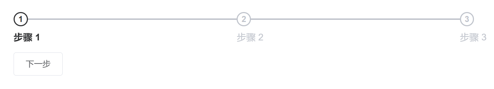

# 步骤条

> 引导用户按照流程完成任务的分步导航条，可根据实际应用场景设定步骤，步骤不得少于 2 步。



## 基本用法
```js
       {
          type: 'steps',
          finishStatus: 'success',
          active: 1,
          dataList: [
              {
                title: '审批人',
                description: 'description'
              },
              {
                title: '审批人',
                description: 'description'
              },
              click:(step)=>{
                // 单击step时回调
                // step 对应步骤数据
              }
            ]
        }
```
## titleItems，descriptionItems使用
配合formatItem函数实现不同步骤展示，不同的内容
```js
       {
          type: 'steps',
          active: 1,
          dataList: [
              {
                title: '审批人',
                showForm: true
              },
              {
                title: '审批人'
              }
            ],
          titleItems: [
            {
              type: 'container',
              items: [
                {
                  type: 'text',
                  value: '',
                  formatItem: (row, item) => {
                    if (row.title) {
                      item.value = row.title;
                    }
                    return item;
                  }
                }
              ]
            }
          ],
          descriptionItems: [
            {
              type: 'container',
              items: [
                {
                  type: 'form',
                  formatItem: (row, item) => {
                    if (row.showForm) {
                      return item;
                    }
                    return [];
                  },
                  items: [
                    {
                      type: 'input',
                      name: 'name',
                      text: '企业名称',
                    },
                  ]
                }
              ]
            }

          ],
          iconItems: []
        }
```
## Attributes
| 属性名 | 说明 | 类型 | 默认值 |
| ----- |----- |----- |----- |
|dataList |每一个步骤的参数 |Array |[]  |
|titleItems |自定义标题插槽items |Array |  |
|descriptionItems |自定义描述性文字插槽items |Array |  |
|iconItems |自定义图标插槽items |Array |  |
| 其他属性    | 请查看 [ElSteps](https://element.eleme.cn/#/zh-CN/component/steps#steps-attributes) |         |        | 
