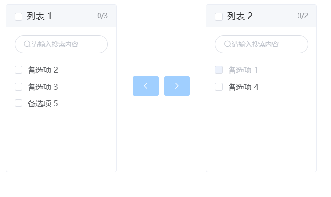

# 穿梭框



## 基本用法

```js
       {
              type: 'transfer',
              data: [
                {key: 1, label: '备选项 1', disabled: true},
                {key: 2, label: '备选项 2'},
                {key: 3, label: '备选项 3'},
                {key: 4, label: '备选项 4'},
                {key: 5, label: '备选项 5'}
              ],
              modelValue: [1, 4],
              options: {
                filterable:true
              },
              bind_on_input: (params)=> {
                console.log(params);
              }
            }
```

## 表单用法

```js
       {
          type: 'form',
          dataSource: {
            form: {
              transfer: [1, 4]
            }
          },
          items: [
            {
              type: 'transfer',
              name: 'transfer',
              data: [
                {key: 1, label: '备选项 1', disabled: true},
                {key: 2, label: '备选项 2'},
                {key: 3, label: '备选项 3'},
                {key: 4, label: '备选项 4'},
                {key: 5, label: '备选项 5'}
              ],
              options: {
                filterable:true
              },
            }
          ]
        }
```

## Attributes

| 属性名           | 说明                                                                                | 类型                            | 默认值 |
| ---------------- | ----------------------------------------------------------------------------------- | ------------------------------- | ------ |
| value            | 绑定值                                                                              | Array                           | -      |
| data             | Transfer 的数据源                                                                   | array[{ key, label, disabled }] | [ ]    |
| style            | 样式                                                                                | object                          | -      |
| options 其他属性 | 请查看 [ElTransfer](https://element.eleme.cn/#/zh-CN/component/transfer#attributes) | object                          | -      |

## Events

| 事件名称 | 说明                                                                            | 回调参数       |
| -------- | ------------------------------------------------------------------------------- | -------------- |
| input    | 绑定值改变时触发                                                                | (value: array) |
| 其他事件 | 请查看 [ElTransfer](https://element.eleme.cn/#/zh-CN/component/transfer#events) |                |
