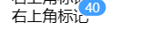

# Badge 标记

> 出现在按钮、图标旁的数字或状态标记。



## 基本用法

```js
{
  id: 'badge',
  type: 'badge',
  name: 'badge标记',
  value: 40,
  items:[{
    type: 'text',
    value: '右上角标记'
  }]
},
```

## Attributes

| 属性名    | 说明                   | 类型                  | 默认值 |
| --------- | ---------------------- | --------------------- | ------ |
| value     | 标记值                 | number                | 0      |
| badgeType | 类型                   | line/circle/dashboard | line   |
| items     | 子元素，标记显示的载体 | array                 | []     |
| max       | 显示的最大值           | number                | 99     |
| isDot     | 是否显示成小红点       | Boolean               | false  |
