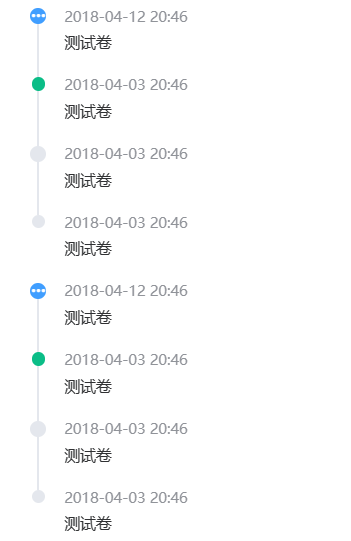

# Timeline 时间线



## 基本用法

```js
{
  id: 'timeline',
  type: 'timeline',
  name: '时间线',
  placement: 'top',
  items: [{
    type: 'text',
    value: '测试卷'
  }],
  dataList: [{
    content: '支持使用图标',
    timestamp: '2018-04-12 20:46',
    size: 'large',
    type: 'primary',
    icon: 'el-icon-more'
  }, {
    content: '支持自定义颜色',
    timestamp: '2018-04-03 20:46',
    color: '#0bbd87'
  }, {
    content: '支持自定义尺寸',
    timestamp: '2018-04-03 20:46',
    size: 'large'
  }, {
    content: '默认样式的节点',
    timestamp: '2018-04-03 20:46'
  }]
}
```

## Attributes

| 属性名    | 说明         | 类型    | 默认值                     |
| --------- | ------------ | ------- | -------------------------- |
| dataList  | 进度值       | number  | 0                          |
| items     | 自定义子元素 | Array   | -                          |
| placement | 时间戳方向   | string  | top 上 bottom 下           |
| reverse   | 排序         | boolean | false 正序 false 倒序 true |
