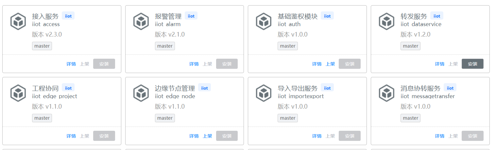

## 基本用法

> 将信息聚合在卡片容器中展示

```js
{
  {
    type: 'table-card',
    id: 'table_card',
    bind_tableData: '${$ds.tableData.data || []}',   //列表数据
    bind_cardConfig: "cardConfig",    //卡片配置
    items: [  // 列表数据外的组件
      {
        type: 'text',
        value: '文本'
      }
    ]
  }
  const cardConfig = {    //card模式card配置
      height: "130px",   //高度
      properties: [    //显示的字段
        "name",
        "login",
        "mobile"
      ],
      configs: {    //字段的显示规则，样式设置  可对字段逐一设置样式
        "login": {
          "defaultValue": "NaN",
          "style": {
            "font-size": "28px",
            "margin-top": "16px",
            'color': '#999'
          },
          "styleFn": "(val) => {return {'color': !val && val != 0 ? '#999999': '#606266'}}"
        },
        "mobile": {
          "style": {
            "color": "#999999",
            "margin-top": "16px"
          }
        }
      }
    }
}

```

## Attributes

| 属性名             | 说明                  |  类型    | 默认值 | 可选值  |
| ----------------- | --------------------  | -------- | ------ |------- |
| tableData         | 列表数据               |  array   |  -     |   -    |
| cardConfig        | 卡片配置               |  object  |  -     |   -    | 
| gutter            | 栅格间隔               |  number  | 0      |   -    |
| cardStyle         | 卡片样式               |  object  | -      |   -    |
| spans             | 栅格占据的列数          |  number  | 6      |   -    |