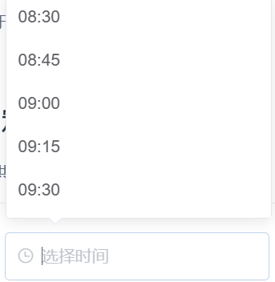

# 1、日期选择器

派生自[ElTimePicker](https://element.eleme.cn/#/zh-CN/component/time-picker)



## 基本用法

```js
// 日期选择
{
  type: 'timepicker', 
  format: "yyyy-MM-dd",
  placeholder: '请选择时间',
  bind_on_changeHandler: (data) => { console.log(data) },
}
// 日期范围选择
{
  type: 'datepicker',
  format: "yyyy-MM-dd",
  valueFormat: "yyyy-MM-dd",
  pickerType: 'daterange',
  isRange: true,
  startPlaceholder: '请选择开始时间',
  endPlaceholder:'请选择结束时间'
  readonly: false,
  bind_on_changeHandler: (data) => { console.log(data) },
}
```

## Attributes

| 属性名             | 说明                  | 类型    | 默认值 | 可选值  |
| ----------------- | --------------------  | ------- | ------ |------- |
| placeholder       | 输入框占位文本         | string| |        |        |
| isRange           | 是否时间范围           | boolean | false  |       |
| readonly          | 是否只读               | boolean | false  |       |
| disabled          | 是否禁用               | boolean | false  |       |
| format            | 格式化                 | string |   |       |
| editable          | 是否可编辑             | boolean | false  |       |
| clearable         | 是否可清除             | boolean | false  |       |
| rangeSeparator    | 选择范围时的分隔符      | String  | '-'    |       |
| startPlaceholder  | 范围选择开始提示语      | String  |        |       |
| endPlaceholder    | 范围选择结束提示语      | String  |        |       |
| align             | 对齐方式               | String  | 'left' |left, center, right|
| pickerType        | 显示类型               | String  | 'date' |year/month/date/dates/months/years<br/>week/datetime/datetimerange<br/>daterange/monthrange |


## Events

| 事件名称          | 说明                        | 回调参数       |
| -----------------| --------------------------- | --------------|
| changeHandler    | 选定的值改变时触发             | 组件绑定值    |
