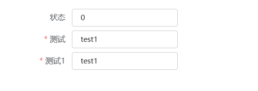

# 表单



> 由输入框、选择器、单选框、多选框等控件组成，用以收集、校验、提交数据。

## 基本用法

- 如果想让表单项的 label 内嵌进表单项控件，可在控件对象内配置 `innerLabel：true`，适用的控件：输入框、下拉框（select lookup lookup-table）、文本域、级联选择器、日期选择器、时间选择器、上传（单个文件）、数字输入框。

> 注意：遇到配置 `innerLabel：true` 表单项样式异常时需要为表单项加 id；设置了`innerLabel：true`后不支持配置labelWidth，由组件内动态计算实现

```js
{
  type: 'form',
  formConfig: {
    inline: true,
    labelPosition: 'right',
    labelWidth: '90px'
  },
  name: '表单',
  // 数据源
  dataSource: {
    form: {
      status: '0',
      test: 'test1'
    }
  },
  // submitChanged: true, // (可选配置) 是否开启只校验提交改变的字段
  // changedFields: {}, //  (可选配置) 改变过的字段对象 和里面的新旧值 格式例如 { fieldA: {oldValue: '', newValue: ''} }
  // bind_on_setChangedFields: (params) => { // (可选配置) 监听那个字段改变的方法 带 当前改变的字段key名
  // },
  // formChange: (vm, type, data) => { // (可选配置) 表单值改变触发的函数
  // },
  items: [
    {
      type: 'input',
      text: '状态',
      name: 'status',
      innerLabel: false // 为true则表单项内嵌label
    },
    {
      type: 'input',
      text: '关联显示',
      bind_display: '$ds.form.status === "1"',
      tip: 'label添加感叹号标签，鼠标移到上方显示的提示语'
    },
    {
      type: 'container', // 表单里面可以嵌套使用任何组件
      items: [
        {
          type: 'form-container', // ** 若使用了其他组件嵌套 导致表单的输入项校验赋值失效需要重新嵌套 form-container 或 row组件
          items: [
            {
              type: 'input',
              text: '测试',
              name: 'test',
              rules: [
                {
                  required: true,
                  trigger: 'change',
                  message: '请选择'
                }
              ]
            },
            {
              type: 'input',
              text: '测试1',
              name: 'test',
              rules: [
                {
                  validator: (rule,el)=>{    //自定义验证规则 例如手机号码  邮箱等
                    //rule  当前对象  el 当前标签对象
                    if (rule.value === '') {
                      rule.callback(new Error('请输入手机号码'));
                    } else if (!/^1[3|4|5|6|7|8|9][0-9]\d{8}$/.test(rule.value)){
                      rule.callback(new Error('请输入正确的手机号码'));
                    } else {
                      rule.callback();
                    }
                  }, required: true
                }
              ]
            }
          ]
        }
      ]
    }
  ]
}

```

## Attributes

| 属性名     | 说明                 | 类型   | 默认值         |
| ---------- | -------------------- | ------ | -------------- |
| id         | 元素 id,唯一标识     | string | -              |
| formConfig | 表单配置，具体看下表 | object | -              |
| rules      | 字段验证规则字段     | object | 可自定义传函数 |

## formConfig Attributes

| 属性名        | 说明                       | 类型    | 默认值 |
| ------------- | -------------------------- | ------- | ------ |
| selfAdaptionW | 是否布局自适应             | boolean | true   |
| minWidth      | 列的最小宽度               | number  | 380    |
| labelWidth    | 表单域标签的宽度           | string  | 1rem   |
| disabled      | 是否禁用该表单内的所有组件 | boolean | false  |
| size          | 用于控制该表单内组件的尺寸 | string  | small  |
| inline        | 行内表单模式               | boolean |        |
| labelPosition | 表单域标签的位置           | string  | left   |

## Events

| 事件名称   | 说明                       | 回调参数       |
| ---------- | -------------------------- | -------------- | ------- |
| formChange | 在表单值改变触发的函数     | (value: string | number) |
| keyupEnter | 在输入框用户按下回车时触发 | (value: string | number) |

## 表单外部组件使用双向绑定值 modelValue

```js
{
  type: 'input',
  name: 'testInput',
  modelValue: '123', // 注意 在form表单里面不能使用该属性
  created: (vm) => {
    window.setTimeout(() => {
      vm.data.modelValue = '456' // 若在form表单里面则不需要定义modelValue属性 使用 vm.$ds.form['testInput'] 代替
    }, 1000);
  }
}
```
