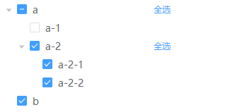
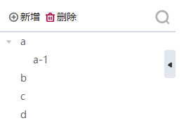
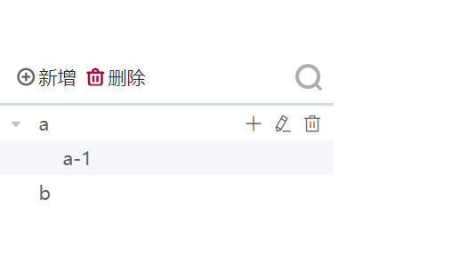

> 用清晰的层级结构展示信息，可展开或折叠。

## 基本用法


```js
{
  type: 'tree',
  name: '基础树',
  transformTotree: true,  // 一维数组自动转换为树状数据
  data: [
    {
      id: 1,
      name: 'a',
      parentId:null
    },
    {
      id: 3,
      name: 'a-1',
      parentId:'1'//父级的id和父级的名字
    },
    {
      id: 2,
      name: 'b',
      parentId: null//父级的id和父级的名字
    }
  ]
}
```

### 直接传入树状数据

```js
{
  type: 'tree',
  name: '基础树',
  data: [
    {
      id: '1',
      name: 'a',
      parentId:null,
      children: [
        {
          id: 3,
          name: 'a-1',
          parentId:'1'
        }
      ]
    },
    {
      id: 2,
      name: 'b',
      parentId:null
    }
  ]
}
```

### 数据绑定示例

```js
{
  type: 'tree',
  name: '基础树',
  ds_config: {
    type: 'meta',
    name: 'treeData',
    ...
  },
  bind_data: '$ds.treeData'
}
```

## 权限模式的树

1. 选中父级，子级不会联动选中
2. 取消父级选中，所有子级都会取消选中
3. 子级没有全部选中时，父级是半选状态
   

```js
{
  type: 'tree',
  name: '权限树——传入一维数组',
  isPermission: true, // 启用权限模式
  curCheckedKeys: [1, 2, 6],
  transformTotree: true,
  data: [
    {
      id: 1,
      name: 'a',
      parentId:null
    },
    {
      id: 3,
      name: 'a-1',
      parentId:'1'
    },
    {
      id: 4,
      name: 'a-2',
      parentId: 1,
    },
    {
      id: 5,
      name: 'a-2-1',
      parentId:'4'
    },
    {
      id: 6,
      name: 'a-2-2',
      parentId:'4'
    },
    {
      id: 2,
      name: 'b',
      parentId: null
    }
  ],
  // 选中值改变事件
  bind_on_check: (params) => {
    // 触发变化的节点的数据
    console.log(params.value.data);
    // 选中值
    console.log(params.value.checked);
  }
}
```

## 业务套件树



```js
{
  type: 'tree',
  name: '业务套件树',
  transformTotree: true,
  treeConfig: { // 树配置和element的tree组件一致
    defaultExpandAll: true
  },
  toolbarConfig: { // 工具栏配置
    buttons: [
      {
        type: 'add',
        text:'新增',
        options:{
          type:'text',
          icon: 'iconfont icon-xinzeng',
        }
      },
      {
        type: 'delete',
        text:"删除" ,
        options:{
          type:'text',
          icon: 'iconfont icon-shanchu'
        }
      }
    ],
    search: true // 显示搜索项
  },
  hideTreeButton: true, // 显示隐藏树按钮
  doubleClkShowInput: true, // 双击进入默认编辑
  data: [
    {
      id: 1,
      name: 'a'
    },
    {
      id: 3,
      name: 'a-1',
      parentId: 1
    },
    {
      id: 2,
      name: 'b'
    },
    {
      id: 4,
      name: 'c'
    },
    {
      id: 5,
      name: 'd'
    }
  ],
  // 点击工具栏按钮事件
  bind_on_clickToolButton: (params) => {
    console.log(params.value);
  }
}
```

## 树下面的 icon



```js
{
  type: 'tree',
  name: '基础树',
  toolbarConfig: { // 工具栏配置
    buttons: [
      {
        type: 'add',
        text:'新增',
        options:{
          type:'text',
          icon: 'iconfont icon-xinzeng',
        }
      },
      {
        type: 'delete',
        text:"删除" ,
        options:{
          type:'text',
          icon: 'iconfont icon-shanchu'
        }
      }
    ],
    search: true // 显示搜索项
  },
  data: [
    {
      id: '1',
      name: 'a',
      parentId: null,
      icon: 'https://xxx.png',  // 前置图片 在name前面展示
      icon: { // 前置icon 在name前面展示
        font: 'el-icon-plus'
      },
      icons: [ // 后置icon 在name后面面展示
        {
          icon: 'el-icon-plus', // element UI的icon一致
          type: 'add'  // 自定义操作类型
        },
        {
          icon: 'el-icon-edit',
          type: 'edit'
        },
        {
          icon: 'el-icon-delete',
          type: 'delete'
        }
      ],
      children: [
        {
          id: 3,
          name: 'a-1',
          parentId: '1'
        }
      ]
    },
    {
      id: 2,
      name: 'b',
      parentId: null
    }
  ],
  // 点击树里面的icon按钮事件
  bind_on_clickTreeNodeIcon: (params) => {
    console.log(params.value);
  }
}
```

## Attributes

| 属性名              | 说明                                                       | 类型          | 默认值 |
| ------------------- | ---------------------------------------------------------- | ------------- | ------ |
| display             | 是否显示                                                   | boolean       | true   |
| curCheckedKeys      | 勾选的节点的 key 的数组                                    | array         | -      |
| transformTotree     | 将一维数组自动转换为树状结构数据，转换依据 conf.tree.props | boolean       | false  |
| isPermission        | 开启权限模式的交互，详见“权限模式的树”                     | boolean       | false  |
| treeConfig          | 配置基本和 element UI 的 tree 一致，详见下文               | object        | -      |
| toolbarConfig       | 工具栏的配置，详见下文                                     | boolean       | false  |
| hideTreeButton      | 启用显示或者隐藏按钮                                       | boolean       | false  |
| doubleClkShowInput  | 双击进入编辑模式                                           | boolean       | false  |
| defaultExpandedKeys | 默认展开的节点 id                                          | Array         | -      |
| icons               | 配置节点里面的 icon                                        | Array         | -      |
| icon                | 配置节点里面的 image/icon                                  | String/Object | -      |

### 1、treeConfig

| 属性名           | 说明                 | 类型    | 默认值 |
| ---------------- | -------------------- | ------- | ------ |
| defaultExpandAll | 是否默认展开所有节点 | boolean | false  |
| props            | 配置选项，具体看下表 | object  | -      |
| delUnParent            | 如果该节点的父id节点在列表中不存在，则显示当前节点 | boolean  | false      |

### 2、props

| 属性名   | 说明                                                     | 类型                          | 默认值 |
| -------- | -------------------------------------------------------- | ----------------------------- | ------ |
| disabled | 指定节点选择框是否禁用为节点对象的某个属性值             | boolean, function(data, node) | false  |
| isLeaf   | 指定节点是否为叶子节点，仅在指定了 lazy 属性的情况下生效 | boolean, function(data, node) | false  |
| virtualScrollTree   | 树的虚拟滚动加载数据 | boolean | false  |

### 3、toolbarConfig

<!-- <tableComp :tableData="toolbarConfig"></tableComp> -->

| 属性名 | 说明         | 类型              | 可选值                                                              | 默认值 |
| ------ | ------------ | ----------------- | ------------------------------------------------------------------- | ------ |
| search | 是否启用搜索 | boolean 、 object | true、false、<br/>{ <br/>showInput：true（常显示搜索输入框） <br/>} | false  |

## Events

| 事件名称           | 说明                       | 回调参数                                                                                                                                                                                                                        |
| ------------------ | -------------------------- | ------------------------------------------------------------------------------------------------------------------------------------------------------------------------------------------------------------------------------- | --------------- |
| check              | 当复选框被点击的时候触发   | params.value.data：触发变化的节点。<br/> params.value.checked：当前选中的情况包含 checkedNodes、checkedKeys、halfCheckedNodes、halfCheckedKeys 四个属性。<br/> params.self：当前视图的 node                                     |
| clickToolButton    | 点击工具栏按钮触发         | params.value.button：当前点击的按钮配置。<br/> params.value.currentNode：当前鼠标选中的树节点。<br/> params.value.event：当前事件对象。<br/> params.self：当前视图的 node                                                       |
| treeNodeUpdateName | 编辑节点名称后触发         | params.value.newValue：节点的新显示值。<br/> params.value.currentNode：当前鼠标选中的树节点。<br/> params.self：当前视图的 node                                                                                                 |
| clickTreeNode      | 点击 tree 节点触发         | params.value.operateData：[id]当前数据 id（id == selectedData.id),<br/> params.value.selectedData：{<br/> data：当前节点的对象，<br/> node：当前节点的 Node，<br/> target：当前节点组件<br/> }<br/> params.value.isDouble：true | false，是否双击 |
| clickTreeNodeIcon  | 点击 tree 的 icon 节点触发 | params.value.e.type：当前操作类型（add、edit、delete...）,<br/> params.value.currentNode.id：对当前 id 进行操作                                                                                                                 |
