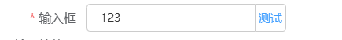

# 输入框

> 通过鼠标或键盘输入字符

> Input 为受控组件，它总会显示 Vue 绑定值。

## 基本用法（脱离表单，单独使用）

实现效果



```js
{
  type: 'input',
  name: 'input',
  text: '输入',
  model: {//脱离表单，单独使用时组件的value设置
    input:'123'//字段名跟name一致
  },
  display: false,
  prefixIcon: "iconfont icon-fabu", // 前缀图标
  suffixIcon: "el-input__icon el-icon-date", // 后缀图标
  // 绑定回车事件
  bind_on_keyupEnter: (data) => { console.log(data) },
  // 绑定change事件
  bind_on_changeHandler: (data) => { console.log(data) },
  // 绑定input事件
  bind_on_inputHandler: (data) => { console.log(data) },
  // 绑定focus事件
  bind_on_handleInputFocus: (data) => { console.log(data) },
  // 绑定blur事件
  bind_on_handleInputBlur: (data) => { console.log(data) },
  append: {
      type: 'button',
      text: '测试',
      handler: (params) => {
        console.log(params)
      }
  }

}
```

## 基本用法（表单中使用）

```js
{
  type:'form',
  dataSource:{
    form:{//固定字段form，即使不明确定义也会在form节点中生成，form中的字段，对应到items里面每个name属性的值
      input:'123'
    }
  },
  items:[
    {
      type: 'input',
      name: 'input',
      text: '输入',
      display: false,
      // 绑定回车事件
      bind_on_keyupEnter: (data) => { console.log(data) },
      // 绑定change事件
      bind_on_changeHandler: (data) => { console.log(data) },
      // 绑定input事件
      bind_on_inputHandler: (data) => { console.log(data) },
      append: {
        type: 'button',
        text: '测试',
        handler: (params) => {
          console.log(params)
        }
      },
    }
  ]

}
```

## Attributes

| 属性名       | 说明                                       | 类型          | 默认值             |
| ------------ | ------------------------------------------ | ------------- | ------------------ |
| display      | 是否显示                                   | boolean       | true               |
| model        | 值                                         | object        | { name 的值:null } |
| placeholder  | 输入框占位文本                             | string        | -                  |
| inputType    | 输入框类型，与原生 HTML[input]的 type 一致 | string        | -                  |
| readonly     | 是否只读                                   | boolean       | false              |
| showPassword | 是否显示切换密码图标                       | boolean       | false              |
| append       | 后置元素                                   | string/object | -                  |
| prefixIcon   | 前缀图标                                   | string        | -                  |
| suffixIcon   | 后缀图标                                   | string        | -                  |

### Append Attributes

| 属性名  | 说明                            | 类型   | 默认值 | 可选值      |
| ------- | ------------------------------- | ------ | ------ | ----------- |
| type    | 类型                            | string | -      | button/icon |
| text    | type 为 button 时配置，文本     | string | -      |             |
| url     | type 为 icon 时配置，图标地址   | string | -      |             |
| style   | type 为 icon 时配置，样式       | object | -      |             |
| handler | type 为 button 时配置，点击时间 | object | -      |             |

## Events

| 事件名称          | 说明                                       | 回调参数                     |
| -----------------| ------------------------------------------ | ----------------------------|
| changeHandler    |  在输入框失去焦点或用户按下回车时触发         | (value: string | number)    |
| keyupEnter       |  在输入框用户按下回车时触发                  | (value: string | number)    |
| inputHandler     |  在 Input 值改变时触发                      | (value: string | number)    |
| handleInputFocus |  在输入框聚焦时触发                         |                             |
| handleInputBlur  |  在输入框失去焦点时触发                      |                             |
