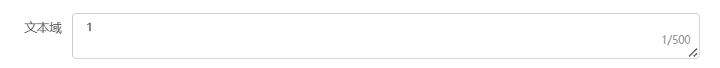

# 文本域

> 用于输入多行文本信息



## 基本用法
```js
{
  type: 'textarea',
  name: 'textarea',
  text: '文本域',
  rows: 2 
  readonly: false, 
  placeholder: '请输入',
  name:'testTextarea',
  cols: 20, // 宽度  默认：200
  showWordLimit: false,  // 是否显示输入字数统计 默认：不展示
  maxlength: 500, // 最大输入长度   默认：无
  resize: 'none', //  控制是否能被用户缩放, none, both, horizontal, vertical 默认：vertical
  model:{//此字段为脱离form单独使用，在form中不可设置此字段，
    testTextarea:'文本域的值'//此字段名需要与name一致
  },
  // 绑定change事件
  bind_on_changeHandler: (data) => { console.log(data) },
  // 绑定input事件
  bind_on_inputHandler: (data) => { console.log(data) }
}
```

## Attributes
| 属性名          | 说明                 | 类型     | 默认值  |  可选值                                |
| ---------------| -------------------- | -------- | ------ | -------------------------------------- |
| rows           | 输入框行数            | number   | 1      |
| placeholder    | 输入框占位文本        | string    | -      |
| readonly       | 是否只读              | boolean  |        |
| cols           | 宽度                 | number    | 200    | 
| showWordLimit  | 是否显示输入字数统计   | boolean  | false   |  
| maxlength      | 最大输入长度          | number   | -       |  
| resize         | 控制是否能被用户缩放   | string   | vertical| none, both, horizontal, vertical      |


## Events

| 事件名称          | 说明                                       | 回调参数                     |
| -----------------| ------------------------------------------ | ----------------------------|
| changeHandler    |  在输入框失去焦点或用户按下回车时触发         | (value: string | number)    |
| inputHandler     |  在 Input 值改变时触发                      | (value: string | number)    |

