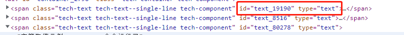
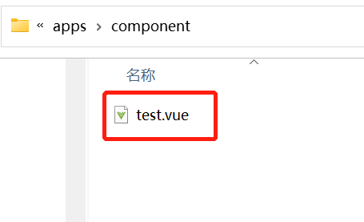
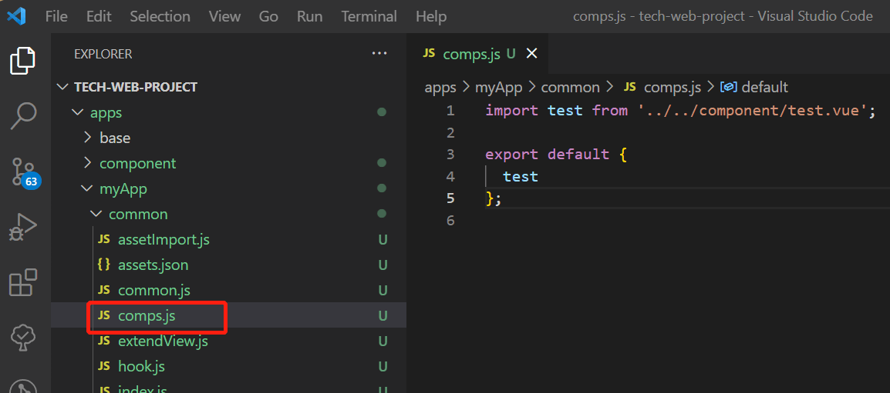

# 自定义 Vue 组件

## 前置约束（Vue 2.7）

平台标准前端底座与渲染引擎基于 Vue 2.7（Vue2 体系）。自定义组件与接入的第三方 UI 组件库需满足以下前提：

- 组件实现需遵循 Vue 2.x 组件规范（以 Options API 为主，使用 export default 导出组件）。
- 组件注册需使用 Vue.use / Vue.component 等 Vue 2.x 方式；不要使用仅 Vue 3 才有的 createApp / app.use 等写法。
- 选型第三方 UI 组件库时，必须选择支持 Vue 2.x / Vue 2.7 的版本；仅支持 Vue 3 的 UI 组件库不适用。

## Vue 组件开发标准

### 需求来源

| 序号 | 需求                   | 详细                                                 |
| ---- | ---------------------- | ---------------------------------------------------- |
| 1    | 尽量简单的标准         | 只要遵循 Vue 开发标准，就能将组件接入渲染引擎        |
| 2    | 尽量少侵入且必须能兼容 | 只需要少量侵入且兼容的改动，就能将组件接入渲染引擎。 |
| 3    | 直接使用第三方 UI 库   | 最终目标                                             |

### 技术分析

1. 将组件和视图解耦，视图节点作为 M 层数据传递到 Vue 组件的对应属性中就可控制组件渲染，组件开发完全可以遵循 Vue 开发标准。
2. 如果视图节点可以使用 Vue 组件的所有方法，那么理论上 Vue 组件内部的所有行为在视图节点内都可以被触发。
3. 如果大家写 Vue 组件时都严格按照数据驱动理念写事件（事件触发数据改变），那么视图将不再需要绑定事件方法，而是直接监听数据变化。
4. 考虑到移动端的一些特殊问题，只能组件嵌套组件，目前没有更好的方式。

### 开发标准

1. 遵循 Vue 组件开发标准
2. props 内禁止使用 config 属性，它是桥接视图节点和 Vue 组件的重要属性；后续版本会统一改为 `t_config`（`t_` 为引擎保留前缀）
3. 事件需要增加 `return`，用于给视图传递事件回参
4. 如果自定义组件内必须支持视图定义子组件，需要使用统一的桥接组件 `tech-component`，将 items 转换成子组件

### 标准 attrs

| **属性** | **值** | **说明** |
| -------- | ------ | -------- |
| id       | String | 组件 ID  |
| viewType | String | 组件类型 |

表现如下：


### 标准 props

| **属性** | **值**  | **说明**                    |
| -------- | ------- | --------------------------- |
| display  | Boolean | 是否加载渲染                |
| visible  | Boolean | 是否显示，同 css 的 display |

### 特殊 props

| **属性** | **值** | **说明**                     |
| -------- | ------ | ---------------------------- |
| config   | Object | 开发自定组件时禁止定义和使用 |

### 自定义 props

遵循 vue 组件开发的 props 标准规范即可，不需要额外动作

### 如何关联视图的 props

视图节点定义的属性和组件内部的 props 属性同名即可

### 开发中禁止使用 config.xxx 获取属性

不能直接使用 config.xxx，会严重影响组件的完整性、独立性和可读性

## 自定义文件位置

1. 在 `./apps/` 下创建 `component` 文件夹


2. 在 `./apps/component` 下创建组件文件（示例：`test.vue`）



## 组件命名规则（tech- 前缀）

> <font color='red'>**【重要提醒】** 为避免组件冲突，凡是通过视图 JSON 的 `type` 渲染的自定义组件，**必须**以 `tech-` 前缀开头命名！同时，强烈建议在命名中加入**产品线或业务标识**（如 `tech-hr-user-select`）。</font>

1. 不在视图中使用（仅作为页面/业务内部组件使用）

- 按 Vue 组件常规命名即可，组件 `name` 不要求以 `tech-` 开头。

2. 需要在视图中使用（通过视图 JSON 的 type 引用渲染）

- Vue 组件 `name` **必须**以 `tech-` 开头，建议格式为 `tech-[业务/产品线标识]-[组件名]`（例如：`tech-crm-order-list`）。
- 视图 JSON 中的 `type` 需要去掉 `tech-` 前缀（例如组件名为 `tech-crm-order-list`，则视图配置中为 `type: 'crm-order-list'`）。

## 组件实现

自定义组件文件代码示例（`test.vue`）：

> <font color='red'>props 内禁止定义 config 属性</font>

```vue
<template>
  <div :style="style">
    {{ value }}
    <button v-if="isXXX" @click="clickHandler">点击</button>
  </div>
</template>

<script>
export default {
  name: "tech-crm-test",
  // props：视图中定义的配置属性（禁止定义 config 属性）
  props: {
    style: {
      type: Object,
      default: () => ({}),
    },
    value: {
      type: String,
      default: "",
    },
    isXXX: {
      type: Boolean,
      default: false,
    },
  },
  data() {
    return {
      myData: {},
    };
  },
  created() {
    this.init(this.value);
  },
  methods: {
    // 初始化方法
    init(params) {
      window.Tech.httpMeta({
        data: {
          // 参考元模型后端的传参规范
          params: {
            args: {
              aaa: "a",
              properties: [
                "name",
                "login",
                "mobile",
                "email",
                "status",
                "remark",
              ],
            },
            model: "rbac_user",
            service: "search",
            app: "base", // 当前应用名称，默认'base'
          },
        },
      }).then((res) => console.log(res));
    },
    // 视图中可通过 bind_on_clickHandler 绑定该方法，并读取该方法的返回数据
    clickHandler() {
      // Vue 组件事件暴露
      this.$emit("clickHandler", this.value);
      // 框架规范：return 的数据可在视图中绑定该方法的入参中取出使用
      return this.value;
    },
  },
};
</script>
```

## 组件引入

找到自己的扩展应用组件引入入口 `./apps/myApp/common/comps.js`


```js
import test from "../../component/test.vue";

export default {
  test,
};
```

## 视图使用（前端后端都可用）

视图中配置使用组件示例：

```js
{
  type: "crm-test", // 视图中的 type 不能带 tech- 前缀
  id: "test_id", // 组件 ID
  style: {
    width: "100px",
    height: "100px",
  },
  value: "test_value", // 对应组件 props.value
  bind_isXXX: "${$ds.isXXX}", // 对应组件 props.isXXX
  bind_on_clickHandler: (params) => {
    const { self: vm, value } = params;
    // vm: 组件实例
    // value: 组件内定义的clickHandler方法返回的数据
    console.log(vm, value);
  },
};
```

## 自定义组件内调用元模型后端 API

### 基本用法 [`this.Tech.httpMeta` 和 `window.Tech.httpMeta`](/pages/e80dbe/#httpmeta-调用元模型-api)

### 其他参数

参考 Axios 传参标准（以下示例较长，可折叠展开查看）

<details>
<summary>Axios 参数示例（展开查看）</summary>

```js
{
  // `url` 是用于请求的服务器 URL
  url: '/user',

  // `method` 是创建请求时使用的方法
  method: 'get', // 默认值

  // `baseURL` 将自动加在 `url` 前面，除非 `url` 是一个绝对 URL。
  // 它可以通过设置一个 `baseURL` 便于为 axios 实例的方法传递相对 URL
  baseURL: 'https://some-domain.com/api/',

  // `transformRequest` 允许在向服务器发送前，修改请求数据
  // 它只能用于 'PUT', 'POST' 和 'PATCH' 这几个请求方法
  // 数组中最后一个函数必须返回一个字符串， 一个Buffer实例，ArrayBuffer，FormData，或 Stream
  // 你可以修改请求头。
  transformRequest: [function (data, headers) {
    // 对发送的 data 进行任意转换处理

    return data;
  }],

  // `transformResponse` 在传递给 then/catch 前，允许修改响应数据
  transformResponse: [function (data) {
    // 对接收的 data 进行任意转换处理

    return data;
  }],

  // 自定义请求头
  headers: {'X-Requested-With': 'XMLHttpRequest'},

  // `params` 是与请求一起发送的 URL 参数
  // 必须是一个简单对象或 URLSearchParams 对象
  params: {
    ID: 12345
  },

  // `paramsSerializer`是可选方法，主要用于序列化`params`
  // (e.g. https://www.npmjs.com/package/qs, http://api.jquery.com/jquery.param/)
  paramsSerializer: function (params) {
    return Qs.stringify(params, {arrayFormat: 'brackets'})
  },

  // `data` 是作为请求体被发送的数据
  // 仅适用 'PUT', 'POST', 'DELETE 和 'PATCH' 请求方法
  // 在没有设置 `transformRequest` 时，则必须是以下类型之一:
  // - string, plain object, ArrayBuffer, ArrayBufferView, URLSearchParams
  // - 浏览器专属: FormData, File, Blob
  // - Node 专属: Stream, Buffer
  data: {
    firstName: 'Fred'
  },

  // 发送请求体数据的可选语法
  // 请求方式 post
  // 只有 value 会被发送，key 则不会
  data: 'Country=Brasil&City=Belo Horizonte',

  // `timeout` 指定请求超时的毫秒数。
  // 如果请求时间超过 `timeout` 的值，则请求会被中断
  timeout: 1000, // 默认值是 `0` (永不超时)

  // `withCredentials` 表示跨域请求时是否需要使用凭证
  withCredentials: false, // default

  // `adapter` 允许自定义处理请求，这使测试更加容易。
  // 返回一个 promise 并提供一个有效的响应 （参见 lib/adapters/README.md）。
  adapter: function (config) {
    /* ... */
  },

  // `auth` HTTP Basic Auth
  auth: {
    username: 'janedoe',
    password: 's00pers3cret'
  },

  // `responseType` 表示浏览器将要响应的数据类型
  // 选项包括: 'arraybuffer', 'document', 'json', 'text', 'stream'
  // 浏览器专属：'blob'
  responseType: 'json', // 默认值

  // `responseEncoding` 表示用于解码响应的编码 (Node.js 专属)
  // 注意：忽略 `responseType` 的值为 'stream'，或者是客户端请求
  // Note: Ignored for `responseType` of 'stream' or client-side requests
  responseEncoding: 'utf8', // 默认值

  // `xsrfCookieName` 是 xsrf token 的值，被用作 cookie 的名称
  xsrfCookieName: 'XSRF-TOKEN', // 默认值

  // `xsrfHeaderName` 是带有 xsrf token 值的http 请求头名称
  xsrfHeaderName: 'X-XSRF-TOKEN', // 默认值

  // `onUploadProgress` 允许为上传处理进度事件
  // 浏览器专属
  onUploadProgress: function (progressEvent) {
    // 处理原生进度事件
  },

  // `onDownloadProgress` 允许为下载处理进度事件
  // 浏览器专属
  onDownloadProgress: function (progressEvent) {
    // 处理原生进度事件
  },

  // `maxContentLength` 定义了node.js中允许的HTTP响应内容的最大字节数
  maxContentLength: 2000,

  // `maxBodyLength`（仅Node）定义允许的http请求内容的最大字节数
  maxBodyLength: 2000,

  // `validateStatus` 定义了对于给定的 HTTP状态码是 resolve 还是 reject promise。
  // 如果 `validateStatus` 返回 `true` (或者设置为 `null` 或 `undefined`)，
  // 则promise 将会 resolved，否则是 rejected。
  validateStatus: function (status) {
    return status >= 200 && status < 300; // 默认值
  },

  // `maxRedirects` 定义了在node.js中要遵循的最大重定向数。
  // 如果设置为0，则不会进行重定向
  maxRedirects: 5, // 默认值

  // `socketPath` 定义了在node.js中使用的UNIX套接字。
  // e.g. '/var/run/docker.sock' 发送请求到 docker 守护进程。
  // 只能指定 `socketPath` 或 `proxy` 。
  // 若都指定，这使用 `socketPath` 。
  socketPath: null, // default

  // `httpAgent` and `httpsAgent` define a custom agent to be used when performing http
  // and https requests, respectively, in node.js. This allows options to be added like
  // `keepAlive` that are not enabled by default.
  httpAgent: new http.Agent({ keepAlive: true }),
  httpsAgent: new https.Agent({ keepAlive: true }),

  // `proxy` 定义了代理服务器的主机名，端口和协议。
  // 您可以使用常规的`http_proxy` 和 `https_proxy` 环境变量。
  // 使用 `false` 可以禁用代理功能，同时环境变量也会被忽略。
  // `auth`表示应使用HTTP Basic auth连接到代理，并且提供凭据。
  // 这将设置一个 `Proxy-Authorization` 请求头，它会覆盖 `headers` 中已存在的自定义 `Proxy-Authorization` 请求头。
  // 如果代理服务器使用 HTTPS，则必须设置 protocol 为`https`
  proxy: {
    protocol: 'https',
    host: '127.0.0.1',
    port: 9000,
    auth: {
      username: 'mikeymike',
      password: 'rapunz3l'
    }
  },

  // see https://axios-http.com/zh/docs/cancellation
  cancelToken: new CancelToken(function (cancel) {
  }),

  // `decompress` indicates whether or not the response body should be decompressed
  // automatically. If set to `true` will also remove the 'content-encoding' header
  // from the responses objects of all decompressed responses
  // - Node only (XHR cannot turn off decompression)
  decompress: true // 默认值

}
```

</details>
