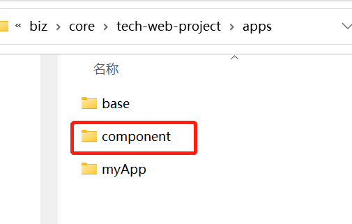
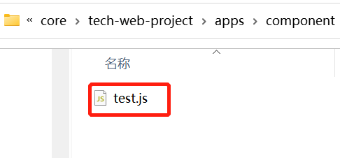
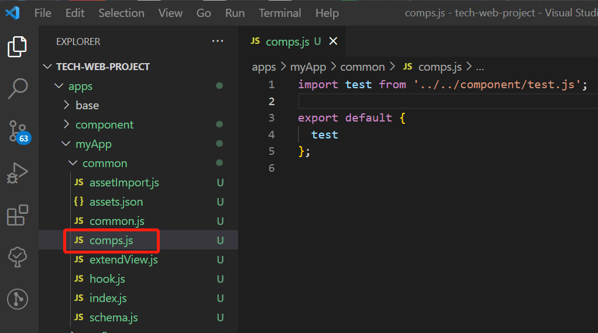

# 自定义视图组件

自定义视图组件用于将一段可复用的视图配置抽离成独立模块，在视图中按需引用，减少重复配置。

## 1. 新建组件文件

1. 在 `./apps/` 下创建 `component` 文件夹



2. 在 `./apps/component` 下创建 `test.js` 文件



3. `test.js` 文件内容示例：

```js
const test = {
  name: "tech-test",
  __block: true,
  view: {
    type: "container",
    id: "tt-1",
    autoChildrenId: true,
    items: [
      {
        type: "button",
        id: "tt-2",
        value: "区块视图组件测试按钮",
      },
    ],
  },
};

export default test;
```

说明：

- `name` 为组件名，必须以 `tech-` 开头。
- `__block: true` 必须配置，否则不会按“区块视图组件”逻辑生效。
- `autoChildrenId: true` 为可选配置，若配置为 `true`，则会自动为子节点添加 `id`。
- `view.id` 需要配置为该区块的顶级 id（建议保证唯一）。

## 2. 注册组件

找到自己的扩展应用组件引入入口：`./apps/myApp/common/comps.js`

```js
import test from "../../component/test.js";

export default {
  test,
};
```



## 3. 视图中使用

在页面/区块的视图 JSON 里，通过 `__block` 引用注册的组件 key（即 `comps.js` 中导出的字段名）：

```js
{
  __block: 'test',
  preId: 'my-pre-',
  id: 'newId',
  text: 'myText'
}
```

字段说明：

- `__block`：固定字段，用于指定要引用的自定义视图组件（值为注册 key，例如 `test`）。
- `preId`：可选，为该区块内所有节点 id 添加统一前缀。
- 其他字段：会与组件 `view` 做深度合并（同名字段以调用处为准）。

## 4. 运行时展开效果

上述调用在实际运行时会展开并合并为（示例）：

```js
{
  type: 'container',
  id: 'my-pre-newId',
  text: 'myText',
  items: [
    {
      type: 'button',
      id: 'my-pre-tt-2',
      value: '区块视图组件测试按钮'
    }
  ]
}
```

合并规则要点：

- `type` 以组件 `view.type` 为准。
- 顶级 `id`：如果调用处传了 `id`，则使用调用处的 `id`；如同时配置了 `preId`，最终为 `${preId}${id}`。
- 子节点 `id`：以组件 `view` 中的 `id` 为基础，如配置了 `preId`，最终为 `${preId}${childId}`。
