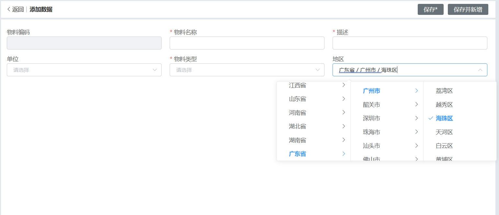
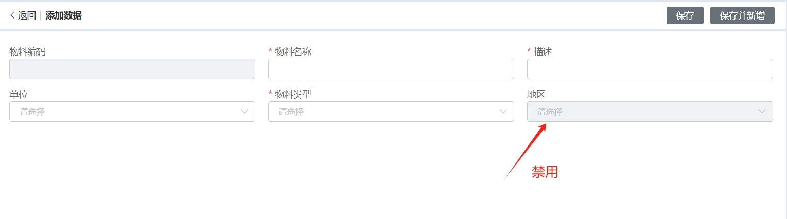
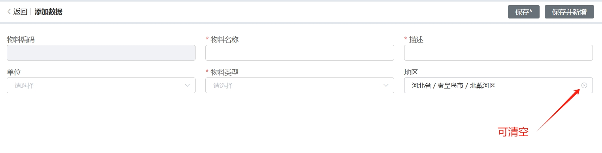
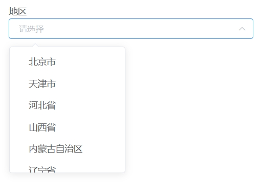
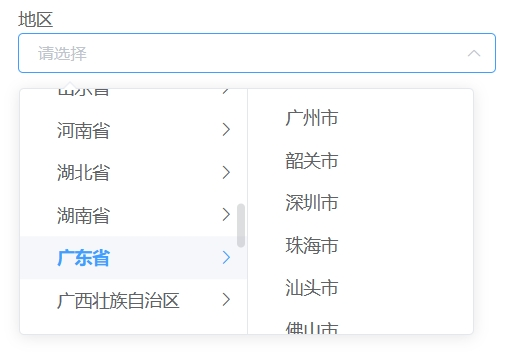
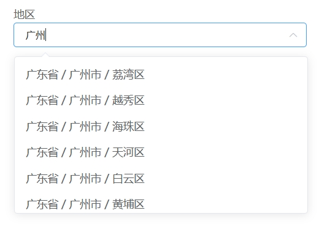
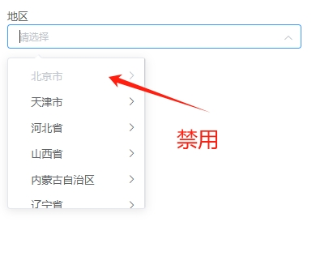
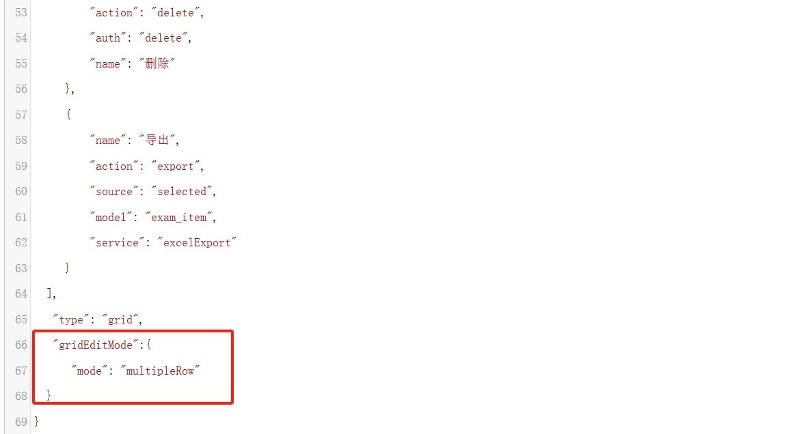
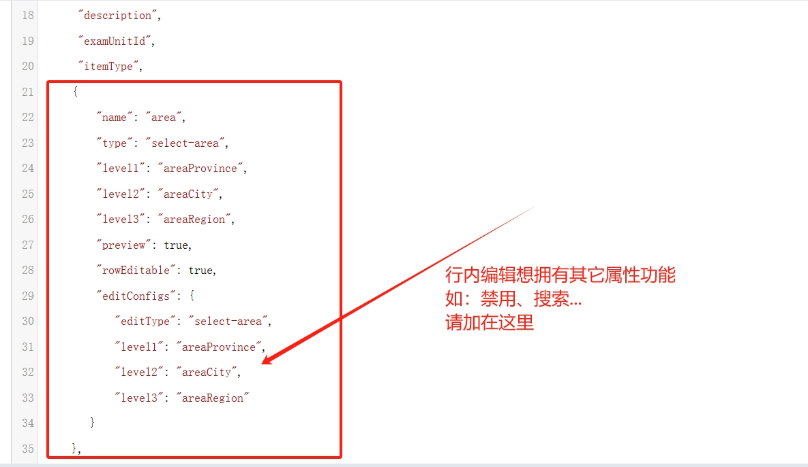

---
title: Cascader 省市区
date: 2024-05-30 14:07:39
permalink: /pages/285fac/
---

## 省市区选择器



## 基本用法

```js
{
  "name": "area",
  "type": "select-area",
  "level1": "areaProvince",
  "level2": "areaCity",
  "level3": "areaRegion"
}
```

字段说明：

- `area`：展示用字段，后端不做任何处理，仅供前端显示
- `type: "select-area"`：省市区组件的类型标识
- `level1 / areaProvince`：存放省的代码
- `level2 / areaCity`：存放市的代码
- `level3 / areaRegion`：存放区的代码

> **注意**：在 grid、form、search 视图中，需在对应的 `columns` 里将省市区字段隐藏：

```js
{ "name": "areaProvince", "hidden": true },
{ "name": "areaCity",     "hidden": true },
{ "name": "areaRegion",   "hidden": true }
```

## 属性配置

### 子菜单触发方式

默认点击展开，可改为 hover 触发，设置 `areaProps.expandTrigger: "hover"`。


```js
{
  "name": "area",
  "type": "select-area",
  "level1": "areaProvince",
  "level2": "areaCity",
  "level3": "areaRegion",
  "areaProps": { "expandTrigger": "hover" }
}
```

### 禁用

设置 `"disabled": true` 禁用整个组件。



```js
{
  "name": "area",
  "type": "select-area",
  "level1": "areaProvince",
  "level2": "areaCity",
  "level3": "areaRegion",
  "disabled": true
}
```

### 清空选项

设置 `"clearable": true` 显示清空按钮（默认值为 `true`）。



```js
{
  "name": "area",
  "type": "select-area",
  "level1": "areaProvince",
  "level2": "areaCity",
  "level3": "areaRegion",
  "clearable": true
}
```

### 显示完整路径

设置 `"showAllLevels": false` 只显示末级选项，默认 `true` 显示完整路径。

`showAllLevels: true`（默认）：


`showAllLevels: false`：


```js
{
  "name": "area",
  "type": "select-area",
  "level1": "areaProvince",
  "level2": "areaCity",
  "level3": "areaRegion",
  "showAllLevels": false
}
```

### 层级显示

通过 `"level"` 控制显示层级，默认为 `3`（省市区全部显示）。

`level: 1`（仅显示省）：



`level: 2`（显示省市）：



```js
{
  "name": "area",
  "type": "select-area",
  "level1": "areaProvince",
  "level2": "areaCity",
  "level3": "areaRegion",
  "level": 2
}
```

> **注意**：`level` 在 grid、form、search 视图中必须保持一致，否则回显会出现异常。

### 可搜索

设置 `"filterable": true` 启用选项搜索（默认值为 `true`）。



```js
{
  "name": "area",
  "type": "select-area",
  "level1": "areaProvince",
  "level2": "areaCity",
  "level3": "areaRegion",
  "filterable": true
}
```

### 禁用特定选项

通过 `format(vm, data)` 回调对数据进行改造，可禁用指定选项。以下示例禁用北京（code 为 `11`）：



```js
{
  "name": "area",
  "type": "select-area",
  "level1": "areaProvince",
  "level2": "areaCity",
  "level3": "areaRegion",
  "format": (vm, data) => {
    for (const item of data) {
      if (item.code == 11) {
        item.disabled = true
      }
    }
    return data
  }
}
```

## 表格视图配置（grid）

在 grid 视图中，设置 `"preview": true` 时只展示文本，不渲染下拉组件；不配置或设为 `false` 时显示组件。

```js
{
  "name": "area",
  "type": "select-area",
  "level1": "areaProvince",
  "level2": "areaCity",
  "level3": "areaRegion",
  "preview": true
}
```

## 行内编辑

**第一步**：在主表视图（如 `demo_exam_item_grid`）中配置行内编辑模式：



```js
"gridEditMode": {
  "mode": "multipleRow"
}
```

**第二步**：在对应字段上配置 `rowEditable` 和 `editConfigs`：



```js
{
  "name": "area",
  "type": "select-area",
  "level1": "areaProvince",
  "level2": "areaCity",
  "level3": "areaRegion",
  "preview": true,
  "rowEditable": true,
  "editConfigs": {
    "editType": "select-area",
    "level1": "areaProvince",
    "level2": "areaCity",
    "level3": "areaRegion"
  }
}
```

## Attributes

| 属性名        | 说明                                    | 类型     | 默认值 |
| ------------- | --------------------------------------- | -------- | ------ |
| level1        | 对应数据库"省"字段名                    | string   | -      |
| level2        | 对应数据库"市"字段名                    | string   | -      |
| level3        | 对应数据库"区"字段名                    | string   | -      |
| level         | 显示层级（1 / 2 / 3）                   | number   | 3      |
| areaProps     | 级联选择器 Props，见下方 Props 表       | object   | -      |
| placeholder   | 输入框占位文本                          | string   | 请选择 |
| filterable    | 是否可搜索选项                          | boolean  | true   |
| disabled      | 是否禁用                                | boolean  | false  |
| clearable     | 是否支持清空选项                        | boolean  | true   |
| showAllLevels | 输入框中是否显示选中值的完整路径        | boolean  | true   |
| format        | 数据转换回调，可修改或禁用选项          | function | -      |
| preview       | 在 grid 中只显示文本，不渲染组件        | boolean  | false  |
| rowEditable   | 是否开启行内编辑                        | boolean  | false  |
| editConfigs   | 行内编辑配置，指定编辑组件类型          | object   | -      |

### Props（areaProps 的可配置项）

| 属性名        | 说明                                   | 类型   | 可选值        | 默认值   |
| ------------- | -------------------------------------- | ------ | ------------- | -------- |
| expandTrigger | 次级菜单的展开方式                     | string | click / hover | click    |
| value         | 指定选项的值为选项对象的某个属性值     | string | -             | value    |
| label         | 指定选项标签为选项对象的某个属性值     | string | -             | label    |
| children      | 指定选项的子选项为选项对象的某个属性值 | string | -             | children |