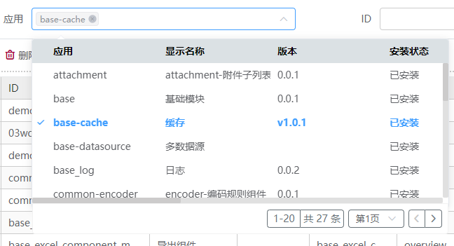
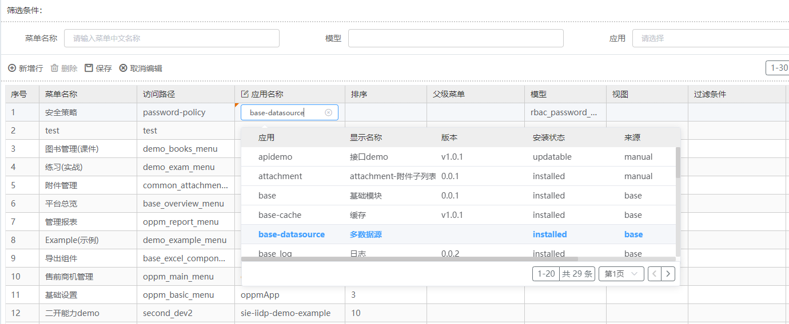

# 下拉多列选择器

当选项需要展示多列时，使用下拉多列选择器展示并选择内容。



## 基本用法

```js
{
    "type": "lookup-table",
    "name": "select",
    "text": "下拉多列选择器",
    "multiple": true,
    "searchModel": "meta_app",       // 查询表 model
    "searchService": "search",       // 查询表 service，默认为 search
    "countService": "customCount",   // 自定义查询总数接口，不配置默认为 count
    "pageSize": 20,
    "matchColumns": [                // 匹配要显示的表格列
        "name",
        "display_name",
        "version",
        "state",
        "source",
        "product"
    ],
    "searchKey": "name",             // 指定搜索字段
    "labelField": "display_name",    // 选中后显示的 label 字段，不配置则默认取 searchKey
    "selectedValue": "xxxx",         // 选中后实际使用的 value 字段，默认取 id
    "searchReqBefore": (params, searchVal) => {  // 请求发出前动态修改参数的钩子
      if (searchVal) {
        params.params.args.filter = ['|', '|', '|',
          ['state', 'like', `%${searchVal}%`],
          ['display_name', '=', searchVal],
          ['version', '=', searchVal],
          ['source', 'like', `%${searchVal}%`]
        ]
      }
      return params;
    },
    "custom": true // 视图配置与 fields 字段信息冲突时，以视图配置优先
}
```

## 搜索视图用法

```js
{
  "type": "search",
  "columns": [
    {
      "name": "app_ids",
      "type": "lookup-table",
      "multiple": true,
      "searchModel": "meta_app",
      "searchService": "search",
      "matchColumns": [
        "name",
        "display_name",
        "version",
        "state",
        "source",
        "product"
      ],
      "searchKey": "name",
      "labelField": "display_name", // 指定显示的label字段，不配置则默认取searchKey
      "selectedValue": "xxxx",
      "custom": true
    },
    {
      "name": "id",
      "displayName": "ID",
      "custom": true,
      "display": true
    },
    "display_name",
    "model"
  ]
}
```

## 表格行内编辑用法

在列配置的 `editConfigs` 中设置 `editType: "lookup-table"` 即可启用行内下拉多列选择。

```js
{
  "type": "grid",
  "gridEditMode":{ // 行内编辑配置
    "mode": "multipleRow",
    "rowBtns": ["update", "add", "delete"],
    "defaultCancelEdit": true,
    "addRowAutoFocus": false
  },
  "columns": [
    "display_name",
    "name",
    "app_name",
    {
      "name": "app_ids",
      "rowEditable": true,
      "editConfigs": { // 配置编辑类型
        "editType": "lookup-table", // 优先级更高app_name列在编辑时显示下拉多列选择框
        "searchModel": "meta_app", //查询表model
        "searchService": "search", //查询表service
        "viewType": "grid,form,search", // 查询视图类型
        "pageSize": 20,
        "matchColumns": [  //匹配要显示的表格列
          "name",
          "display_name",
          "version",
          "state",
          "source",
          "product"
        ],
        "searchKey": "name",             // 指定搜索字段
        "labelField": "display_name",    // 选中后显示的 label 字段，不配置则默认取 searchKey
        "selectedValue": "xxxx"          // 选中后实际使用的 value 字段，默认取 id
      }
    },
    "sequence",
    "parent_ids",
    "model",
    "view",
    "filter",
  ]
}
```

表格行内编辑下拉多列选择效果图


## Attributes

| 属性名           | 说明                                                      | 类型     | 必填 | 默认值  |
| ---------------- | --------------------------------------------------------- | -------- | ---- | ------- |
| searchModel      | 查询表 model                                              | String   | 是   |         |
| searchService    | 查询表 service                                            | String   | 否   | search  |
| countService     | 自定义查询总数接口                                        | String   | 否   | count   |
| matchColumns     | 匹配要显示的表格列                                        | Array    | 是   |         |
| searchKey        | 指定搜索字段；未配置 `labelField` 时，也作为 label 显示字段 | String   | 是   |         |
| labelField       | 选中后显示的 label 字段，优先级高于 `searchKey`           | String   | 否   |         |
| selectedValue    | 选中后实际使用的 value 字段                               | String   | 否   | id      |
| multiple         | 是否多选                                                  | Boolean  | 否   | false   |
| clearable        | 是否可清空                                                | Boolean  | 否   | true    |
| pageSize         | 分页条数                                                  | Number   | 否   | 20      |
| searchReqBefore  | 请求发出前动态修改参数的钩子函数，须返回修改后的 params   | Function | 否   |         |
| viewType         | 行内编辑时指定查询视图类型（如 `grid,form,search`）       | String   | 否   |         |
| custom           | 视图配置与 fields 字段信息冲突时，以视图配置优先          | Boolean  | 否   | false   |

## Events

| 事件名称      | 说明       | 回调参数                 |
| ------------- | ---------- | ------------------------ |
| changeHandler | 变更时触发 | (value: string / number) |
