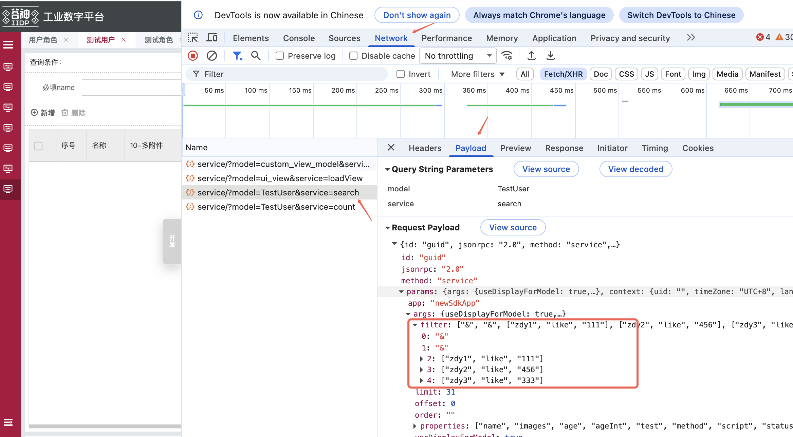

# 全局方法

查看平台插件版本：`techPluginsVersion`

# window.tech 全局公用变量

```js
window.tech.userInfo; // 当前登录的用户信息

window.tech.templateApp; // 模板应用

window.tech.env; // 当前环境
```

# window.Tech 公共 API 方法

## httpMeta 调用元模型 API ⭐ 常用推荐

### 基本用法

```js
window.Tech.httpMeta({
  data: {
    // 参考元模型后端的传参规范
    params: {
      args: {
        filter: [],
        limit: 31,
        offset: 0,
        properties: ["name", "login", "mobile", "email", "status", "remark"],
      },
      model: "rbac_user",
      service: "search",
      app: "base", // 当前应用名称，默认'base'
    },
  },
  // showMsg: false // 调用接口后是否显示Message提示窗 设置为false时不显示 默认为true
}).then((res) => console.log(res));
```

### 参数属性讲解

| **属性**     | **值类型** | **默认值**   | **说明**                                                                                                                           |
| ------------ | ---------- | ------------ | ---------------------------------------------------------------------------------------------------------------------------------- |
| type         | String     | 'meta'       | 'meta'调用元模型 API，'api'同 axios 的使用方式                                                                                     |
| data         | Object     | {必要的参数} | 参考元模型后端的传参规范                                                                                                           |
| directReturn | Boolean    | false        | 为 true 时可百分百获得接口返回值                                                                                                   |
| showMsg      | Boolean    | true         | 调用接口后是否显示 Message 提示窗 设置为 false 时不显示                                                                            |
| tips         | Object     | 增删改的提示 | 自定义方法成功失败提示，<br/>{<br/> tips:{<br/> 'service 名称': {<br/> success: '成功提示', error: '失败提示' <br/> }<br/> }<br/>} |

## cookie 操作 ⭐ 常用推荐

### 设置 cookie

`window.Tech.cookies.set(key, value, options)`

```js
window.Tech.cookies.set("info", { a: 1 }, { expires: 7 });
// 设置token
window.Tech.token.set(token);
```

| 属性名          | 说明                                             | 类型                         | 默认值                       |
| --------------- | ------------------------------------------------ | ---------------------------- | ---------------------------- |
| key             | cookie 的 key                                    | String                       | -                            |
| value           | cookie 储存的值                                  | String、Number、Object、Bool | -                            |
| options.expires | 有效期，Number 时，单位为天；Date 类型时指定时间 | Number、Date                 | -                            |
| options.path    | cookie 的可见地址                                | String                       | "/"，当前地址                |
| options.domain  | cookie 的可见的域名                              | String                       | 创建此 cookie 的域名和子域名 |
| options.secure  | 是否支持 https 传输                              | Boolean                      | false                        |

### 获取 cookie

`Tech.cookies.get(key)`

```js
window.Tech.cookies.get("info");
// 获取token
window.Tech.token.get();
```

### 移除 cookie

`window.Tech.cookies.remove(key)`

```js
window.Tech.cookies.remove("info");
// 移除token
window.Tech.token.remove();
```

## reactiveFn vue3 响应式

`window.Tech.reactiveFn`

## watchFn watch 监听的方法

`window.Tech.watchFn`

例：在登陆页的登陆按钮监听按钮文案变化

```js
// 在首页的登陆按钮
let loginBtn = tech_app.page.getNode("button_meta_login_btn"); // 获取登陆按钮
let loginBtnDataReactive = window.Tech.reactiveFn(loginBtn.data); // 登陆按钮data配置转响应式
if (loginBtn.data._myWatch) {
  // 检查之前是否有对应watch 有则先销毁
  loginBtn.data._myWatch();
  loginBtn.data._myWatch = null;
}
// 建watch
loginBtn.data._myWatch = window.Tech.watchFn(
  () => loginBtnDataReactive.value,
  (val) => {
    console.log(" === watch val == ", val);
  },
  { deep: true, immediate: true },
);
// 使用$set重写beforeDestroy 在节点销毁时候一并回收watch 不然会有内存溢出
Tech.$set(loginBtn.data, "beforeDestroy", async (vm) => {
  if (Super?.beforeDestroy) {
    Super.beforeDestroy();
  }
  console.log(" === in outer beforeDestroy ");
  if (vm.data._myWatch) {
    // 销毁watch 不然有内存溢出
    vm.data._myWatch();
    vm.data._myWatch = null;
  }
});

// f12 console 运行修改按钮文案
loginBtn.data.value = "11";

// 会打印出
// === watch val == 11
```

## tBus 监听通讯方法

`window.Tech.tBus`

例：在登陆页的登陆按钮监听按钮文案变化

```js
// 在首页的登陆按钮
let loginBtn = tech_app.page.getNode("button_meta_login_btn"); // 获取登陆按钮

// 定义监听触发方法
let myOnFn = (val) => {
  console.log(" === on value == ", val);
  loginBtn.data.value = val.value;
};
// 监听
Tech.tBus.$on("checkLoginBtn", myOnFn);

// 使用$set重写beforeDestroy 在节点销毁时候一并回收watch 不然会有内存溢出
Tech.$set(loginBtn.data, "beforeDestroy", async (vm) => {
  if (Super?.beforeDestroy) {
    Super.beforeDestroy();
  }
  // 关闭监听
  window.Tech.tBus.$off("checkLoginBtn", myOnFn);
});

// f12 console 运行修改按钮文案
// 发送变化
Tech.tBus.$emit("checkLoginBtn", { value: "11" });

// 会打印出
// === on value == 11
```

## 带 Super 继承重新定义变量属性方法

> 需要 t-core 版本 2.3.3 以上

`window.Tech.$set`

例：对象变量 a 的属性 b.c（支持多层级路径，也支持单层级）是一个方法

> **注意：** Super 里面不会包含 items 属性，不然会很耗性能

```js
// 可直接拷贝到 console运行：
let a = {
  b: {
    c: async (res) => {
      console.log("src run", res);
      return res;
    },
  },
};

// 第1次重置 b.c属性方法 里面用Super可以拿回原来对象(一次重置前)
Tech.$set(
  a,
  "b.c",
  async (res) => {
    console.log("run 1 begin", res);
    try {
      console.log(" === Scope == ", Scope);
    } catch (e) {}
    let distRes = await Super.b.c(res); // Super是上一次的a对象
    console.log("run 1 end", distRes);
    return distRes;
  },
  { a: 1 },
); // 第四个参数为 可选参数 提供 第三个参数方法里面 Scope 调出来使用 例如 Scope.a

// 第2次重置 b.c属性方法 里面用Super可以拿回上一次重置对象(二次重置前)
Tech.$set(
  a,
  "b.c",
  async (res) => {
    console.log("run 2 begin", res);
    try {
      console.log(" === Scope == ", Scope);
    } catch (e) {}
    let distRes = await Super.b.c(res); // Super是上一次的a对象
    console.log("run 2 end", distRes);
    return distRes;
  },
  { a: 2 },
); // 第四个参数为 可选参数 提供 第三个参数方法里面 Scope 调出来使用 例如 Scope.a

// 运行
a.b.c({ t: 2 });

// 运行结果
/*
run 2 begin {t: 2} 2
run 1 begin {t: 2} 1
src run {t: 2}
run 1 end {t: 2}
run 2 end {t: 2}
*/
// 与传统继承运行顺序一样
```

## 带 Super 继承链路跟踪方法

> 需要 t-core 版本 2.3.3 以上，且只在 `npm start` 开发环境上生效

`window.Tech.$trace`

例：对象变量 a 的属性 b.c 的方法重置链路

```js
Tech.$trace(a, "b.c");

// 运行结果
/*
 == obj ==  {b: {…}}
 == key ==  b.c
 顺序  2 async (res) => {
	console.log('run 2 begin', res);
	let distRes = await Super.b.c(res); // Super是上一次的a对象
	console.log('run 2 end', distRes);
	return distRes
}
 顺序  1 async (res) => {
	console.log('run 1 begin', res);
	let distRes = await Super.b.c(res); // Super是上一次的a对象
	console.log('run 1 end', distRes);
	return distRes
}
*/
// 可以看到继承链运行函数逻辑顺序
```

## 获取当前标准页所有结构的上下文

当前 vm 标准页的搜索栏、主表格、主表单、子表、添加关联、抽屉表单的所有上下文信息。

返回的结构如下：{ search: search 上下文, grid: grid 上下文, ... }

```js
// 返回的数据详细内容参考扩展钩子上下文
window.Tech.$page(xxxx); // 参数为id和vm都支持 如果是字符串就当id处理
```

## 获取参数的业务上下文

返回当前 vm 的 biz 上下文 例如 tab 里面就返回当前子 tab 的相关信息

```js
// 返回的数据详细内容参考扩展钩子上下文
window.Tech.$biz(xxxx); // 参数为id和vm都支持 如果是字符串就当id处理
```

## Message 弹出提示语 ⭐ 常用推荐

`window.ELEMENT.Message(options)`

```js
// 弹出提示语,简写，默认info类型
window.ELEMENT.Message("请选择要删除的数据");

// 成功弹窗简写
window.ELEMENT.Message.success("请选择要删除的数据");

// 警告弹窗简写
window.ELEMENT.Message.warning("请选择要删除的数据");

// 错误弹窗简写
window.ELEMENT.Message.error("请选择要删除的数据");

// 普通调用
window.ELEMENT.Message({
  message: "请选择要删除的数据",
  type: "info",
  // 更多配置请下面看属性表
});
//可展开详情
window.ELEMENT.Message({
  message: "消息",
  showMore: "消息详情内容",
});
```

弹出提示语 options 的属性

| 属性名      | 说明                                          | 类型     | 默认值 |
| ----------- | --------------------------------------------- | -------- | ------ |
| message     | 消息文字                                      | String   | -      |
| type        | 类型                                          | String   | info   |
| iconClass   | 自定义图标的类名，会覆盖 type                 | String   | -      |
| customClass | 自定义类名                                    | String   | -      |
| duration    | 显示时间, 毫秒。设为 0 则不会自动关闭         | Number   | 3000   |
| showClose   | 是否显示关闭按钮                              | Boolean  | false  |
| center      | 文字是否居中                                  | Boolean  | false  |
| onClose     | 关闭时的回调函数, 参数为被关闭的 message 实例 | Function | -      |
| offset      | 距离窗口顶部的偏移量                          | Number   | 20     |
| showMore    | 可展开消息详情内容                            | String   | -      |

### 全局配置 duration 弹出提示展示时间

前端工程 apps.json

```js
"messageDuration": 5000,      //所有提示语展示时间
"errMessageDuration": 10000,  //错误提示语展示时间 另可配置值为'forever' 永久显示，需手动点击关闭按钮才关闭
"errMessageShowClose": true   //错误提示语是否显示关闭按钮
```

## 全局方法调用弹窗

```js
window.Tech.confirmbox({
  width: "45%",
  title: "提示",
  items: [
    {
      id: "custom_id",
      value: "确定这样操作吗?",
      type: "text",
    },
  ],
  options: {
    confirm: (close) => {
      // 确定按钮
      close();
    },
    cancel: (close) => {
      // 取消按钮
      close();
    },
  },
});
```

| 属性名  | 说明                   | 类型   | 默认值 |
| ------- | ---------------------- | ------ | ------ |
| width   | 弹窗宽度               | string | 50%    |
| title   | 弹窗标题               | string | -      |
| items   | 弹窗内部视图           | object | -      |
| options | 点击确定取消执行的函数 | object | -      |

## Toast 轻提示

`window.ELEMENT.Toast.show(options)`

```js
// 提示语,简写
window.ELEMENT.Toast.show("轻提示内容");

// 普通调用
window.ELEMENT.Toast.show({
  message: "轻提示内容",
  icon: "iconfont icon-guding1",
  iconStyle: {}, // 图标样式
  duration: 3000, // 提示框维持3秒显示 默认2.5秒
});
```

## Loading 加载

`window.ELEMENT.Loading.service(options)`

```js
let loadingInstance = window.ELEMENT.Loading.service(options); // options配置详见下表
// 关闭loading
loadingInstance.close();
```

options 的属性

| 属性名      | 说明                                                                                                                                      | 类型          | 默认值        |
| ----------- | ----------------------------------------------------------------------------------------------------------------------------------------- | ------------- | ------------- |
| target      | Loading 需要覆盖的 DOM 节点。可传入一个 DOM 对象或字符串；若传入字符串，则会将其作为参数传入 document.querySelector 以获取到对应 DOM 节点 | object/string | document.body |
| body        | 遮罩插入至 DOM 中的 body 上                                                                                                               | boolean       | false         |
| fullscreen  | 是否全屏                                                                                                                                  | boolean       | true          |
| lock        | 锁定屏幕的滚动                                                                                                                            | boolean       | false         |
| text        | 显示在加载图标下方的加载文案                                                                                                              | string        | -             |
| spinner     | spinner                                                                                                                                   | string        | -             |
| background  | 遮罩背景色                                                                                                                                | string        | -             |
| customClass | Loading 的自定义类名                                                                                                                      | string        | -             |

## Date 时间、日期处理

默认引入 moment.js 库，更多使用方式参考文档：http://momentjs.cn/

```js
//调用方式
window.Tech.moment("12-25-1995", "MM-DD-YYYY");
window.Tech.moment(new Date()).format("YYYY-MM-DD");
```

|         输入 | 示例           | 描述                                          |
| -----------: | :------------- | :-------------------------------------------- |
|       `YYYY` | 2014           | 4 或 2 位数字的年份                           |
|         `YY` | 14             | 2 位数字的年份                                |
|          `Y` | -25            | 带有任意数字和符号的年份                      |
|          `Q` | 1..4           | 年份的季度。将月份设置为季度的第一个月        |
|     `M` `MM` | 1..12          | 月份数字                                      |
| `MMM` `MMMM` | Jan..December  | 语言环境中的月份名称，由 moment.locale() 设置 |
|     `D` `DD` | 1..31          | 月的某天                                      |
|         `Do` | 1st..31st      | 月的某天，带序数                              |
| `DDD` `DDDD` | 1..365         | 年的某天                                      |
|          `X` | 1410715640.579 | Unix 时间戳                                   |
|          `x` | 1410715640579  | Unix 毫秒时间戳                               |

|           输入 | 示例   | 描述                                      |
| -------------: | :----- | :---------------------------------------- |
|       `H` `HH` | 0..23  | 小时（24 小时制）                         |
|       `h` `hh` | 1..12  | 小时（使用 `a A` 的 12 小时制）           |
|       `k` `kk` | 1..24  | 小时（从 1 到 24 的 24 小时制）           |
|        `a` `A` | am pm  | 上午或下午（单一字符 `a p` 也被视为有效） |
|       `m` `mm` | 0..59  | 分钟                                      |
|       `s` `ss` | 0..59  | 秒钟                                      |
| `S` `SS` `SSS` | 0..999 | 带分数的秒钟                              |
|       `Z` `ZZ` | +12:00 | 从 UTC 偏移为 +-HH:mm、+-HHmm 或 Z        |

## Base64 编码解码

```js
// Base64编码
window.Tech.Base64.Base64.encode(str);
// Base64解码
window.Tech.Base64.Base64.decode(str);
```

## arrayParseTree 链式数组转换为树形结构

`window.Tech.utils.arrayParseTree(list, options, autoParent)`

将链式数组转换为树组件可以解析的树形结构。

```html
<template>
  <el-tree :data="treeData"></el-tree>
</template>
<script>
  export default {
    data() {
      return {
        list: [],
        treeData: [],
      };
    },
    created() {
      this.treeData = window.Tech.utils.arrayParseTree(
        list,
        {
          key: "id",
          children: "children",
          parentKey: "parentId",
        },
        false,
      );
    },
  };
</script>
```

| 属性名     | 说明                                                                                                                                     | 类型    | 可选值 | 默认值 |
| ---------- | ---------------------------------------------------------------------------------------------------------------------------------------- | ------- | ------ | ------ |
| list       | 链式数组                                                                                                                                 | Array   |        |        |
| options    | 定义转换字段<br/> {<br/> key: 依据（默认 id）, <br/> children: 子属性（默认 children）,<br/> parentKey: 链式依据（默认 parentId）<br/> } | Object  |        |        |
| autoParent | 是否自动补全不存在的父级                                                                                                                 | Boolean |        | false  |

## js 对象转 json

`window.Tech.jsToJson(data)`

```js
let content = "{a:()=>{console.log(111)}}";
let fn = new Function("return " + content);
let data = fn();
let distContent = window.Tech.jsToJson(data) || "{}"; // json
```

## 深拷贝

`window.Tech._cloneDeep(data)`

```js
const data = window.Tech._cloneDeep({ a: 1 });
```

## mergeWith 合并属性

`window.Tech.mergeWith(object, sources, customizer)`

> 递归合并来源对象的自身和继承的可枚举属性到目标对象。
> 将 object2 的属性合并到 object1 中，结果改变 object1 对象

```js
const object1 = {
  amit: [{ susanta: 20 }, { durgam: 40 }],
};
const object2 = {
  amit: [{ chinmoy: 30 }, { kripamoy: 50 }],
};
// console.log(window.Tech.mergeWith(object1, object2))
// return {'amit':[{'susanta':20, 'chinmoy':30 }, {'durgam':40, 'kripamoy':50}]}
```

**自定义方法**

```js
function customizer(obj, src) {
  if (Array.isArray(obj)) {
    return obj.concat(src);
  }
}
const object = {
  amit: [{ susanta: 20 }, { durgam: 40 }],
};
const other = {
  amit: [{ chinmoy: 30 }, { kripamoy: 50 }],
};
console.log(window.Tech.mergeWith(object, other, customizer));
// {'amit':[{'susanta':20 }, {'durgam':40}, {'chinmoy':30}, {'kripamoy':50 }]}
```

| 属性名     | 说明             | 类型     | 可选值                                                     | 默认值 |
| ---------- | ---------------- | -------- | ---------------------------------------------------------- | ------ |
| object     | 需要修改的对象   | Object   |                                                            |        |
| sources    | 数据源           | Object   |                                                            |        |
| customizer | 自定义赋值的函数 | Function | 方法的参数：objValue, srcValue, key, object, source, stack | -      |

## addIdPre 添加 id 前缀

`window.Tech.addIdPre(view, idPre)`

给视图的 id 属性添加前缀（包含子节点），可以给不同模块、业务添加 id 前缀，以免 id 有冲突

```js
const view = {
  type:'container',
  id:'container',
  items:[
    {
      type:'button',
      id:'button'
      text:'按钮'
    }
  ]
}

const newView = window.Tech.addIdPre(view, 'project_')

// 生成的视图
//{
//  type:'container',
//  id:'project_container',
//  items:[
//    {
//      type:'button',
//      id:'project_button'
//      text:'按钮'
//    }
//  ]
//}
```

| 属性名 | 说明                   | 类型   | 可选值 | 默认值 |
| ------ | ---------------------- | ------ | ------ | ------ |
| view   | 需要添加 id 前缀的视图 | Object |        |        |
| idPre  | 前缀                   | String |        |        |

<!-- ## formFormat form 视图处理

### initForm 获取 formItems

#### vm.$cmd.meta.formFormat.initForm(`vm`,`view`,`fields`)

- 根据接口规则获取 formItem 的视图，默认外层添加 row 组件
- `vm`：当前调用此方法的视图实例，一般在视图生命周期方法中的到，或者 bind 事件中得到，例如`created:(vm)=>{}`,`bind_on_xxx:({self:vm}=params)=>{}`,更多获取方法请查看[框架](/dev/document/3、框架/3.1、节点 node.html)部分文档

```js
// 获取initForm实例
const formNode = vm.$cmd.meta.formFormat.initForm(
  vm,
  viewConfig?.views?.form,
  viewConfig?.fields
);
// 获取form中每一项的视图，默认外层添加row组件
const formItems = formNode.items;
// console.log('formItems:',formItems)
// 获取form中每一项的视图，只要formItems列表
// const formItems = formNode.items[0].items
```

参数：
| 属性名 | 说明 | 类型 | 可选值 | 默认值 |
| ----- |----- |----- |----- |----- |
|vm |当前视图实例 |Object | | |
|view |loadview 接口返回的 form 视图（views.form） |Object | | |
|fields |loadview 接口返回的 fields |Object | | |

返回结果：
| 属性名 | 说明 | 类型 | 可选值 | 默认值 |
| ----- |----- |----- |----- |----- |
|items |解析后的 form.items 中的视图，默认包一层 row |Array | | |
|disabledRules |是否有校验规则 |Boolean | | |
|defaultSelfAdaptionW |是否有自动计算每项 item 的宽度 |Boolean | | | -->

<!-- ### dealDefaultValue 设置 form 默认值

#### vm.$cmd.meta.formFormat.dealDefaultValue(`formView`,`view`,`fields`)

根据基础应用的接口视图规则，设置表单项目的默认值

> form 中的 defaultValue 在 form 实例第一次生成时有效，form 实例生成后无法修改 defaultValue，如需修改，请参使用 dataSource.form 来设置表单的值

```js
// 给FormItem添加默认值
vm.$cmd.meta.formFormat.dealDefaultValue(formView, view, fields);
```

参数：
| 属性名 | 说明 | 类型 | 可选值 | 默认值 |
| ----- |----- |----- |----- |----- |
|formView |form 的视图对象 |Object | | |
|view |loadview 接口返回的 form 视图（views.form） |Object | | |
|fields |loadview 接口返回的 fields |Object | | |

返回结果：`formView`对象，其中的 formItem 对象中添加 defaultValue 属性

### handleSearchData 获取 filter 数据

#### vm.$cmd.meta.formFormat.handleSearchData(`formData`,`formItems`)

获取 search 接口的 filter 格式数据

```js
const filterArr = vm.$cmd.meta.formFormat.handleSearchData(formData, formItems);
// console.log(filterArr)
```

参数：
| 属性名 | 说明 | 类型 | 可选值 | 默认值 |
| ----- |----- |----- |----- |----- |
|formData |表单数据 |Object | | |
|formItems |form 中 items 的视图配置 |Array | | |

返回结果：search 接口中 filter 二维数组格式的数据,例：`[&,["name","like","%test%"],["age","=","18"]]` -->

<!-- ### handleEmptyData 重置空值

#### vm.$cmd.meta.formFormat.handleEmptyData(`vm`, `formData`,`fields`)

处理表单的空值，非'auto'、'string'、'text'的数据类型设置为 null

```js
const formFormatData = vm.$cmd.meta.formFormat.handleEmptyData(
  vm,
  formData,
  fields
);
// console.log(formFormatData)
```

参数：
| 属性名 | 说明 | 类型 | 可选值 | 默认值 |
| ----- |----- |----- |----- |----- |
|vm |当前视图实例 |Object | | |
|formData |表单数据 |Object | | |
|fields |loadview 接口返回的 fields |Object | | |

返回结果：formData 对象，把非'auto'、'string'、'text'数据类型的空值设置为 null -->

<!-- ### getSearchTagsFilter 获取 tags 数据

#### vm.$cmd.meta.formFormat.getSearchTagsFilter(`vm`, `formData`,`fields`)

获取表单数据搜索的标签数据结构

```js
const formTagsData = vm.$cmd.meta.formFormat.getSearchTagsFilter(
  vm,
  formData,
  fields
);
// console.log(formFormatData)
```

参数：
| 属性名 | 说明 | 类型 | 可选值 | 默认值 |
| ----- |----- |----- |----- |----- |
|vm |当前视图实例 |Object | | |
|formData |表单数据 |Object | | |
|fields |loadview 接口返回的 fields |Object | | |

返回结果：tags 组件的[tags 属性](/dev/document/4、组件/4.1、基础组件/4.1.22、Tags 标签.html)结构，`{name: "name",text: "角色名称",value: "123"}` -->

<!-- ## tableFormat table 视图处理

### formatColumns 获取 columns 视图

#### vm.$cmd.meta.tableFormat.formatColumns({`view` ,`fields`}=`options`)

获取表格 columns 的视图数据

```js
const tableColumns = vm.$cmd.meta.tableFormat.formatColumns({ view, fields });
// console.log(tableColumns)
```

参数：
| 属性名 | 说明 | 类型 | 可选值 | 默认值 |
| ----- |----- |----- |----- |----- |
|options.view |loadview 接口返回的 grid 视图（views.grid） |Object | | |
|options.fields |loadview 接口返回的 fields |Object | | |

返回结果（Array）：table 组件中的[columns 属性](/dev/document/4、组件/4.1、基础组件/4.1.3、Table 表格.html#\_1-5、attributes)

### formatToolbarBtns 获取 toolbar 按钮视图

#### vm.$cmd.meta.tableFormat.formatToolbarBtns(`vm`,{`view` ,`permissions`}=`options`)

获取表格工具栏按钮组的视图数据

```js
const tableToolbarBtns = vm.$cmd.meta.tableFormat.formatToolbarBtns(vm, {
  view,
  permissions,
});
// console.log(tableToolbarBtns)
```

参数：
| 属性名 | 说明 | 类型 | 可选值 | 默认值 |
| ----- |----- |----- |----- |----- |
|vm |当前视图实例 |Object | | |
|options.view |loadview 接口返回的 grid 视图（views.grid） |Object | | |
|options.permissions |loadview 接口返回的 permissions |Array | | |

返回结果（Object）：表格工具栏按钮组的视图数据 -->

## goTo 跳转页面

### vm.$cmd.meta.goTo(vm, params, options)

- path：跳转页面的 url
- 可配置完整路径，eg：/base/rbac_root_menu/rbac_role_menu,
- 也可配置最后的路径，会匹配所有菜单，拼接匹配到的第一个菜单，例如：rbac_role_menu

```js

const options = {
  removeSelf: false, // 是否移除当前页面 默认false
  removeTarget: true // 是否先移除目标页面 默认true
}

// 前端扩展
const params = { // 到表单
  path: '/base/rbac_root_menu/rbac_role_menu',
  query: {
    clickType: 'preview',
    view: 'form',
    id: 'xxxxxxxx'
  }
}
const params = { // 到主页面
  path: '/base/rbac_root_menu/rbac_role_menu',
   query: {
     view: "grid",
      searchParams: { // 查询参数（非必填）
        name : "小明",
        age: "20"
      }
   }
}
const params = { // 到表单 新增情况
  path: '/base/rbac_root_menu/rbac_role_menu',
  query: {
    clickType: 'add',
    view: 'form',
    id: 'null'
  }
}
vm.$cmd.meta.goTo(vm, params, options)

// 后端视图-表格操作列按钮配置-到表单
{
  "name": "测试跳转",
  "action": "jumpView",
  "params": {
    "path": "/base/rbac_root_menu/rbac_role_menu",
    "query": {
      "clickType": 'preview',
      "view": "form",
      "id": "$row.id"
    }
  }
}
// 后端视图-表格操作列按钮配置-到主页面
{
  "name": "测试跳转",
  "action": "jumpView",
  "params": {
    "path": "/base/rbac_root_menu/rbac_role_menu",
    "query": {
      "view": "grid",
      "searchParams": { // 表格search查询参数（非必填）
        "name" : "$row.id",
        "age": "20"
      }
    }
  }
}

// path只配置最后一段路径，全菜单匹配对应的页面
// appName可配置跳转的菜单所属app名称，若不配置则全量匹配
const params = {
  path: 'mbm_aps_mrp_item_replace_menu',
  appName: "mbm-center-aps-mrp",
  query: {
    clickType: 'add',
    view: 'form',
    id: 'null'
  }
}
vm.$cmd.meta.goTo(vm, params, options)


// goto跳转至审批流审批详情表单 - isApproval 标识
vm.$cmd.meta.goTo(vm, {
  path: '/base/workflow/handle/task',
  query: {
    view: 'form',
    // id: currData?.id,
    id: '05gbruitzrc58',
    options: {
      args:
        {
          ids: ['05gbruitzrc58'],
          app: 'workflow',
        } || {},
      model: 'wf_process_ui_view',
      service: 'loadView',
      id: '05gbruitzrc58',
      // row: currData,
      row: {},
    },
    isApproval: true, // 审批流表单标识
  },
})
```

参数：
| 属性名 | 说明 | 类型 | 可选值 | 默认值 |
| ----- |----- |----- |----- |----- |
|vm | 当前视图实例 | Object | 必填 | |
|params | 跳转页面信息 | Object | 必填 | |
|options | 选项 | Object | 非必填 | |
|options.removeSelf | 是否移除当前页面 默认 false | Boolean | 非必填 | |
|options.removeTarget | 是否先移除目标页面 默认 true | Boolean | 非必填 | |
|params.path | 跳转页面的 url | String | 必填 | |
|params.appName | 跳转页面的所属 app | String | 非必填 | |
|params.query | 跳转页面携带的参数 | Object | 非必填,不配置时为跳转列表 | |
|params.query.view | 跳转页面的的视图（grid: 主页,form：主表单视图） | String | | |
|params.query.id | 跳转页面为主表单时的数据 id | String | | |
|params.query.clickType | 跳转页面为主表单时的状态 | String | add/edit/preview | |
|params.query.searchParams | 跳转页面带参数查询 | Object | 非必填 | |

# tech_app 公共 API 方法

## 根据 id 获取视图节点

```js
tech_app.page.getNode("xxxx"); // 参数为视图的 id
// 获取视图节点的父节点
tech_app.page.getNode("xxxx").parent;
```

## 查看扩展列表

```js
let extendView = tech_app.extendView;
```

## 全局添加样式

> 第一个参数：添加全局样式的唯一标识 或 前端节点 vm
>
> 若使用全局标识则比较消耗前端渲染性能；如果使用前端节点 vm（如 `tech_app.page.getNode('xxx')`），则按节点生命周期回收样式

```js
tech_app.utils.addClass('添加全局样式的唯一标识 或 前端节点vm', `选择器{样式}`)
例：
tech_app.utils.addClass(
  'hide-tab-cache-class', // '添加全局样式的唯一标识' 或 前端节点vm 例如 tech_app.page.getNode('xxx')
  `#tab-rbac_user_menu_tab_role_ids_container_main_content {display: none;}`
)
```

<!-- # tech_app 公共 API 方法

## tech_app.page

### tech_app.page.getNode() 获取视图节点

参数：
| 属性名 | 说明 | 类型 | 可选值 | 默认值 |
| ----- |----- |----- |----- |----- |
| nodeId | 目标视图的 id | String | | |

返回结果：
| 属性名 | 说明 | 类型 | 可选值 | 默认值 |
| ----- |----- |----- |----- |----- |
| 节点对象 | 前端视图的配置 | Object | | |

### tech_app.page.getNode().parent 获取视图节点的父节点

返回结果：
| 属性名 | 说明 | 类型 | 可选值 | 默认值 |
| ----- |----- |----- |----- |----- |
| 节点对象 | 前端视图的配置 | Object | |

## tech_app.extendView

查看扩展列表

## tech_app.utils.addClass

全局添加样式

```js
tech_app.utils.addClass('添加全局样式的唯一标识', `选择器{样式}`)
例：
tech_app.utils.addClass(
  'hide-tab-cache-class',
  `#tab-rbac_user_menu_tab_role_ids_container_main_content {display: none;}`
)

``` -->

## 扩展全局调用接口钩子

### 全局接口请求前

```js
reset_http_req_extend_extend: { // 根据自己业务定义扩展名 例如 reset_http_req_extend_extend
    type: 'custom',
    selector: {
      attr: 'id',
      value: 'page_meta_index'
    },
    beforeOperate: (app, config, options) => {
      Tech.$set(Tech, 'globalApiReq', (conf) => {
        try {
          if (
            conf?.headers?.common?.Accept &&
            conf?.headers?.common?.Accept?.startsWith('application/json')
          ) {
            let data = conf?.data;
            let isStr = false;
            if (Object.prototype.toString.call(conf?.data) === '[object String]') {
              isStr = true;
              data = JSON.parse(conf.data);
            }
            if (data?.params?.model === 'xxx321') {
              data.params.model = 'xxx123'; // 按需处理请求前参数
            }
            if (isStr) {
              conf.data = JSON.stringify(data);
            }
          }
        } catch (e) {}

        if (Super.globalApiReq) {
          // 若有上一次的调用上一次的
          conf = Super.globalApiReq(conf);
        }
        return conf;
      });
      return config.view;
    },
    view: {}
  }
```

### 全局接口请求后

```js
reset_http_res_extend_extend: { // 根据自己业务定义扩展名 例如 【xxapp】_【xx业务】reset_http_res_extend_extend
    type: 'custom',
    selector: {
      attr: 'id',
      value: 'page_meta_index'
    },
    beforeOperate: (app, config, options) => {
      Tech.$set(Tech, 'globalApiRes', (res) => {
        try {
          res.xxaa = 123 // 按需修改返回结果
        } catch (e) {}

        if (Super.globalApiRes) {
          // 若有上一次的调用上一次的
          res = Super.globalApiRes(res);
        }
        return res;
      });
      return config.view;
    },
    view: {}
  }
```

## 添加过滤条件

`window.Tech.addFilter`

方便在[扩展](/pages/287053/)或者[业务钩子](/pages/43dd47/#查询)上修改，search 接口的 filter 入参时候加过滤条件



- **第一个参数**：第一个过滤条件数组，例如：`[['a','=',1]]`
- **第二个参数**：第二个过滤条件数组，例如：`['|',['c','=',1],['d','=',2]]`
- **第三个参数**：两个过滤条件的合并关系，`'&'` 与关系、`'|'` 或关系，不传默认 `'&'`
- **返回**：合并后的过滤条件数组，例如：`['&',['a','=',1],'|',['c','=',1],['d','=',2]]`

```js
window.Tech.addFilter(filterArr, newFilterArr, "&");

// 例：
let a = [["a", "=", 1]];
let b = ["|", ["c", "=", 1], ["d", "=", 2]];
let c = window.Tech.addFilter(a, b, "&");
console.log(c);
// c打印出来为：['&',['a','=',1],'|',['c','=',1],['d','=',2]]
```
