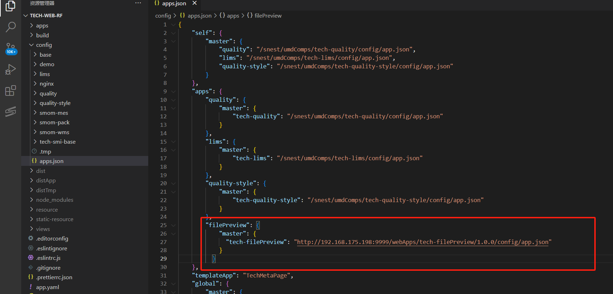
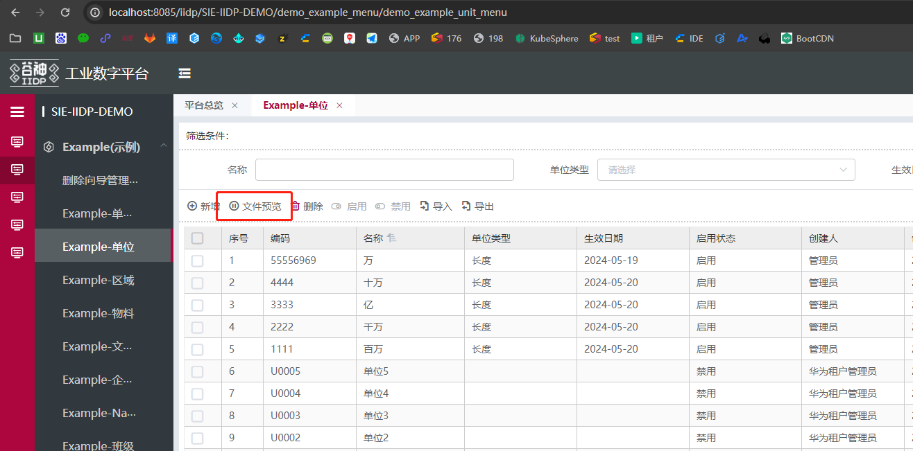

# 1.文件预览说明

仅支持 PDF、docx、xlsx 后缀文件和图片(jpg、png、gif 等)文件预览

## 2.文件预览使用简介

### 2.1  文件预览基础引入配置 
   
 若作为内置应用（不走应用市场安装），需先在 apps.json 文件内引入组件

```js
{
  ...
  "apps": {
    ...
    "filePreview": {
      "master": {
        "tech-filePreview": "http://iidp.chinasie.com:9999/webApps/tech-filePreview/1.0.3/config/app.json"
      }
    }
  }
}
// 外网引入组件地址以这个为准，图片仅供参考代码放置的位置
```



或使用安装包的方式引入组件，下载以下安装包，然后去应用市场上传安装

#### [点击下载组件 zip 包](/iidpdoc/file/tech-filePreview.zip)
#### [点击下载组件 jar 包](/iidpdoc/file/sie-snest-filePreview-1.0-SNAPSHOT.jar)

### 2.2 使用场景一 ——表格单元格点击预览

在 grid 视图字段内配置如下配置 type:"link" 配置 href

```js
 {
  "displayName": "文件编码",
  "name": "fileCode",
  "hidden": true,
  "type": "link",
  "href": "?page=techFilePreview&filePrefix=fileSystem&fileId=$row.fileId"
},
// filePrefix文件存储地址文件夹，如果默认都是fileSystem可不传
// $row代表当前行数据  fileId对应你的文件id
// 也可以直接传文件地址 ?page=techFilePreview&filePath=$row.filePath
```

### 2.3 使用场景二 ——其他点击预览
跳转新页面方式API：
```js
// 点击事件内添加如下代码 参数规则参考上面示例
window.open(
  window.location.origin + window.tech.routerBase + '?page=techFilePreview&filePrefix=fileSystem&fileId=xxxx',
  '_blank'
);
// 或
window.open(
  window.location.origin + window.tech.routerBase + '?page=techFilePreview&filePrefix=fileSystem&filePath=xxxx',
  '_blank'
);
```
( 实例展示 ) 通过打开新的页面，预览文件。具体操作以如下示例：

```js
demo_exam_file_preview_extend_view: {
    selector: {
      // 如果是节点id列表
      attr: 'id', // 属性 key
      value: 'demo_example_unit_menu_table_toolbar_create'
    },
    type: 'after',
    view:{
      type: 'button',
      value:'文件预览',
      options:{
        type:'text',
        size:'medium',
        icon: 'iconfont icon-qiyong'
      },
      // 绑定按钮的点击事件
      bind_on_click: () => {
        // 点击事件内添加如下代码 参数规则参考上面示例
        window.open(
          window.location.origin + window.tech.routerBase + '?page=techFilePreview&filePrefix=fileSystem&filePath=/static-resource/sie-iidp-demo-example/vue.png',
          '_blank'
        );
      }
    }
  },
```
## 效果图展示如下   



