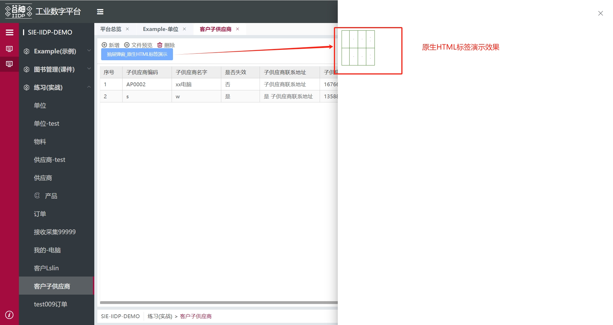

# 原生标签


## 使用原生HTML标签

支持使用原生html标签直接构造视图，只需要写前端扩展代码。下面以“客户子供应商”实例为演示，在前端位置进行页面扩展，
然后将下面对应的代码放在扩展的item内。

### 支持范围（受限）

平台仅支持以下原生标签通过前缀方式使用：table、th、tr、td、div、span、p、h1、h2、h3、h4、h5、h6、video、br、hr、img。

- 使用方式：将标签名加上 `n-` 前缀作为节点 `type`，例如 `div` 用 `type: 'n-div'`，`table` 用 `type: 'n-table'`，其余同理（见下方示例）。
- 适用场景：适合简单结构与排版；复杂交互或业务能力请使用平台组件。

```js
{
  type: 'n-table',
  css: '.demo-table td{border: 1px green solid; padding: 10px;}',
  className: 'demo-table',
  attrs: {
    tt: '标签属性'
  },
  items: [
    {
      type: 'n-tr',
      items: [
        {
          type: 'n-td',
          items: [
            {
              type: 'text',
              text: '原生table'
            }
          ]
        },
        {
          type: 'n-td',
          items: [
            {
              type: 'n-hr',
              text: '原生table'
            }
          ]
        }
      ]
    }
  ]
}
```
## 使用原生HTML标签

实现效果图如下：


