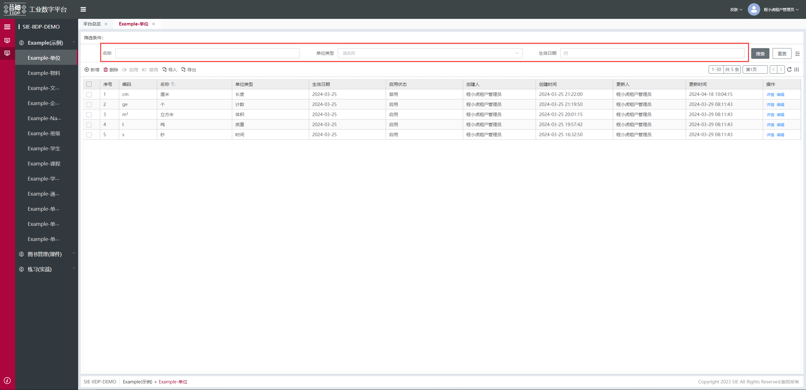
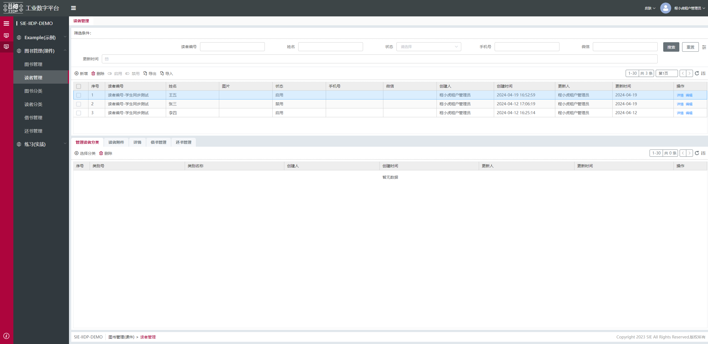
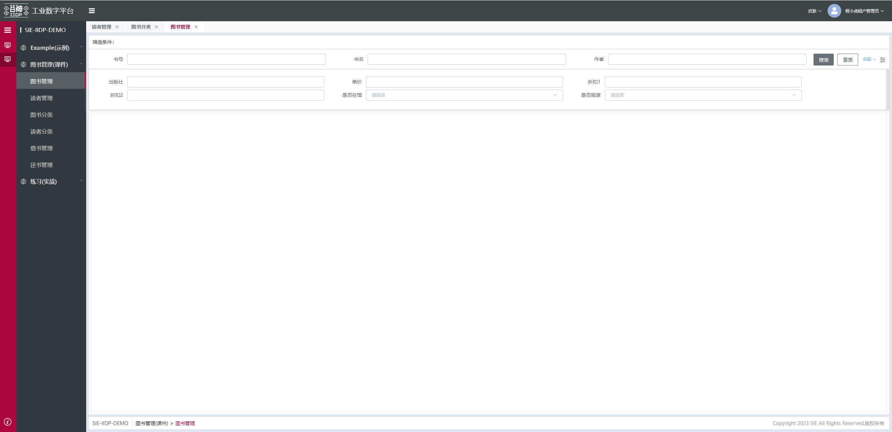
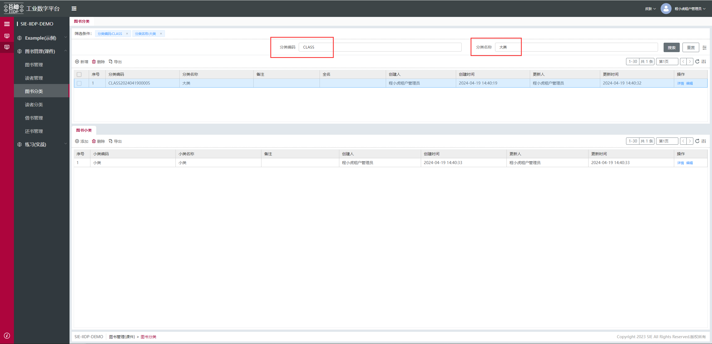
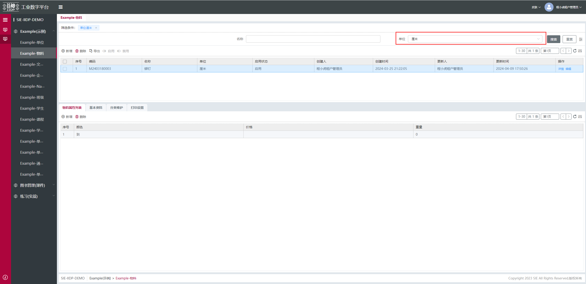
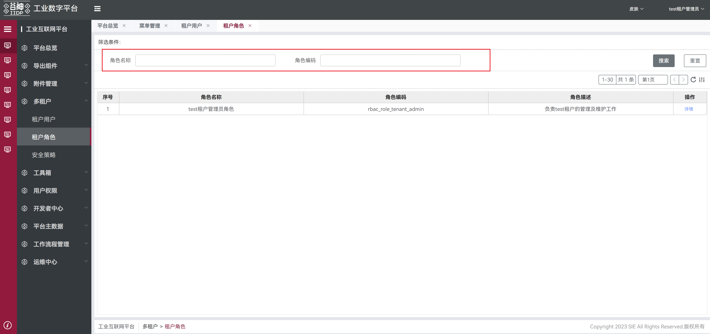

# 搜索视图

## 原始搜索视图

- columns：搜索字段。

```js
{
    "columns": [
        "unitName",
        "unitType",
        "effectDay"
    ],
        "type": "search"
}
```

搜索：


更多配置请看[后端-基本视图-search](/pages/dcf97f)

## 控制表单项是否放入缓存，跨 tab、menu 时使用同一值

```js
"columns": [
  "name",
  "status",
  {
    "name": "prop1",
    "cache":"cacheName"//String,存放在sessionStorage的key值，例如：cacheName:{prop1:value}
  },
  {
    "name": "prop2",
    "cache":"cacheName"//String,存放在sessionStorage的key值，多个columns有相同的cache，会存放为cacheName:{prop1:value,prop2:value2}
  },
]
```

## 配置搜索条件，模糊搜索或者精确搜索

```js
"columns": [
  "name",
  "status",
  {
    "name": "code",
    "isPrecise":"all"
    // all 精确查询filter: [['code','=','xxx']] left 左模糊匹配filter: [['code','=','%xxx']]
    // right 右模糊匹配filter: [['code','=','xxx%']] 不设置默认为左右模糊匹配filter: [['code','=','%xxx%']]
  },
  {
    "name": "id",
    "isPrecise":"left"//all 精确 left 左模糊匹配 right 右模糊匹配 不设置默认为左右模糊匹配
  },
]
```

## 配置搜索条件，字符串拆分搜索

```js
"columns": [
  "name",
  "status",
  {
    "name": "code",
    // 字段数据: {field: 'a,b,c' } => [['field','like', '%a%'],['field','like', '%b%'],['field','like', '%c%']]
    "splitSymbol":","
  },
]
```

## 是否显示筛选条件标题

- filterTitle: "hidden" 当前页面隐藏筛选条件标题
  "hiddenFilterTitle": true 全局隐藏选条件标题
- showSearchConfig: false 隐藏控制筛选条件标题的图标

```js
{
  "type": "search"，
  "filterTitle": "hidden",//隐藏筛选条件标题
  "showSearchConfig": false//隐藏控制筛选条件标题的图标
},
```

## 输入框前缀后缀图标

```js
"columns": [
  "name",
  "status",
  {
    "name": "prop1",
    "prefixIcon": "el-input__icon el-icon-date"
  },
  {
    "name": "prop2",
    "suffixIcon": "el-input__icon el-icon-search"
  }
]
```

## 搜索项默认显示行数配置

- row: 2 默认显示 2 行

```js
{
    "columns": [
        "readerNumber",
        "name",
        "state",
        "cellPhoneNumber",
        "weChat",
        "update_date"
    ],
        "type": "search",
        "row": 2
}
```

- addPopRow:: 2 默认显示 2 行，添加关联弹窗(addEr 专用)

```js
{
  "type": "search"，
  "addPopRow": 2,
  "columns": [
    "name",
    ...
  ]
}
```



## 单行显示搜索项数量配置

- col: 3 每行显示 3 个搜索项

```js
{
    "columns": [
        "bookNumber",
        "bookName",
        "author",
        "press",
        "price",
        "discount1",
        "discount2",
        "isMuseum",
        "isScrap"
    ],
        "type": "search",
        "col": 3     //请尽量按照能被24整除的数量配置，遵循24栅格化原则，例如 2 3 4 6
}
```



## 搜索表单 label 宽度配置

- formConfig:表单配置

```js
{

    "type": "search",
    "formConfig": {
      "labelWidth": "200px"
    },
    "columns": [
        "name",
        "code"
    ]
}
```

## 搜索项默认值（表单项同样适用）

- defaultValue: 固定值
- defaultValueFn: 方法，最终会返回方法中 return 的结果
- 如默认时间， return new Date() 或 return [new Date(window.Tech.moment().add(-3, 'd').startOf('day')), new Date(window.Tech.moment().endOf('day'))]
- 如获取其他节点或调用接口赋值，(vm) => { const aa = vm.$select('xxxxxxxxxxx').$ds.form.xx;return aa}

```js
{
    "columns": [
        {
            "name": "classificationCode",
            "defaultValue": "CLASS"
        },
        {
            "name": "classificationName",
            "defaultValueFn":  (vm) => { const aa = vm.$select('xxxxxxxxxxx').$ds.form.xx;return aa} // 默认值，可配置方法，需return结果
        }
    ],
        "type": "search"
}
```



## 下拉组件默认选择第一个（表单项同样适用）

- defaultSelected: true

```js
{
    "columns": [
        "itemName",
        {
            "name": "unitId",
            "defaultSelected": true
        }
    ],
        "type": "search"
}
```



## 输入框过滤前后空格 （表单项同样适用）

- isTrim: true 默认 false

```js
{
  "type": "search"，
  "columns": [
    {
      "name": "name",
      "isTrim": true
    },
    "code"
    ...
  ]
}
```

## 搜索项对齐方式

- 可在 apps.json 文件配置`"searchAlign": "left"`开启全局配置, 也可在视图单独配置。【视图配置的优先级更高】

```js
{
  "type": "search",
  "searchAlign": "left", //在视图配置靠左对齐
  "columns": [
    "name",
    "code"
  ]
}
```



## 保存查询方案

- "techAutoSaveSearch": true
- 可在单个 search 视图配置，也可在 apps.json 文件开启全局配置
- 将最后一次查询条件保存到数据库（仅主表），重新打开页面时会读取最后一次保存的查询方案，并用该查询方案查询数据
- 注：2.7.0 及以上版本支持

```js
{
  "type": "search",
  "techAutoSaveSearch": true,
  "columns": [
    "name",
    "code"
  ]
}
```

### Attributes

| 属性名           | 说明                                             | 类型    | 可选值            | 默认值 |
| ---------------- | ------------------------------------------------ | ------- | ----------------- | ------ |
| type             | 搜索视图类型                                     | String  | 固定项必配 search | -      |
| columns          | 搜索字段集合                                     | Array   | -                 | -      |
| filterTitle      | 隐藏筛选条件标题                                 | String  | hidden            | -      |
| showSearchConfig | 隐藏控制筛选条件标题的图标                       | Boolean | -                 | true   |
| row              | 搜索模块展示行数                                 | Number  | -                 | 2      |
| col              | 搜索模块每行显示搜索项个数                       | Number  | -                 | 3      |
| addPopRow        | 添加 ER 关联的弹窗的搜索模块展示行数(addEr 专用) | Number  | -                 | 2      |
| searchAlign      | 搜索项对齐方式                                   | String  | -                 | right  |

### columns item Attributes

| 属性名          | 说明                                                 | 类型     | 可选值                          | 默认值 |
| --------------- | ---------------------------------------------------- | -------- | ------------------------------- | ------ |
| cache           | 控制表单项是否放入缓存</br>跨 tab、menu 时使用同一值 | String   | 存放在 sessionStorage 的 key 值 | -      |
| prefixIcon      | 输入框前缀图标                                       | String   | -                               | -      |
| suffixIcon      | 输入框后缀图标                                       | String   | -                               | -      |
| defaultValue    | 默认固定值                                           | String   | -                               | -      |
| defaultValueFn  | 设置默认值的方法，最终会返回方法中 return 的结果     | Function | -                               | -      |
| defaultSelected | 下拉搜索项默认选择第一个（表单项同样适用）           | Boolean  | -                               | false  |
| isTrim          | 输入框过滤前后空格 （表单项同样适用）                | Boolean  | -                               | false  |
