# 表格视图

- columns：表格列。
- buttons：表格操作列按钮。
- tbar： 工具条按钮。

更多配置请看[后端-基本视图-grid](/pages/405eb0/#_3-8-1-2-表格-grid)

```js
{
  "type": "grid",
  "oSize": 200, // 每次渲染的数据偏移量，偏移量越大白屏几率越小，渲染次数就越少，但每次渲染耗时就越久。 默认2
  "transformTableData": "(list)=>{list.forEach((item)=>{item.xxx=item.xxx/1000});return list}",  //配置初始显示数据转换
  "isDefaultSelectRow": true,   //单主表模式是否默认选中第一行
  "advancedQueryGroupSize": 2,  // 限制条件组的数量，小于0或不配置则就不限制
  "advancedQueryConditionSize": 2, // 限制条件组的条件数量，小于0或不配置则就不限制
  "columns": ["name", "login", "mobile", "email", "status"],
  "buttons": [
    {
      "name": "编辑",
      "action": "edit",
      "auth": "update"
    },
    {
      "name": "重置密码",
      "auth": "resetPassword",
      "service": "resetPassword",
      "action": "openView",
      "model": "rbac_user",
      "views": "custom",
      "args":{},
    }
  ],
  "tbar": [
    {
      "name": "新增",
      "action": "create",
      "auth": "create"
    },
    {
      "name": "删除",
      "action": "delete",
      "auth": "delete"
    }
  ]
}
```

表格：
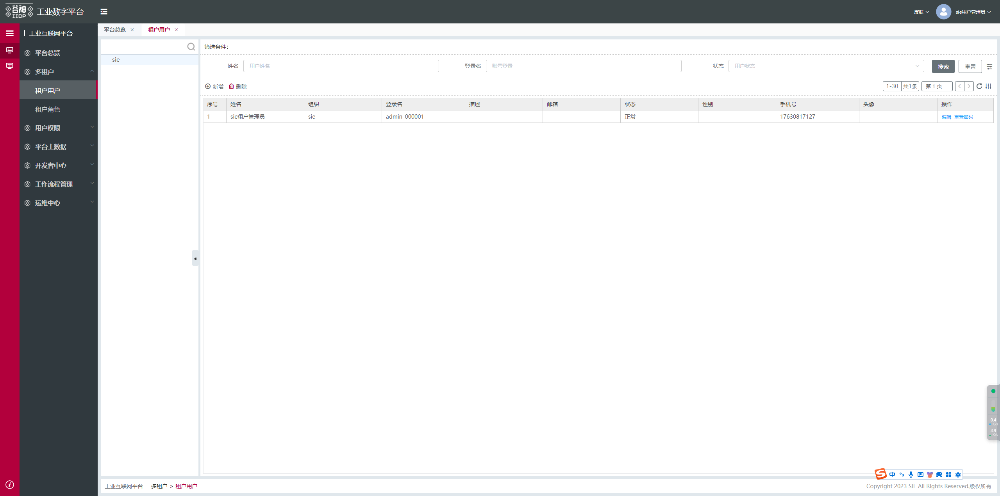

## 高级表格使用

-在 config 文件夹里面的 apps.json 文件内添加 "techAdvancedTable":true 开启高级表格使用
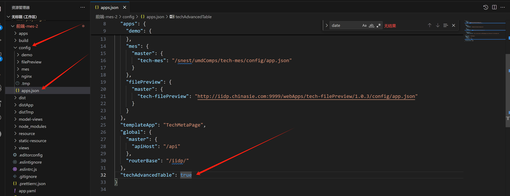
配置后：

1、表格右上角会增加可动态设置表格列相关设置图标

2、搜索条件可动态设置相关展示

3、详情页表单可以动态设置相关字段的展示

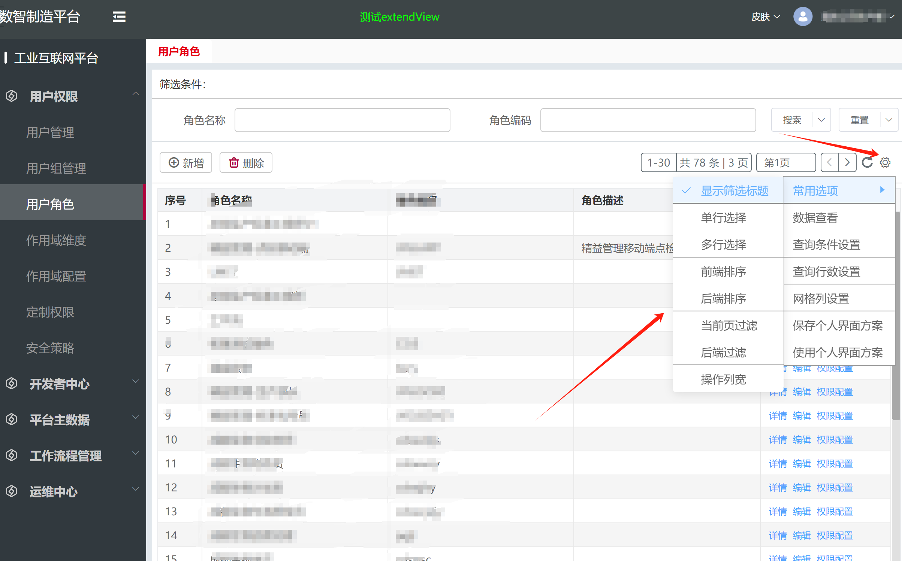
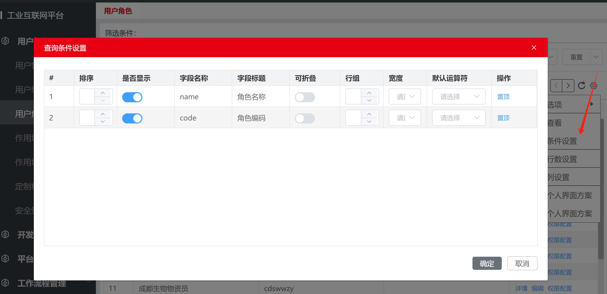
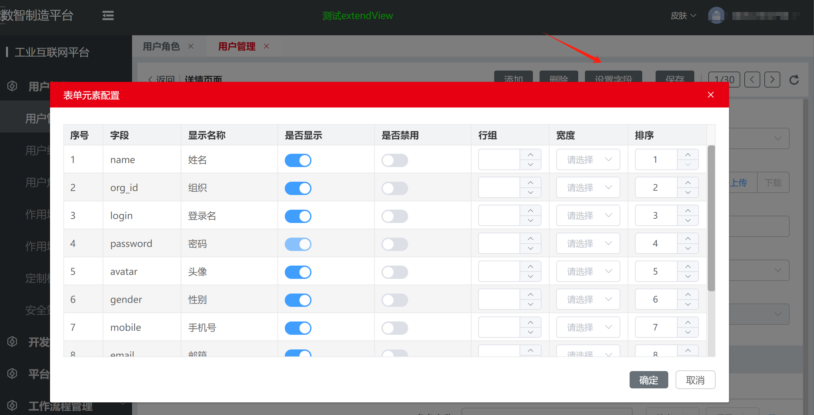

## 高级查询

可以通过`apps.json`进行配置开启全局高级查询

```js
{
    "techAdvancedTable": true,  // 需要开启高级表格
    "techAdvancedQuery": true,  // 开启高级查询
    "techAdvancedQueryGroupSize": 2,		// 限制条件组的数量，小于0或不配置则就不限制
    "techAdvancedQueryConditionSize": 2	// 限制条件组的条件数量，小于0或不配置则就不限制
}
```

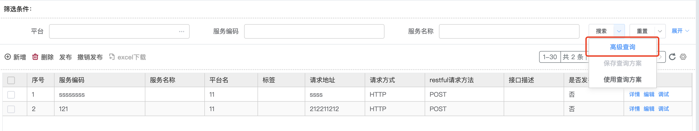


## 自适应行高

- 注意：按列配置 autoRowHeight=true 时单元格内自动换行，需要先在视图或在 apps.json 里配置 autoRowHeight:true

```js
{
  "type": "grid",
  "columns": [
    "name",
    "is_admin",
    {
      "name": 'display_name',
      "autoRowHeight": false // 按列配置
    }
  ],
  "autoRowHeight": true // 视图级比系统级优先级更高
}
```

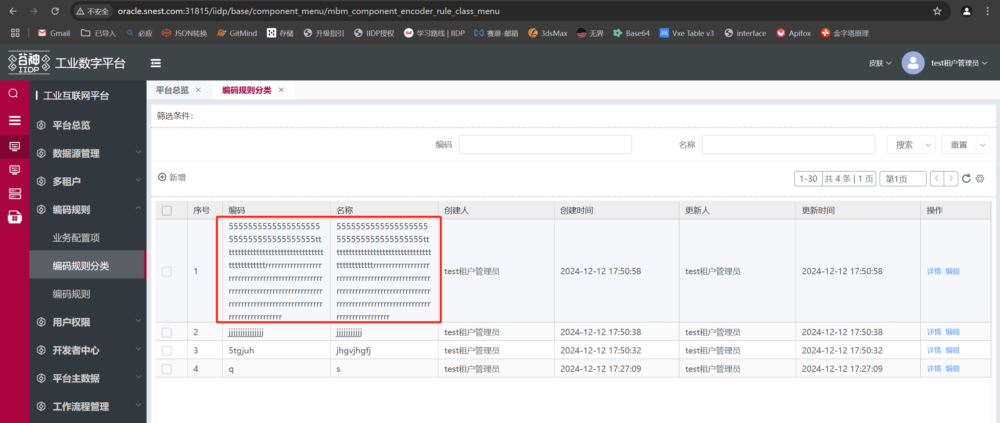

## 自定义单元格

单元格中显示图片

```js
// 可以在视图的columns中直接写type和其他属性 会自动将type等属性加到items
{
  "type": "grid",
  "columns": [
    "name",
    {
      "label": "车头照片",
      "type": "icon",
      "name": "carside_photo",
      "iconType": "url",
      "preview":"true", // 使图标可以放大预览
      "icon": "",
      "fn": "(row) => {return row.carside_photo}"
    },
    "is_admin"
  ],
  "buttons": [
    {
      "name": "详情",
      "action": "preview",
      "auth": "read"
    }
  ]
}
```


## 自定义单元格值

```js
{
  "type": "grid",
  "columns": [
    "name",
    {
      "name": "is_admin",
      "transformValue": "(val, item, row)=>{if(val){return val+'123';} return '否'; }" // 返回值即为单元格显示的值
    }
  ],
  "buttons": [
    {
      "name": "详情",
      "action": "preview",
      "auth": "read"
    }
  ]
}
```

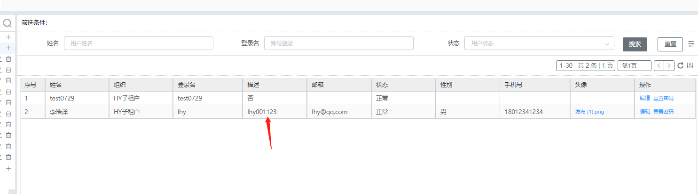

## 自定义单元格 tip 内容

```js
{
  "type": "grid",
  "columns": [
    "name",
    {
      "name": "is_admin",
      "tooltipFn": "(row, column) => {return '您好' + row.name + '！'}" // 返回值即为单元格tip显示的值
    }
  ],
  "buttons": [
    {
      "name": "详情",
      "action": "preview",
      "auth": "read"
    }
  ]
}
```

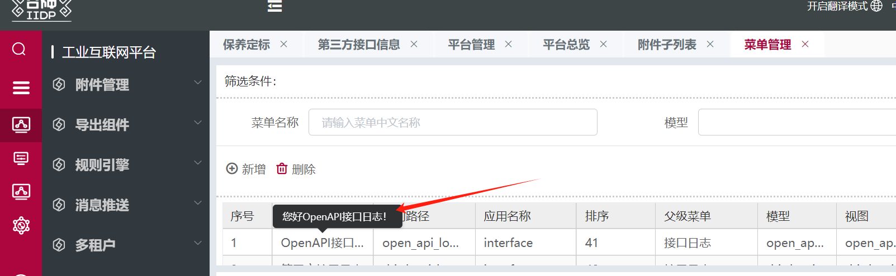

## 自定义列标题属性

```js
{
  "type": "grid",
  "columns": [
    "name",
    {
        "name": "remark",
        "displayName": '备注123', // 显示名称
        "custom": true // custom为true时 该对象会覆盖后端返回的fields里的对象 所以label会覆盖后端返回的字段的displayName
    },
    "is_admin"
  ],
  "buttons": [
    {
      "name": "详情",
      "action": "preview",
      "auth": "read"
    }
  ]
}

配置说明：
  custom: true  默认false,配置为true时，视图配置的属性覆盖fields里对应字段定义的属性

注：
修改表格列标题，可配置label或displayName，建议用displayName
```

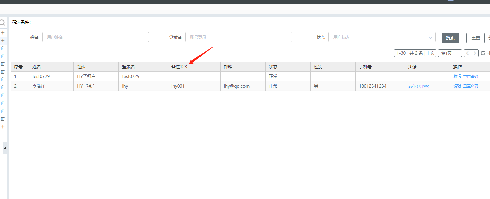

## 自定义行属性

- cellStyle: row(当前行) column(当前列)

```js
{
  "type": "grid",
  "cellStyle": ({ row, column }) => {if(row.status == '0') {if(column.field == 'status'){return {backgroundColor: 'blue'}}return {backgroundColor: 'pink'}}else {return {backgroundColor: 'gray'}}},
  "columns": [
    "name",
    "remark",
    "is_admin"
  ],
  "buttons": [
    {
      "name": "详情",
      "action": "preview",
      "auth": "read"
    }
  ]
}
```

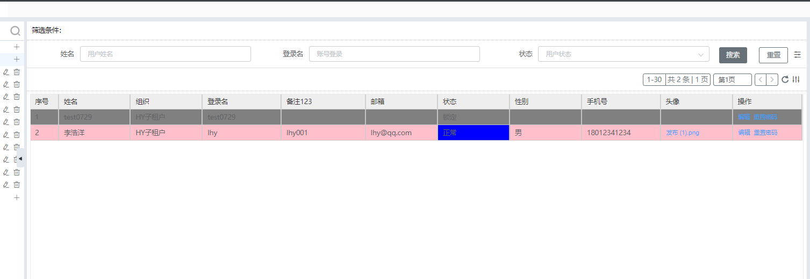

## 隐藏表格序号列

- showSequenceNum: false 默认为 true

```js
{
  "type": "grid",
  "showSequenceNum": false,
  "columns": [
    "name",
    "remark",
    "is_admin"
  ],
  "buttons": [
    {
      "name": "详情",
      "action": "preview",
      "auth": "read"
    }
  ]
}
```

## 表格冻结列

- fixed: left（冻结左侧）, right（冻结右侧）

```js
{
  "type": "grid",
  "columns": [
    {
      "name": "name",
      "fixed": "left"
    }
    "remark",
    "is_admin"
  ]
}
```

## 表格行 key 配置 (可选配置)

- 使用行 key 能提供渲染性能 可选配置 在没有配置情况下 默认 "useKey": true "keyField": "id"

```js
{
  "type": "grid",
  "gridOptions": {
    "row-config": {
      "useKey": true, // 是否使用行key 默认true  若表格上需求是存在两行数据一样(包括id) 则配置false
      "keyField": "id" // 取当前行的某属性作为行key 默认为id属性
    }
  }
}
```

## 表头禁止拖拽

- gridColumnDrop: false

```js
{
  "type": "grid",
  "gridColumnDrop": false,
  "columns": [
    "name",
    "code",
    "is_admin"
  ],
  "buttons": [
    {
      "name": "详情",
      "action": "preview",
      "auth": "read"
    }
  ],
  "tbar": [
    "@defaults"
  ]
}
```

## 表格行可拖拽

- gridRowDrop: true; 默认 false

```js
{
  "type": "grid",
  "gridRowDrop": true,
  "columns": [
    "name",
    "code",
    "is_admin"
  ],
  "buttons": [
    {
      "name": "详情",
      "action": "preview",
      "auth": "read"
    }
  ],
  "tbar": [
    "@defaults"
  ]
}
```

## 表头分组

```js
{
  "type": "grid",
  "columns": [
    "name",
    "code",
    {
      "name": "remark", // 注意：后端模型必须要定义字段，否则整列不显示
      // 分组列头，通过 children 定义子列
      "children": [{
        "prop": "sex",
        "label": "Sex",
        "children": [
          {"prop": "address", "label": "Address", "type": "text"},
          {"prop": "address1", "label": "Address1" , "type": "text"}
        ]},
        {"prop": "age", "label": "Age" ,"type": "text"}
      ]
    },
    "is_admin"
  ],
  "buttons": [
    {
      "name": "详情",
      "action": "preview",
      "auth": "read"
    }
  ],
  "tbar": [
    "@defaults"
  ]
}
```

## 表尾数据

```js
{
  "type": "grid",
  // 动态同步 返回二维数组
  "summaryMethod": "({ columns, data })=> {return [columns.map((column, columnIndex) => {if (columnIndex === 0) {return '平均';}return data.filter(item=>!!item[columns.property]).length;})];}",
  // 异步 适用于调接口获取汇总数据的情况
  // filterArr: 筛选条件数组，可直接传到接口中
  // 返回的数据结构如下：[{header:'合计',data:{列名1:{header:'重量/t',value:1000},列名2:{header:'数量',value:1000},}}] 或 [{header:'合计',data:{列名1:1000,列名2:500}}]
  "summaryMethod": "async(vm,filterArr)=>{let res=await window.Tech.httpMeta({data:{params:{args:{useDisplayForModel:true,order:'',filter:filterArr,limit:0,offset:0,properties:['id','matchid','operatype']},service:'statistics',model:'LApplicationbillTP',app:'newSdkLes'}}});return res.data}",
  "columns": ["name", "code", "is_admin" ],
  "buttons": [
    {
      "name": "编辑",
      "action": "edit",
      "auth": "update"
    }
  ],
  "tbar": [
    "@defaults"
  ]
}

```

## 表格数据分组

```js
{
  "type": "grid",
  "gridGroupConfig": {
    "field":"name"    //分组字段
  },
  "gridOptions": {
    "tree-config": {
      "expandAll":true   //是否全展开
    }
  }
  "columns": [
    {
      "name": "name",
      "treeNode": true   //配置treeNode的字段需与分组字段名一致
    },
    "code",
    {
      "name": "remark"
    },
    "is_admin"
  ],
  "buttons": [
    {
      "name": "详情",
      "action": "preview",
      "auth": "read"
    }
  ],
  "tbar": [
    "@defaults"
  ]
}
```

## 行内编辑

```js
// 标准视图
{
  "type": "grid",
  "showHeader": false, // 是否显示表头
  "editShowCancelBtn": false,   //行内编辑配置了默认编辑状态情况下，隐藏取消编辑按钮
  "editShowSaveBtn": false, //行内编辑配置了默认编辑状态情况下，隐藏保存按钮
  "editSyncCheckBg": true, //可编辑表格配置选中添加背景色
  "gridEditMode":{
    "mode": "multipleRow", // multipleRow:多行编辑 singleRow:单行编辑
    // 行内编辑需要用到的类型 如果只修改不新增删除就只写update
    // 存在update： 工具栏会出现一个编辑按钮
    // 存在add且工具栏存在新增按钮： 会把新增按钮替换成新增行按钮
    // 存在delete：点击编辑按钮操作列内会出现删除按钮
    "rowBtns": ["update", "add", "delete"],
    "defaultCancelEdit": true, // 配置上下表格的子表视图,默认进入编辑模式
    "addRowAutoFocus": false, // 行内编辑新增行时是否自动获取焦点，默认为true (2.4以上uat版本)
    "addRowAfter": true, // 行内编辑新增行时添加到表格末尾,默认为false，添加到表格头部
    "arrowKeys": true, // 是否启用上下左右键控制正在编辑的单元格 默认开启
    "btnConfig": {// 仅用于配置在子表的tbar编辑按钮，由主表选择的数据控制该按钮的禁用状态状态
      "edit": {   // 编辑按钮选项配置
        "bind_disabled": {  // 动态绑定禁用状态
          "path": "dataSource.mainTableRowData.isEnable",
          "selector": "equip_spot_check_procedure_menu_table_main_table",
          "transform": "(params)=>{if(params.self.$ds.isDetail && params.self.$ds.clickType == 'add'){return false;}else{ return params.value === '1'?true:false;} return false;}"
        },
        // ...
      }
    }
  },
    // beforeEditMethod: 控制单元格是否可编辑方法 row:行数据 column： 列信息
    // 返回true代表允许编辑 false代表不允许编辑
  "beforeEditMethod": `({ row, rowIndex, column, columnIndex }) => {
      if(row.rowIndex === 0) {return false;} return true;}`,
  "columns": [
    {
      "name":"name",
      "rowEditable": true, // 代表此列可编辑
      "editConfigs": { // 可不配 不配则根据数据类型取默认的编辑类型
        "editType": "input" // 优先级更高 name列在编辑时显示input框
      },
      "addRow_config": "selfAdd", // 自增：selfAdd 默认值：default
      "custom": true, // custom=true则此处配置的属性优先级高于fields里的属性
      "required": true // 是否必填 不配置则取fields里的required
    },
    {
      "name":"code",
      "rowEditable": true,
      "formatItem": "(row, item) => { if(row.rowIndex===0) { item.editRender = { configs: { editType: 'select' } } } return item; }" // 根据行数据判断显示何种编辑控件
    },
    {
      "name": "age",
      "addRow_config": "default",  // default或者selfAdd
      "defaultValue": 18, // 默认值 可配置对象例如  {"label": "小白", "value": "03ics377ig70i"}
      "defaultValueFn":  (vm) => { vm.$select('xxxxxxxxxxx');return 'xxx'}, // 默认值，可配置方法，需return结果
      "defaultValueFn":  async(vm) => { const result = await window.Tech.httpMeta({...}); return result.data} // 默认值，可配置异步方法，需return结果
    }
    "remark",
    "is_admin"
  ],
  // 新增行时 如果需要显示默认数据 可以调用元模型接口查默认数据
  // 要求接口返回的字段和表格中要赋值的字段名称一致，否则需自定义table_field和result_field
  // 优先级最高 会覆盖columns里的对象设置的addRow_config
  "addRow_config": {
    "type": "meta",
    "params": {
      "model": "xxx",
      "service": "xxx",
      "args": {}
    },
    "table_field": ['name', 'code'], // 表格中需要回填的字段名称，和 result_field 中对应位置字段匹配
    "result_field": ["productName", "productCode"] // 接口中需要回填到表格的字段名称，和 table_field 中对应位置字段匹配
  },
  "buttons": [
    {
      "name": "详情",
      "action": "preview",
      "auth": "read"
    },
    {
      "name": "编辑",
      "action": "edit",
      "auth": "update"
    }
  ],
  "tbar": [
    "@defaults"
  ]
}
```

- 校验表格必填项用法，如果存在不通过的记录，则将数据返回

```js
tech_app.page
  .getNode("menu_table_main_table")
  .instance.getInstance()
  .fullValidate(rows)
  .then((res) => console.log(res)); // rows是要校验的行数据
```

- 行内编辑相关配置说明

```
{
    主表单下的子表 {
        单行编辑 {
            er表 {
                配置isAloneSave = true {
                    点击行内绿色保存按钮时拼接子表的指令集调主表的update
                }
                配置isErAloneSave = true {
                    详情页子表要调接口要先配置isAloneSave=true,
                    点击行内绿色保存按钮时不配置isAloneSave=true就不调接口只是拼接指令集,
                    配置了isAloneSave=true时点击行内绿色保存按钮时就拼接主表行id调子表接口
                }
                isAloneSave和isErAloneSave都不配置 {
                    点击行内绿色保存按钮时只是拼接指令集 不调接口
                }
            }
        }
        多行编辑 {
            er表 {
                配置isAloneSave = true 或 不配置isAloneSave {
                    子表工具栏不显示保存按钮 在右上角统一保存
                    拼接子表的指令集调主表的update
                }
                配置isErAloneSave = true {
                    子表工具栏显示保存按钮 点击保存按钮调用批量保存接口
                }
            }
            非er表 {
                子表工具栏显示保存按钮 点击保存按钮执行批量保存
            }
        }
    }
    上下表格的子表 {
        单行编辑 {
            er表 {
                配置isAloneSave = true 或 不配置isAloneSave {
                    拼接指令集 调主表的update接口
                }
                配置isErAloneSave = true {
                    拼接主表行id调子表接口
                }
            }
        }
        多行编辑 {
            er表 {
                配置isAloneSave = true 或 不配置isAloneSave {
                    子表工具栏显示保存按钮
                    拼接子表的指令集调主表的update
                }
                配置isErAloneSave = true {
                    子表工具栏显示保存按钮 点击保存按钮调用批量保存接口
                }
            }
        }
    }
}
```

## 复用表格操作列默认按钮

- copyAction: "preview", 可配置'edit'和'preview'

```js
{
  "name": "编辑1",
  "action": "edit1",
  "copyAction": "edit",
  "auth": "edit1"
}
```

## 自定义操作列按钮

- enableCondition: 根据函数返回值(true 或 false)设置按钮禁用状态

- showCondition: 根据函数返回值(true 或 false)动态显示或隐藏按钮

- actionAfter: "refreshTable" 接口执行后刷新操作，接口必须返回成功标识（返回 true 即可）

- actionBeforeFn: 接口执行前的自定义操作，返回 true 继续执行接口调用，返回 false 终止执行接口调用

- actionAfterFn: 接口执行后的自定义操作

- isLoading: true 按钮点击后，按钮自身添加 loading

- showPopLoading: true 按钮点击后，页面全局添加 loading

- args 说明:

  $row.name: 当前表格行数据

  $table.row: 主表格当前行数据，用于主列表 tbar 配置

  $table.subRow: 子表格当前行数据，用于上下表子表 tbar 配置

  $form.curForm: 主表单当前数据，用于主表单子表 tbar 配置

  自定义参数 eg: "xxx": "123"

  自定义传参 函数 othersParams: (vm) => { return {xxx:123}} 动态构造 args 方法

```js
{
  "type": "grid",
  "columns": ["name", "code", "is_admin" ],
  "buttons": [
    {
      "name": "发布",
      "service": "installApp",
      "auth": "update",
      "model": "meta_app_store",
      "app": "sie-iidp-iam", // 可不配置，默认当前菜单所属app
      "customStyleFn": "(row)=>{ if(row.name==='123'){ return { fontSize: '12px', color: '#333' } } }", //根据当前行数据自定义按钮的样式
      // 按钮自定义传参
      "args":{
        "name1": "$row.name", // row 为当前行数据
        "name2": "$table.row.name",
        "name3": "$table.subRow.name",
        "name4": "$form.curForm.name",
        "xxx": "123",
        "othersParams": "(vm) => { return {xxx:123}}"
      },
      "enableCondition": "(row,vm)=> {if (row && row[0].rowIndex == 0) {return false} else { return true}}",
      "showCondition": "(row,button,vm)=> {if (row.rowIndex == 0) {return false} else { return true}}",
      "actionBeforeFn": "(vm) => {console.log(vm); return false}",
      // 配置了actionAfter=refreshTable 点击按钮后会自动刷新表格
      "actionAfter": "refreshTable",
      "actionAfterFn": "(vm, data) => {console.log(vm)}" // data为接口返回的数据
    }
  ],
  "tbar": [
    "@defaults"
  ]
}


```

## 表格展开行

```js
{
  "type": "grid",
  "columns": [
    {
      "name": "name",
      "type": "expand",
      "items": [{
        "type": "button",
        "value": "example"
      }]
    },
    "auth",
    "type",
    "model",
    "description"
  ],
  "tableExpandConfig": {
    "toggleMethod": "({ expanded, column, columnIndex, row }) => {return true;}", // 实现展开与关闭的细节处理，返回值用来决定是否允许继续执行
    "visibleMethod": "({ row, column }) => {return true;}" // 返回值用来决定是否允许显示展开按钮
  },
  "tbar": [
    {
      "name": "刷新",
      "model": "xxxx",
      "service": "refresh",
      "auth": "refresh"
    }
  ],
  "buttons": [
    {
      "name": "详情",
      "action": "preview",
      "auth": "read"
    }
  ]
}
```

## 动态表格列

1. 后端 search 接口增加的 fields 和 views 字段（类似 loadview 接口返回的 fields 和 views）,  
   fields 和 views 应包含需要展示的列的数据, 如下所示 </br>
   原来为

```js
data: [数据];
```

改为

```js
data: {
 data: [数据],
 fields: {
  trend: {
    dateType: 'String',
    displayName: '趋势',
    name: 'trend'
  },
  type: {
    dateType: 'String',
    displayName: '属性',
    name: 'type'
  },
  resAdminOrg: {
    dateType: 'String',
    displayName: '节点名称',
    name: 'resAdminOrg'
  }
},
 views: {
    grid: {
      view_id: 'mes_tech_month_stat_grid',
      body: {
        columns: [
          {
            displayName: '节点名称',
            name: 'resAdminOrg'
          },
          {
            displayName: '属性',
            name: 'type'
          },
          {
            displayName: '趋势',
            name: 'trend'
          }
        ],
        type: 'grid'
      }
    }
  }
}
```

2. 扩展修改页面表格默认的 search 接口为后端新接口
3. 下面代码为默认的 search 的逻辑代码，修改 search 参数请求后端新接口

```js
'demo_example_org_level_menu_form_main_table_search': {
   type: 'custom',
   selector: {
      attr: 'id',
      value: 'demo_example_org_level_menu_form_main_table_search'
   },
   beforeOperate: (app, operateItem, options) => {
      options.element.commands.requestSearch = async (params, filterArr) => {
         const { self: vm } = params;
         const commonform = vm.$select(vm.$cmd.getIdPre(vm) + 'form_main_table_search_common');
         // 树视图时使用树视图的请求参数
         const treeNode = vm.$select(`${vm.$ds.idPre}tree_main_wrap`);
         const loadViewConfig = treeNode?.$ds?.loadViewConfig;
         if (loadViewConfig && !vm.$cmd.fromTab(vm)) {
            return await commonform.request('tableData', {
               app: loadViewConfig.subApp,
               service: 'search',
               model: loadViewConfig.subModel,
               args: {
                  filter: filterArr,
                  useDisplayForModel: true,
                  limit: vm.$ds.paging.pageSize + 1, // 多拿一条
                  offset: vm.$ds.paging.pageStart,
                  order: '',
                  properties: vm.$cmd.meta.toProperty(
                    commonform.$ds.tableView.data.views.grid.body.columns,
                    commonform.$ds.tableView.data.fields
                  )
               }
            });
         }
         return await commonform.request('tableData', {
            model: commonform.$cmd.getModel(commonform),
            args: {
               filter: filterArr,
               properties: vm.$cmd.meta.toProperty(
                commonform.$ds.tableView.data.views.grid.body.columns,
                commonform.$ds.tableView.data.fields
               )
            }
         });
      };
      return operateItem.view;
   }
}
```

## 表头服务端排序

```js
{
  "type": "grid",
  "headerSortRemote": true, // 启用服务端排序
  "sortMultiple": true, // 启用多列排序
  "columns": [
    {
      "name": "name",
      "sortable": true
    },
    "auth",
    "type",
    "model",
    "description"
  ],
  "tbar": [],
  "buttons": [
    {
      "name": "详情",
      "action": "preview",
      "auth": "read"
    }
  ]
}
```

## 表头服务端筛选

```js
{
  "type": "grid",
  "headerFilterRemote": true, // 启用服务端筛选
  "columns": [
    "name",
    "auth",
    "type",
    "model",
    "description"
  ],
  "tbar": [],
  "buttons": [
    {
      "name": "详情",
      "action": "preview",
      "auth": "read"
    }
  ]
}
```

## 表格合并单元格

- mergeRowList 需要合并行的列

```js
// 合并行
{
  "checkbox": "multiple_2",
  "buttons": [
    {
      "action": "preview",
      "auth": "read",
      "name": "详情"
    },
    {
      "action": "edit",
      "auth": "update",
      "name": "编辑"
    }
  ],
        "mergeRowList": ["isEnable"],//需要合并行的列
        "headerSortRemote": true,
        "sortMultiple": true,
        "columns": [
        "unitCode",
        "unitName",
        "unitType",
        "isEnable",
        "effectDay",
        "create_user",
        "create_date",
        "update_user",
        "update_date"
  ],
  "tbar": [
    {
      "name": "刷新",
      "model": "rbac_permission",
      "service": "refresh",
      "auth": "refresh"
    }
  ],
  "buttons": [
    {
      "name": "详情",
      "action": "preview",
      "auth": "read"
    }
  ],
  "type": "grid",
}
```

表格合并行：
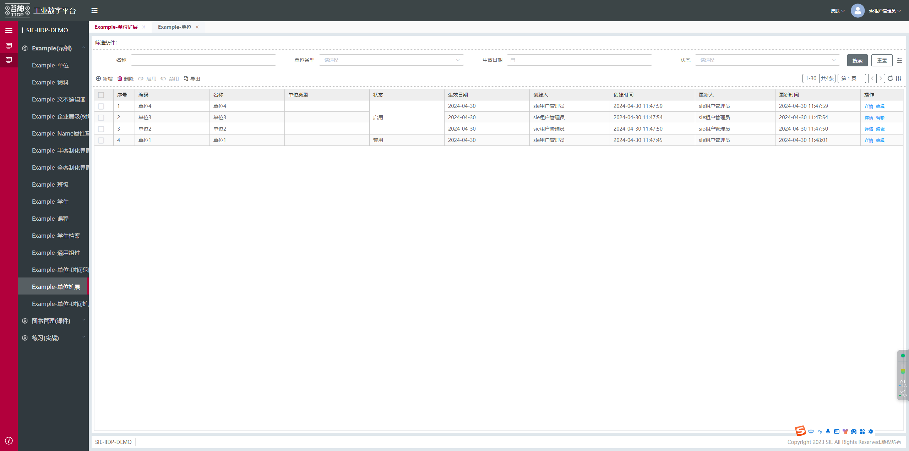

- mergeMethod 自定义合并逻辑

```js
// 还支持传入方法 自定义合并逻辑
{
  "type": "grid",
  // rowspan:2 跨两行  colspan:1 不跨列
  "mergeMethod": ({ row, _rowIndex, _columnIndex, column, visibleData, visibleStartXIndex, visibleStartYIndex })=>{
    // row[column.field] 当前行数据    visibleData[_rowIndex + 1] //下一行数据
    if(_rowIndex== 0 && _columnIndex == 2){
      // 第一行第三列单元格 跨两行
      return { rowspan: 2, colspan: 1 }
    }else if(_rowIndex== 1 && _columnIndex == 2){
      // 同时 第二行第三列单元格 隐藏
      return { rowspan: 0, colspan: 0 }
    }
    // 以上得到的效果是第三列的前两行合并为一个单元格
  },
  "columns": [
    "name",
    "auth",
    "type",
    "model",
    "description"
  ],
  "tbar": [
    {
      "name": "刷新",
      "model": "xxxx",
      "service": "refresh",
      "auth": "refresh"
    }
  ],
  "buttons": [
    {
      "name": "详情",
      "action": "preview",
      "auth": "read"
    }
  ]
}
```

表格自定义合并行：
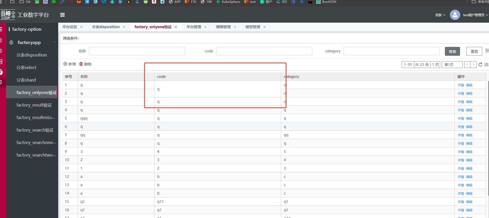

## 表格自定义查询条件

- searchByMainTable： 自定义查询条件
- compatible： 是否开启自定义逻辑运算符，默认关闭

```js
主表配置
{
  "type": "grid",
  // 主表配置和type:grid同级
  "searchByMainTable": {
    "service":{
      "search": "search1"，//自定义表格查询方法
      "count":"count1"//自定义表格总条数查询方法
    }
    "model": "QEntrustQuality",//自定义model
    "app":"base",//自定义app
    "args": {
      "filter": [
        [
          "name",
          "like",
          "33"
        ],
        [
          "samplecode",
          "like",
          "$row.samplecode"//上下表格模板中主表选中行对应字段
        ],
        [
          "org_id",
          "like",
          "$tree.id"//左侧树视图中的节点对应字段
        ]
      ]
    }
  },
}

子表配置
{
  "type": "form",
  "tabs": [
    {
      "header": "角色",
      // 子表配置和header同级
      "searchByMainTable": {
        "autoSearch": true, // 非Er关系子表若要和主表关联查询配置
        "service":{
          "search": "search1"，//自定义表格查询方法
          "count":"count1"//自定义表格总条数查询方法
        }
        "model": "QEntrustQuality",//自定义model
        "args": {
          "filter": [
            [
              "name",
              "like",
              "33"
            ],
            [
              "samplecode",
              "like",
              "$row.samplecode"//上下表格模板中主表选中行对应字段
            ],
            [
              "org_id",
              "like",
              "$tree.id"//左侧树视图中的节点对应字段
            ]
          ]
        }
      },
      "tbar": [
        {
          "name": "添加",
          "action": "addEr",
          "auth": "update"
        },
        {
          "name": "删除",
          "action": "deleteEr",
          "auth": "delete"
        }
      ],
      "body": {
        "type": "app_role_grid,app_role_search,app_role_form",
        "field": "role_ids",
        "columns": [
          "name",
          "remark"
        ]
      }
    }
  ],
  "columns": [
    "name",
    "avatar",
    "gender",
    ...
  ],
  "tbar": [
    {
      "name": "添加",
      "action": "addEr"
    },
    {
      "name": "删除",
      "action": "deleteEr"
    }
  ],
  "buttons": [
    "@defaults"
  ]
}
```

#### 配置 compatible 自定义查询条件中的逻辑运算符

> sie-iidp-base-web-v3.0.1-HotFix.002 及以上版本支持

平台默认使用 `&` (AND) 逻辑运算符连接 `searchByMainTable` 中的查询条件。  
若需自定义逻辑运算符（如 `|` (OR)），请在 `searchByMainTable` 配置中设置 `compatible: true`。  
并在 `filter` 数组内指定所需的逻辑运算符。

```js
searchByMainTable: {
  compatible: true,
  args: {
    filter: [
      '|',
      '&',
      ['zdy1', 'like', '123'],
      ['zdy2', 'like', '456'],
      ['zdy3', 'like', '789']
    ]
  }
}
```

## 表格把 search 和 count 接口合并替换成 searchPage

- searchWithCount 合并 search 和 count 接口为 searchPage

版本支持@tech/t-el-ui: "^2.9.0-uat.8"

```js
{
  "type": "grid",
  "searchWithCount": true,
  "columns": [
    "name",
    "auth",
    "type",
    "model",
    "description"
  ]
}
```

## 上下表格模板

- typeView 控制子表的显示隐藏 在表格配置
- hasDefaultSelectRow 表格具有默认选中行
- dbClickEnterDetails 禁止双击进入详情页
- mainTableHeight 主表默认高度
- tabTableAutoHeight 子表自适应高度页面不显示外层滚动条

```js
{
  "type": "grid",
  "typeView": "subTable",	//显示子表
  "hasDefaultSelectRow": false,//表格具有默认选中行 不配置则默认是true
  "dbClickEnterDetails": "disable", //禁止双击进入详情页，不配置默认双击进入详情页
  "mainTableHeight": "3rem",//主表高度不设置默认高度2rem
  "tabTableAutoHeight": true, //子表自适应高度页面不显示外层滚动条
  "columns": [
    "name",
    "is_admin",
    "code",
    "remark"
  ],
  "buttons": [
    {
      "name": "详情",
      "action": "preview",
      "auth": "read"
    },
    {
      "name": "编辑",
      "action": "edit",
      "auth": "update"
    }],
  "tbar": [
    "@defaults"
  ]
}
```

上下表格：
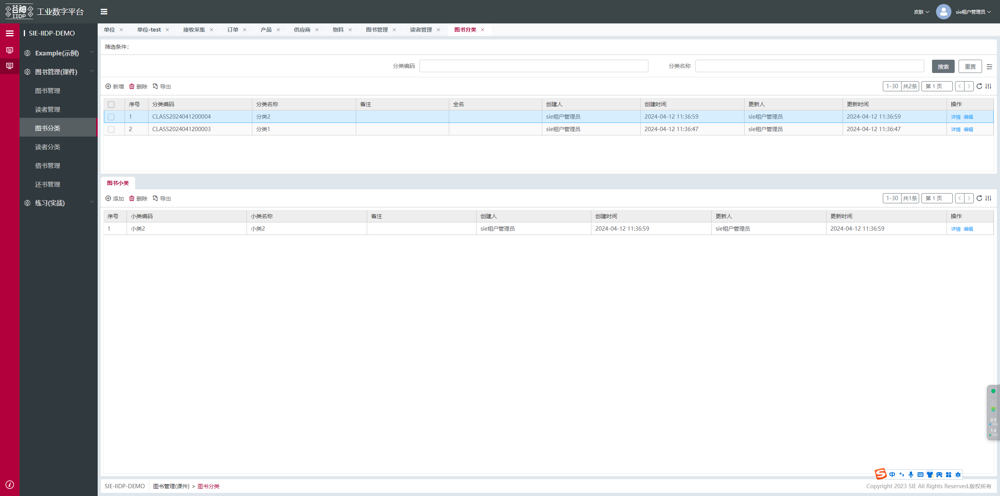

- singleGrid 多个 tabs 非 er 关系子表的配置
- mainTableColumns 主表选中行内容回填抽屉表单

```js
{
  "type": "form",
  "columns": [
    "name",
    "is_admin",
    "code",
    "remark"
  ],
  "tabs": [
    {//第一个tabs  er关系子表
      "header": "用户",
      "rowspan": 3,
      "isAloneSave": true,//er关系子表编辑删除等操作直接调接口保存
      "tbar": [
        {
          "name": "添加",
          "action": "addEr",
          "auth": "update"
        },
        {
          "name": "删除",
          "action": "deleteEr",
          "auth": "delete"
        }
      ],
      "body": {
        "type": "search,grid",
        "field": "user_ids",//er关系 String
        //回填抽屉表单字段和主表选中行对应字段一致
        "mainTableColumns":[{//主表选中行内容回填抽屉表单
          "name": 'code',
          "custom": true,
          "disabled": true,
          "readonly": true,
        }],
        //回填抽屉表单字段和主表选中行对应字段不一致
        "transformInitValue": (res)=>{//主表选中行内容回填抽屉表单
          let maintableObj = tech_app.page.getNode('rbac_role_menu_table_main_table')
          let rowValue = maintableObj?.instance?.getEditActived();
          if (rowValue?.row) {
              rowValue = rowValue?.row
          }
          if (!rowValue) {
              rowValue = maintableObj?.instance?.boxSelected?.[0];
          }
          if(rowValue){
           // 抽屉表单的对应值 = 主表选中行对应值
            res.remark = rowValue?.code||null;
          }
          return res;
        },
        "columns": [
          "login",
          "name",
          "email",
          "mobile",
          "status"
        ]
      }
    },
    {//第二个tabs 非er关系
      "header": "权限",
      "rowspan": 3,
      "body": {
        "type": "grid,singleGrid,search,form",//非er关系加singleGrid
        "field": { //非er关系配置
          "attrs": {
            "unique": "tab001", // 唯一标识 避免与其他节点id冲突（可选参数）
            "relateModel": "rbac_permission" // 对应页面的model
          }
        },
        "columns": [
          "name",
          "auth",
          "type"
        ]
      }
    }
  ]
}
```

主表选中行内容回填抽屉表单：
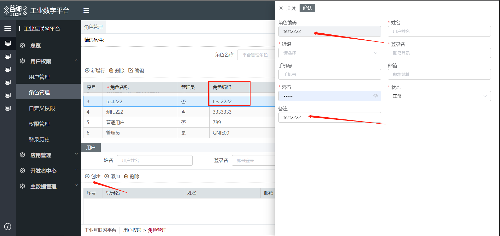

## 隐藏 toolbar、分页、刷新、columnsConfig

- pagin.limit 设置条数
- pagin.display 隐藏分页组件显示
- pagin.unPaging 不分页
- pagin.selectPageSize.show 显示分页 n 条/页下拉(可系统级配置)
- pagin.selectPageSize.allowCreate 显示分页 n 条/页下拉(可系统级配置)
- pagin.selectPageSize.options 显示分页 n 条/页下拉(可系统级配置)

```js
{
  "type": "grid",
  "toolbar": {
    "toolbarDisplay": false,//整个toolbar隐藏
    "refreshDisplay": false //刷新按钮隐藏
  },
  "columnsConfigMode": false, //自定义表格列按钮隐藏
  "pagin": {
      "limit": 10, //设置条数
      "display": false,//隐藏分页组件显示
      "unPaging": true, //不分页   不调总条数接口； 设置这个参数 同时隐藏分页组件 limit = 0
      "selectPageSize":{
        "show": true, // 显示分页n条/页下拉
        "allowCreate": true, // 允许用户创建n条/页新条目
        "options": [20,50,100] // 分页n条/页下拉选项
      }
  },
  "columns": [
    "name",
    "is_admin",
    "code",
    "remark"
  ]
},
```

- 系统级配置 selectPageSize 配置在 config\apps.json
  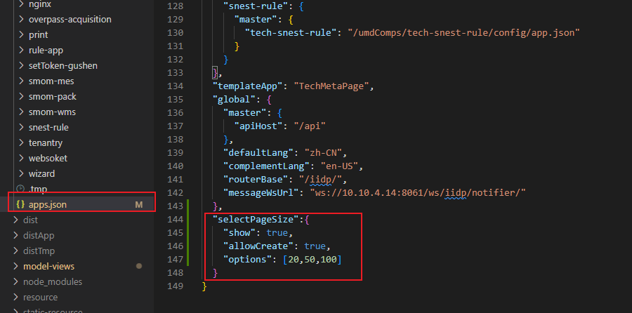

## 取消检查保存的弹框提示

取消行内编辑未保存时操作其他后的弹框提示，配置 checkSaveToTable: false
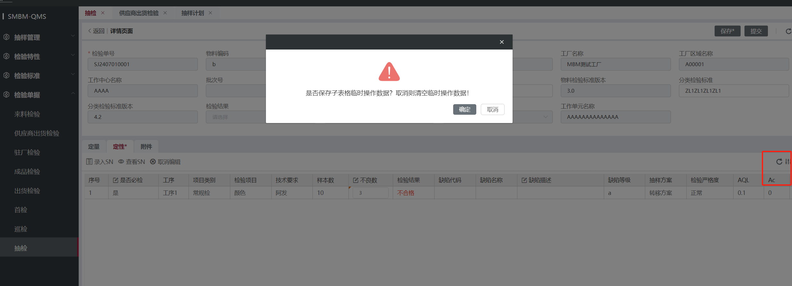

```js
{
  "type": "grid",
  "checkSaveToTable": false
  "columns": [
    "name",
    "code",
    "status",
  ]
}

```

## 视图配置表格勾选框

```js
{
  "type": "grid",
  "checkbox": "multiple_2",//多选： multiple_2 单选： single_2， 已勾选数据vm.$ds.checkedDataList
  "checkType": "bgSync",//勾选和高亮蓝色背景选中行同步
  "selectedType": "linkSubTable",//选中子表关联行，边框加粗
  "columns": [
    "name",
    "is_admin",
    "code",
    "remark"
  ]
},
```

## 视图配置表格使用自定义分页组件

```js
//单个视图配置
{
  "type": "grid",
  "customPaging": {     //配置自定义分页组件，可配置true使用默认配置或者配置以下配置
    "selectPageSize": [10, 20, 30, 50, 100, 200, 500],
    "position": "right"
  }
},
//全局配置在项目的apps.json中配置
{
  "customPaging": {     //配置自定义分页组件，可配置true使用默认配置或者配置以下配置
    "selectPageSize": [10, 20, 30, 50, 100, 200, 500],
    "position": "right"
  }
}
```

| checkbox 配置 | 版本 | 数据取值          | 差别及变更原因                                                                                                                                                       |
| ------------- | ---- | ----------------- | -------------------------------------------------------------------------------------------------------------------------------------------------------------------- |
| multiple      | 旧   | selectedTableData | 原 selectedTableData 取值会与表格高亮选中行数据重复<br/>会存在问题，已勾选多个行再有点击单行高亮 electedTableData 就会只存留高亮那一行数据，与外对接请使用新版本配置 |
| single        | 旧   | selectedTableData | 单选取值同上，与外对接请使用新版本配置                                                                                                                               |
| multiple_2    | 新   | checkedDataList   | 为了和 selectedTableData 表格高亮选中行区别开<br/>现 selectedTableData 为表格高亮选中行数据，checkedDataList 为已勾选行数据                                          |
| single_2      | 新   | checkedDataList   | 单选取值同上                                                                                                                                                         |

## 表格工具栏按钮分组合并

> > > "group": "id" ,group 是分组标识，id 一样的合并到一组

```js
"tbar": [
    {
      "name": "上传",
      "action": "create",
      "auth": "create",
      "icon": "iconfont icon-shangchuan"
    },
    {
      "name": "安装",
      "group": "add",
      "model": "meta_app_store",
      "service": "installApp",
      "auth": "installApp",
      "action": "installApp",
    },
    {
      "name": "删除",
      "group": "add1",
      "action": "delete",
      "auth": "delete"
    }
  ]

```

> > > group 也支持配置成对象，配置分组的名字，和分组的 icon

```js
 "tbar": [
    {
      "name": "操作1",
      "action": "action1",
      "auth": "auth1",
      "group": {
        "groupName": "分组名称",
        "id": "group1",
        "icon": "el-icon-eleme"
      }
    },
    {
      "name": "操作2",
      "action": "action2",
      "auth": "auth2",
      "group": {
        "groupName": "分组名称",
        "id": "group1",
        "icon": "el-icon-eleme"
      }
    },
    "@defaults"
  ]

```

## tab 模式

- 列表视图配置 isOpenViewTab: true

- 默认展示列表页签，共三个页签，列表、新增(可关闭)、详情(可关闭)

- 新增：点击新增按钮，打开新增页签

- 详情：点击详情按钮，打开详情页签，主表单为查看态

- 编辑：点击编辑按钮，打开详情页签，主表单为编辑态

- 双击行，打开详情页签，主表单为查看态

```js

{
  "body": {
  "checkbox": "multiple_2",
          "typeView": "subTable",
          "isOpenViewTab": true,
          "buttons": [
    {
      "action": "preview",
      "auth": "read",
      "name": "详情"
    },
    {
      "action": "edit",
      "auth": "update",
      "name": "编辑"
    }
  ],
          "columns": [
    "classificationCode",
    "classificationName",
    "remark",
    "fullName",
    "create_user",
    "create_date",
    "update_user",
    "update_date"
  ],
          "tbar": [
    {
      "action": "create",
      "auth": "create",
      "name": "新增"
    },
    {
      "action": "delete",
      "auth": "delete",
      "name": "删除"
    },
    {
      "name": "导出",
      "action": "export",
      "model": "book_classification",
      "service": "excelExport"
    }
  ],
          "type": "grid"
},
  "mode": "primary",
        "model": "book_classification",
        "name": "图书分类-列表",
        "type": "grid"
}
```

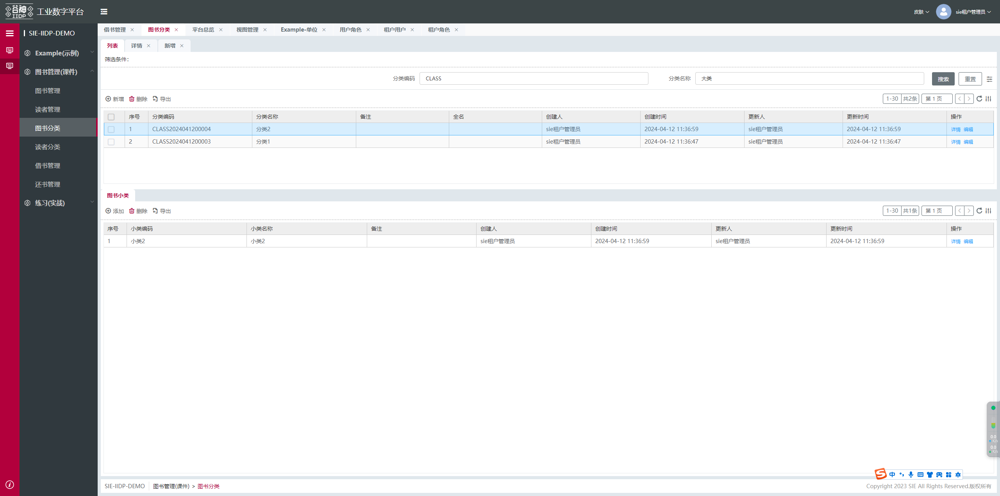

## 树型表格

- 列表视图配置 treeNode: true

```js

{
  "type": "grid",
  "treeLoadMethod": {   //配置树表结构懒加载请求子数据自定义方法，不配置默认取当前列表的model和service
    "model": "MesWorkorderTVO",
    "service": "searchChild"
  },
  "gridOptions": {
    "treeConfig": {
      // transform为true时开启自动将列表转成树结构，需要指定parentField
      // transform为false时需要指定childrenField tableData结构为[{id:1,name:2,children:[id:2,name:3]}]
      // 设置children这种方式可以让子数据全部展示，不用担心分页引起的子数据不全
      "transform": true,
      "rowField": "id", // 树节点的字段名
      "parentField": "hlId", // 父级
      "childrenField": "children", // 子级
      "seqTreeNode": true,  //在序号列展开子节点配置
      "checkboxTreeNode": true,  //在复选框列展开子节点配置
      "lazy": true,    //配置是否懒加载
      "hasChild": "hasChildren",
      "loadMethod": async ({ row })=>{    //懒加载方法，row：父级当前行数据可以用来传递给子接口参数
        const table = tech_app.page.getNode('mes_workorder_t_menu_table_main_table');  //获取表格节点，调用定义好的接口
        const res = await table.request('tableChildData', {
          args: {
            "filter":[['parentWorkorderNo','=',row.workorderNo]]
          }
        });
        return res.data.length>0?res.data:[];
      }
    },
    // checkStrictly: 是否严格的遵循父子不互相关联的做法 为true时选中子不会自动勾选父
    "checkboxConfig": { "checkStrictly": true, "showHeader": true }
  },
  "columns": [
      {
        "displayName": "功能位置编码",
        "name": "functLocationCode",
        "treeNode": true //树节点
      },
      {
        "displayName": "功能位置名称",
        "name": "functLocationName"
      },
      {
        "displayName": "父级",
        "name": "hlId",
        "display": false,
        "custom": true
      }
    ],
}
- 数据示例
[
  {
      "functLocationCode": "M2404020001",
      "functLocationName": 'xxxx',
      "hlId": "03snqk3ffdh4a",
      "id": "03sobo47uajtn"
  },
  {
     "functLocationCode": "M2404020002",
      "functLocationName": 'xxxx',
      "hlId": null,
      "id": "03snr66ttwhv4"
  },
  {
      "functLocationCode": "M2404020003",
      "functLocationName":'xxxx',
      "hlId": null,
      "id": "03snqk3ffdh4a"
  }
]
```

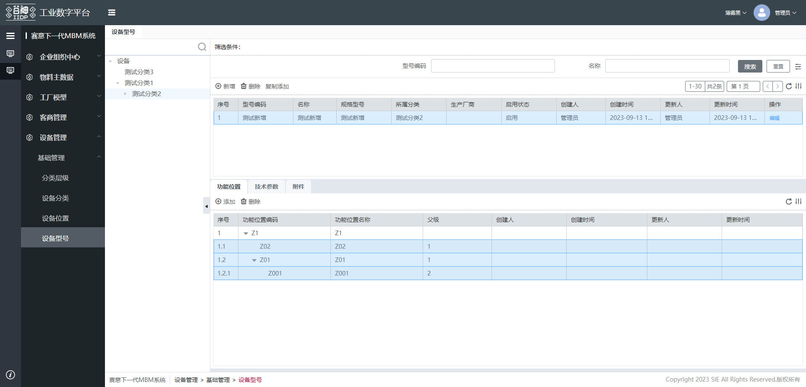

## 表格双击事件配置

- 列表视图配置 doubleclickAction: 'preview'

```js

{
  "type": "grid",
  "doubleclickAction": "preview",//默认preview双击进入详情页，可配置 edit 双击进入编辑
  "columns": [
    "name",
    "is_admin",
    "code",
    "remark"
  ]
}
```

## 表格虚拟滚动

```js
{
    "type": "grid",
    // 竖向虚拟滚动 每次渲染的数据偏移量 默认2
    "oSize": 10,
    // 横向虚拟滚动 每次渲染的数据偏移量 默认2
    "oSizeX": 20,
    // 取消自动计算列宽：默认false开启，true禁用。注：自动计算列宽有一定性能损耗
    "cancelAutoWidth": true,
    // 开启横向虚拟滚动：默认false禁用，true开启。注：横向虚拟滚动可能会导致表头高度异常，需要配合设置固定表头高度和列宽以消除异常
    "virtualScrollX": true,
    // 基础列宽
    "columnWidth": "170px",
    // 操作列宽度
    "operateColumnWidth": "350px",
    "headerCellStyle": {
      // 表头高度
      "height": "90px"
    },
    "columns": [
      {
        "label": "业务类型",
        "name": "businesstype",
        // 单独设置列宽
        "width": "150px"
      }
    ]
}

```

## 表格列隐藏

- 列表视图配置 hidden: true

```js
{
  "type": "grid",
  "columns": [
    {
      "name": "name",
      "hidden": true

    },
    "is_admin",
    "code",
    "remark"
  ]
}
```

## 表格列对齐方式

- 可在 apps.json 文件配置`"gridAlign": "center"`（left/right/center）开启全局配置, 也可在视图单独配置。【视图配置的优先级更高】

```js
{
  "type": "grid",
  "gridAlign": "center", // 在视图配置单元格数据居中
  "columns": [
    "name",
    "is_admin",
    "code",
    "remark"
  ]
}
```

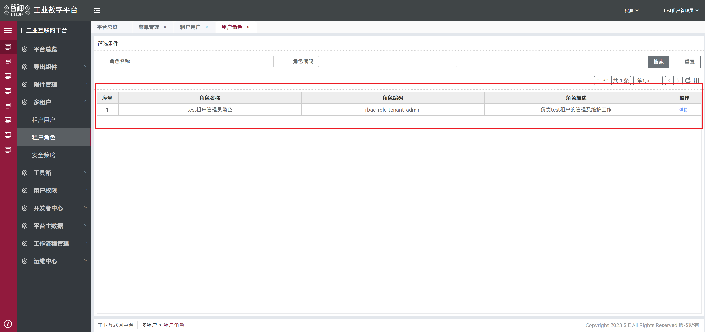

## 禁用自动搜索

- 进入主表格时，不自动搜索，需要手动点击搜索按钮进行搜索。disabledInitAutoSearch:true

```json
{
  "type": "grid",
  "isOpenViewTab": true,
  "disabledInitAutoSearch": true
}
```

## 表格 tbar 默认按钮

前端对于工具栏的按钮的配置一些默认的 action，直接配置就能实现对应的功能

#### 新增

```js
{
  "name": "新增",
  "action": "create",
  "auth": "create"
}
```

#### 删除

```js
{
  "name": "删除",
  "action": "delete",
  "auth": "delete"
}
```

#### 添加 Er 关系

- 说明：selectedDisplay 可以配置添加关联弹框的已选择数据的显示名称，非必选，默认取 name 字段

```js
{
  "name": "添加",
  "action": "addEr",
  "auth": "update",
  "selectedDisplay": "displayName"
}
```

#### 新增 Er 关系

```js
{
  "name": "创建",
  "action": "createEr",
  "auth": "create"
}
```

#### 删除 Er 关系

```js
{
  "name": "删除",
  "action": "deleteEr",
  "auth": "delete"
}
```

#### 导入

- 功能： 导入表格数据
- args 说明:

  $table.row: 主表格当前行数据，用于主列表 tbar 配置

  $table.subRow: 子表格当前行数据，用于上下表子表 tbar 配置

  $form.curForm: 主表单当前数据，用于主表单子表 tbar 配置

  也可自定义参数 eg: "xxx": "123"

```js
{
  "action": "import",
  "service": "excelImport",
  "name": "导入",
  "model": "equip_maintenance_procedure",
  "auth": "import",
  "fileLimit": {
    "ext": ".xls,.xlsx",
    "maxSize": "2048"
  },
  "args": {
    "name": "$table.row.name",
    "name1": "$table.subRow.name",
    "name2": "$form.curForm.name",
    "xxx": "123"
  }
}
```

#### 导出

- 功能： 导出下载表格数据，需要调用后端接口

- 说明：

  1. 未配置表格勾选功能：默认导出当前查询条件下所有数据

  2. 配置表格勾选功能：若有勾选表格数据，导出所勾选的表格数据，否则导出当前查询条件下所有数据

  3. 可配置 reqPrepFn 和 reqAfterFn 钩子函数（v2.8.1-HOTFIX.029 及以上版本支持）。

```js
{
  "name": "导出",
  "action": "export",
  "model": "model1",
  "service": "service1",
  "auth": "export",
  "customExport": true，    //是否开启自定义导出
  "reqPrepFn": (vm,params)=> {params.type='111'; return params}, // 自定义导出参数的钩子，参数为当前视图的实例和请求参数，返回新的请求参数
  "reqAfterFn": (vm)=> {window.ELEMENT.Message.success('导出成功')} // 导出成功后的钩子，参数为当前视图的实例
}
```

#### 导出数据

- 说明： 导出当前列表的数据，不需要调用后端接口

```js
{
  "name": "导出",
  "action": "exportData",
  "auth": "exportData"
}
```

#### 下载静态模板

```js
{
    "filename": "/apps/2023-10-30/保养规程导入模板.xlsx",
    "auth": "staticDownload",
    "name": "下载模板",
    "action": "staticDownload",
    "downloadName": "自定义文件名称"
}
```

#### 下载动态模板

```js
{
    "auth": "methodDownload",
    "name": "下载模板",
    "action": "methodDownload",
    "model": "xxx",
    "service": "xxx"
},
```

#### 复用标准 tbar 按钮

- copyAction: 可配置上述按钮 action

```js
配置多个导出按钮，复用默认的导出按钮事件，根据不同入参导出不同数据
 {
    "name": "导出1",
    "action": "export1",
    "copyAction": "export", // 复用的按钮配置
    "model": "model1",
    "service": "service1",
    "auth": "export"
},
{
    "name": "导出2",
    "action": "export2",
    "copyAction": "export", // 复用的按钮配置
    "model": "model2",
    "service": "service2",
    "auth": "export"
}
```

## 表格 tbar 自定义按钮

- bind_disabled: 根据选择行数据控制按钮禁用状态

  - $ds.selectedTableData: 当前表格选择的行数据
  - $ds.checkedDataList: 当前表格勾选的行数据（配置了 checkbox: multiple_2）
  - $ds.checkedDataIds: 当前表格勾选数据的 id 集合

- bind_display: 动态控制工具栏按钮显示或隐藏（表达式返回 true 显示，false 隐藏）

- args 说明:

  - "bind_ids": "$ds.checkedDataIds": 当前表格勾选数据的 id 集合
  - $table.row: 主表格当前行数据，用于主列表 tbar 配置
  - $table.subRow: 子表格当前行数据，用于上下表子表 tbar 配置
  - $form.curForm: 主表单当前数据,用于主表单子表 tbar 配置
  - 自定义参数: `"xxx": "123"`
  - 自定义函数传参,动态构造 args 方法: `othersParams: (vm) => { return {xxx:123}}`

- actionBeforeFn: 接口执行前的自定义操作，返回 true 继续执行接口调用，返回 false 终止执行接口调用

- actionAfter: "refreshTable"
  接口执行后刷新操作，接口必须返回成功标识（返回 true 即可）

- actionAfterFn:接口执行后的自定义操作

```js
{
    "action": "xxx",
    "service": "xxx",
    "auth": "xxx",
    "name": "自定义操作",
    "model": "xxxxxx",
    "bind_disabled": "${$ds.selectedTableData.length === 0 || $ds.selectedTableData[0].state.value !== '0'}",
    "args": {
        "bind_ids": "$ds.checkedDataIds",
        "name": "$table.row.name",
        "name1": "$table.subRow.name",
        "name2": "$form.curForm.name",
        "xxx": "123",
        "othersParams": "(vm) => { return {xxx:123}}"
    },
    "actionBeforeFn": "(vm) => {console.log(vm); return false}",
    "actionAfter": "refreshTable",
    "actionAfterFn": "(vm) => {console.log(vm)}"
}


```

- 导入: 通过 Excel 导入数据时，统一使用该模板

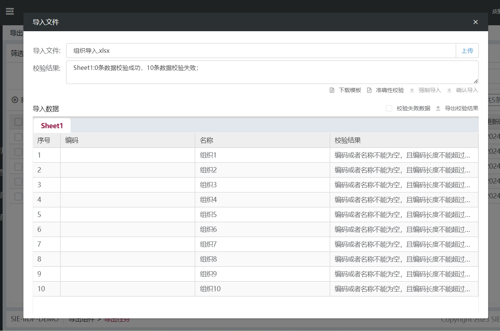

- buttonList 说明:
  模板下载：需要实际业务调用方能根据实际需要配置模板，点击下载模板
  准确性校验：需要实际业务调用方能够根据需要配置校验规则，点击按照校验规则进行准确性校验
  强制导入：默认置灰，校验完成之后高亮展示，点击按照 Excel 数据进行导入
  确认导入：默认置灰，校验完成后，若校验完全通过 （即无校验失败的条数）

```js
{
  "name": "导入",
  "statement": "_fullImport",//固定
  "modelName": "TestUser",//自定义
  "fileName": "/apps/2024-04-02/491743031479803153.xlsx",//自定义
  "buttonList": [//按需配置按钮文本和图标,不配置默认都显示
    {
      "text": "下载模板",
      "action": "downloadTemplate",//固定
      "icon": "el-icon-document"
    },
    {
      "text": "准确性校验",
      "action": "importValidate"//固定
    },
    {
      "text": "强制导入",
      "action": "forceImport"//固定
    },
    {
      "text": "确认导入",
      "action": "confirmImport"//固定
    }
  ]
}
```

- 导出 name: 导出 功能： 异步导出，点击按钮生成导出任务，可跳转进入导出任务页面查看并下载

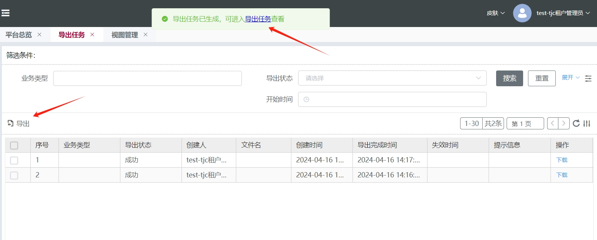

```js
{
  "name": "导出",
  "statement": "_fullExport"//固定
  "modelName":"TestUser",//用户配置业务模型
}
```

## 新菜单标签打开详情页配置

(t-base 2.5 或以上版本生效)
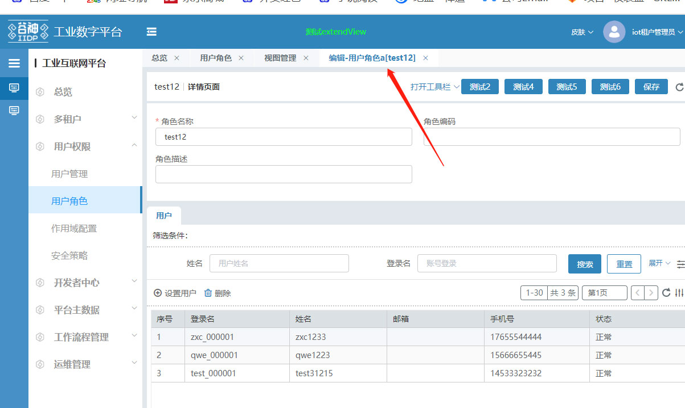

```js
{
  "type": "grid",
  "openDetailInTab": {
    "tabMenuTitle": "$menName", // 可选配置 tab标题里面的菜单名 可以拼接任意字符 例如 "$menName ss"
    "tabFieldTitle": "$row.id", // 可选配置 tab标题里面的字段名 $row为编辑或详细状态的表格行数据 可以拼接任意字符 例如 "$row.name xx $row.id"
    // "tabTitleFn": "(vm, menuName, row) => { return {tabMenuTitle:menuName+'a',tabFieldTitle:(row?.name || '') } }"
    // 可选配置 自定义钩子方法 返回 标题菜单名 标题字段名  若配置了 tabTitleFn 则优先覆盖  tabMenuTitle  tabFieldTitle  配置
  }
}
```

工程的 config/apps.json 配置开启全局的 新菜单标签打开详情页配置

注意：配置了全局后可能会使某些详情页里面的扩展失效，需要按扩展复用原来的扩展

```js
// apps.json
{
  ...
  "global": {
    ...
    "openDetailInTab": {
      // 与视图配置属性一致
    }
  }
}
```

## 菜单标签最大打开数量配置

(t-base 2.4 或以上版本生效)
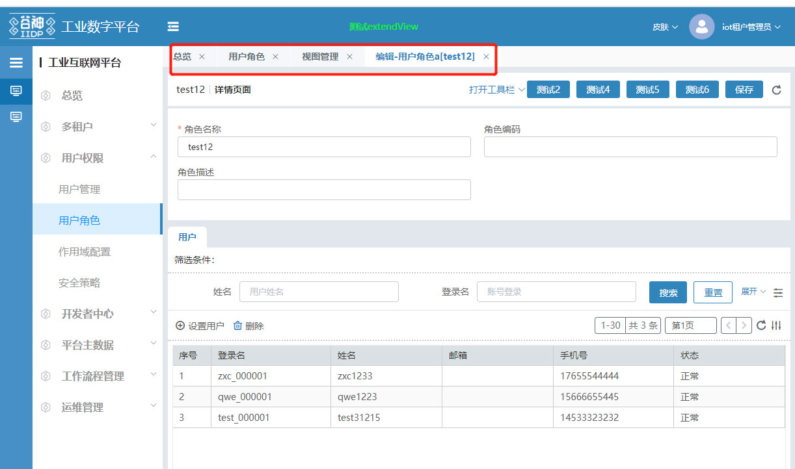

工程的 config/apps.json 配置 菜单标签最大打开数量 例如下面最多打开 20 个菜单 tab

```js
// apps.json
{
  ...
  "global": {
    ...
    "maxMenuTabs": 20
  }
}
```

## 使用表格原生方法

表格是在 vxe-grid 组件的基础上封装的，因此可以调用组件自带的方法。
调用步骤：

1. 到 vxe 官网根据自己的需求找到对应的方法 所有方法都在 Methods 里
2. 找到表格实例，例如 vm.instance
3. 调用方法：vm.instance.getInstance().xxx(); xxx 是官方提供的方法

   [vxe 官网地址](https://vxetable.cn/v3/#/grid/api)

4. 在使用 vxetable3 原生配置
   > https://vxetable.cn/v3.8/#/table/api
   > 例如：在 vxetable3 官网 api 上搜索
   > 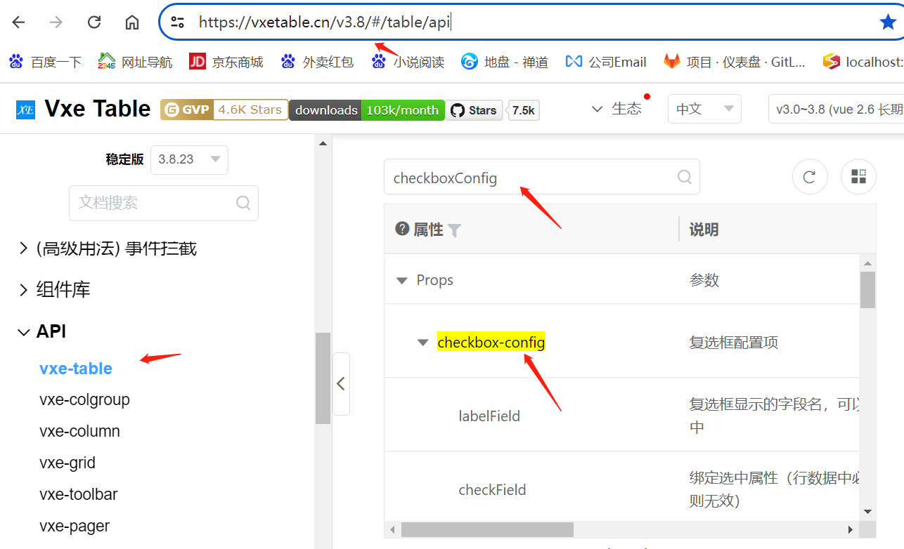
   > 例如：搜索到配置为： (按需禁用行勾选)
   ```js
    "checkbox-config": {
      checkMethod: ({ row }) => { return false }
    }
   ```
   则在表格视图配置为：
   ```js
   {
    。。。
    type: 'grid',
    gridOptions: {
      "checkbox-config": {
        checkMethod: ({ row }) => { return false }
      }
    }
    。。。
   }
   ```

## 配置额外属性 mergeAttrs

配置额外属性到渲染后的表格前端视图节点，方便配置自定义指令

```js
{
  type: "grid",
  mergeAttrs: {
    "xxx":xxx
  }
}
```

## Attributes

| 属性名                           | 说明                                                                                                   | 类型     | 必填 | 可选值                             | 默认值      |
| -------------------------------- | ------------------------------------------------------------------------------------------------------ | -------- | ---- | ---------------------------------- | ----------- |
| type                             | 视图类型                                                                                               | String   | 是   | grid                               | -           |
| columns                          | 表格列                                                                                                 | Array    | 是   | -                                  | -           |
| buttons                          | 表格操作列按钮                                                                                         | Array    | 是   | -                                  | -           |
| tbar                             | 工具条按钮                                                                                             | Array    | 是   | -                                  | -           |
| cellStyle                        | 单元格样式                                                                                             | Function | 否   | -                                  | -           |
| summaryMethod                    | 自定义的表尾数据计算方法                                                                               | Function | 否   | -                                  | -           |
| showHeader                       | 是否显示表头                                                                                           | Boolean  | 否   | -                                  | true        |
| gridEditMode                     | 行内编辑配置 [attrs](/pages/57732f/#grideditmode-attributes)                                           | Object   | 否   | -                                  | -           |
| beforeEditMethod                 | 控制单元格是否可编辑方法返回 true 可编辑，false 不可编辑                                               | Function | 否   | -                                  | -           |
| addRow_config                    | 新增行时 如果需要显示默认数据 可以调用元模型接口查默认数据                                             | Object   | 否   | -                                  | -           |
| tableExpandConfig                | 表格展开行配置                                                                                         | Object   | 否   | -                                  | -           |
| headerSortRemote                 | 启用服务端排序                                                                                         | Boolean  | 否   | -                                  | -           |
| sortMultiple                     | 启用多列排序                                                                                           | Boolean  | 否   | -                                  | -           |
| headerFilterRemote               | 启用服务端筛选                                                                                         | Boolean  | 否   | -                                  | -           |
| mergeRowList                     | 合并行                                                                                                 | Array    | 否   | -                                  | -           |
| mergeMethod                      | 合并行算法返回{rowspan 跨几行，colspan 跨几列}                                                         | Function | 否   | -                                  | -           |
| searchByMainTable                | 表格自定义查询配置(主表子表都可用) [attrs](/pages/57732f/#表格自定义查询条件)                          | Object   | 否   | -                                  | -           |
| typeView                         | 表格视图显示类型(用于配置上下表格模板)                                                                 | String   | 否   | subTable                           | -           |
| hasDefaultSelectRow              | 表格具有默认选中行                                                                                     | Boolean  | 否   | -                                  | true        |
| dbClickEnterDetails              | 禁止双击进入详情页                                                                                     | String   | 否   | disable                            | true        |
| mainTableHeight                  | 上下表格模板情况下主表高度                                                                             | String   | 否   | -                                  | 2rem        |
| tabTableAutoHeight               | 子表自适应高度页面不显示外层滚动条                                                                     | Boolean  | 否   | -                                  | false       |
| toolbar.toolbarDisplay           | 控制整个 toolbar 显示隐藏 [toolbar 相关配置项](/pages/57732f/#隐藏-toolbar、分页、刷新、columnsconfig) | Boolean  | 否   | -                                  | true        |
| toolbar.refreshDisplay           | 控制刷新按钮显示隐藏                                                                                   | Boolean  | 否   | -                                  | true        |
| columnsConfigMode                | 控制自定义表格列按钮显示隐藏                                                                           | Boolean  | 否   | -                                  | true        |
| pagin.limit                      | 表格每页显示条数[pagin 分页相关配置项](/pages/57732f/#隐藏-toolbar、分页、刷新、columnsconfig)         | Number   | 否   | -                                  | 30          |
| pagin.display                    | 控制分页组件显示隐藏                                                                                   | Boolean  | 否   | -                                  | true        |
| pagin.unPaging                   | 控制分不分页 true 为不分页                                                                             | Boolean  | 否   | -                                  | false       |
| pagin.selectPageSize.show        | 显示每页显示条目个数下拉                                                                               | Boolean  | 否   | -                                  | false       |
| pagin.selectPageSize.allowCreate | 允许用户创建每页显示新条目                                                                             | Boolean  | 否   | -                                  | false       |
| pagin.selectPageSize.options     | 每页显示条目个数下拉选项                                                                               | Array    | 否   | -                                  | [30,50,100] |
| checkbox                         | 表格勾选                                                                                               | String   | 否   | multiple_2(多选)/single_2(单选)    | -           |
| checkType                        | 勾选和高亮蓝色背景选中行同步                                                                           | String   | 否   | bgSync                             | -           |
| selectedType                     | 选中子表关联行，边框加粗                                                                               | String   | 否   | linkSubTable                       | -           |
| gridOptions                      | 表格配置项                                                                                             | Object   | 否   | -                                  | -           |
| doubleclickAction                | 双击行执行动作                                                                                         | String   | 否   | preview(进入详情页)/edit(进入编辑) | -           |
| oSize                            | 竖向虚拟滚动 每次渲染的数据偏移量                                                                      | Number   | 否   | -                                  | 2           |
| oSizeX                           | 横向虚拟滚动 每次渲染的数据偏移量                                                                      | Number   | 否   | -                                  | 2           |
| cancelAutoWidth                  | 取消自动计算列宽 false 开启，true 禁用                                                                 | Boolean  | 否   | -                                  | false       |
| virtualScrollX                   | 开启横向虚拟滚动 false 禁用，true 开启                                                                 | Boolean  | 否   | -                                  | false       |
| columnWidth                      | 基础列宽                                                                                               | String   | 否   | px, %                              | -           |
| operateColumnWidth               | 操作列宽度                                                                                             | String   | 否   | px, %                              | -           |
| headerCellStyle                  | 表头单元格附加样式                                                                                     | Object   | 否   |                                    | -           |
| disabledInitAutoSearch           | 禁用自动搜索，需要手动点击搜索按钮进行搜索                                                             | Boolean  | 否   | -                                  | false       |
| gridAlign                        | 表格列对齐方式                                                                                         | String   | 否   | -                                  | left        |

### 子表 Attributes

| 属性名             | 说明                                                                     | 类型          | 必填 | 可选值                                                           | 默认值 |
| ------------------ | ------------------------------------------------------------------------ | ------------- | ---- | ---------------------------------------------------------------- | ------ |
| type               | 子表包含视图                                                             | String        | 是   | grid,singleGrid(非 er 关系子表),formpart(主表单拆分),search,form | -      |
| field              | 子表对应关联模型                                                         | String/Object | 是   | -                                                                | -      |
| mainTableColumns   | 主表选中行内容回填抽屉子表单(回填抽屉表单字段和主表选中行对应字段一致)   | Object        | 否   | -                                                                | -      |
| transformInitValue | 主表选中行内容回填抽屉子表单(回填抽屉表单字段和主表选中行对应字段不一致) | Function      | 否   | -                                                                | -      |

#### gridEditMode Attributes

| 属性名            | 说明             | 类型    | 必填 | 可选值                                    | 默认值 |
| ----------------- | ---------------- | ------- | ---- | ----------------------------------------- | ------ |
| mode              | 编辑类型         | String  | 是   | multipleRow(多行编辑)/singleRow(单行编辑) | -      |
| rowBtns           | 工具栏操作按钮   | Array   | 是   | ["update", "add", "delete"]               | -      |
| defaultCancelEdit | 默认进入编辑模式 | Boolean | 否   | -                                         | -      |

### columns item Attributes

参考组件文档 [table columns](/pages/9353d8/#column-attributes)
| 属性名 | 说明 | 类型 | 必填| 可选值 | 默认值 |
| ---------------- |----------------- |--------|---------- |--------- |---------- |
| type | 单元格显示类型 | String | 否 | icon(图片)/seq(序号)</br>/checkbox(复选框)/radio(单选框)</br>/expand(展开行)/html |-|
| name | 表格列数据对象 | String | 是 | - | - |
| label | 表格列标题 | String | 否 | - | - |
| displayName | 表格列标题(推荐使用)</br>需配合 custom:true 使用 | String | 否 | - | - |
| treeNode | 是否为树节点 | Boolean | 否 | - | - |  
| hidden | 隐藏表格列 | Boolean | 否 | - | false |
| fixed | 将列固定在左侧或者右侧 | String | 否 | left(冻结左侧)/ right(冻结右侧) | - |

### buttons item Attributes

操作栏默认显示详情和编辑按钮
主表 buttons: ['@defaults']
子表 buttons: ['@defaultsEr']
| 属性名 | 说明 | 类型 | 必填 | 可选值 | 默认值 |
| ---------------- |-------------------------------- |---------- |----- |------------- |---------- |
| action | 表格操作列按钮执行动作 | String | 是 | edit/preview(查看详情)</br>/openView(打开新视图界面)/previewEr(查看子表详情)/updateEr(编辑子表)| - |
| auth | 权限配置 | String | 否 | read、update、自定义| - |
| model | 调接口模型 | String | 否 | - | - |
| service | 调接口服务 | String | 否 | - | - |
| args | 调接口传参 | Object | 否 | - | - |
| options | 配置项[attrs](/pages/15c744/#options-attributes)| Object | 否 | - | - |
| enableCondition | 根据函数返回值(true 或 false)设置按钮禁用状态
| showCondition | 根据函数返回值(true 或 false)动态显示或隐藏按钮
| actionAfter | 接口执行后刷新操作，接口必须返回成功标识（返回 true 即可）| String | 否 | refreshTable(刷新列表) | - |
| actionAfterFn | 接口执行后自定义操作
| isLoading | 按钮点击后，按钮自身添加 loading | Boolean | 否 | - | - |
| showPopLoading | 按钮点击后，页面全局添加 loading | Boolean | 否 | - | - |

### tbar item Attributes

工具条默认显示新增和删除按钮
主表 tbar: ['@defaults']
子表 tbar: ['@defaultsEr']
| 属性名 | 说明 | 类型 | 必填 | 可选值 | 默认值 |
| ---------------- |-------------------------------- |---------- |----- |------------- |---------- |
| action | 工具条按钮执行动作 | String | 是 | create/delete</br>addEr(添加子表关联)/deleteEr(删除子表)</br>/createEr(新增子表)</br>/import/export(调用后端接口导出)</br>/exportData(纯前端导出)</br>/staticDownload(下载静态模板)</br>/methodDownload(下载动态模板)</br>/createRow(新增行) | - |
| auth | 权限配置 | String | 否 | create、delete、自定义| - |
| group |分组标识，id 一样的合并到一组 | String/Object | 否 | - | - |
| bind_display | 动态绑定是否显示按钮 |String | 否 | - | - |
| bind_disabled | 动态绑定是否禁用按钮 |String | 否 | - | - |
| options | 配置项[attrs](/pages/15c744/#options-attributes)| Object | 否 | - | - |
