# 表单视图

- columns：表单项
- tabs： 子表项
- tbar： 工具栏按钮 （t-base 2.4 或以上版本可以使用）

## 原始后端视图

```js
{
  "type": "form",
  // 表单项
  "columns": ["name", "login", "mobile", "email", "role_ids", "password", "status"],
  "tabs": [
    {
      // 子表tab标题
      "header": "角色",
      // 子表tbar按钮
      "tbar": [
        {
          "name": "添加",
          "action": "addEr",
          "auth": "update"
        },
        {
          "name": "删除",
          "action": "deleteEr",
          "auth": "delete"
        }
      ],
      // 子表配置
      "body": {
        "type": "grid,form,search",
        "field": "role_ids",
        "columns": ["name", "is_admin"]
      }
    }
  ]
}
```

更多配置请看[后端-基本视图-form](/pages/405eb0/#_3-8-1-1-表单-form)

## 控制表单项的显示隐藏

动态控制显示隐藏

```js
"columns": [
  "name",
  "status",
  {
    "name": "prop1",
    "bind_display": "${$ds.form.status === 1}"   // 当status 等于 1 时显示
  },
  {
    "name": "prop2",
    "bind_display": "${$ds.form.status === 2}"   // 当status 等于 2 时显示
  },
]
```

同一个表单项不同展现形式, 新增或编辑情况下控制同一个字段 不同配置

- 定义不同的 id

```js
// 该表单项在新增是必填，展示下拉控件；编辑是非必填，展示开关控件
"columns": [
    {
        "displayName": "作者1",
        "id": "book_form_main_top_common_items_0_items_login1",
        "name": "author",
        "custom": true,
        "required": false,
        "type": "switch",
        "bind_display": "${$ds.clickType == 'edit'}"
    },
    {
        "displayName": "作者2",
        "id": "book_menu_form_main_top_common_items_0_items_login2",
        "name": "author",
        "custom": true,
        "required": true,
        "type": "select",
        "bind_display": "${$ds.clickType == 'add'}"
    }
]
```

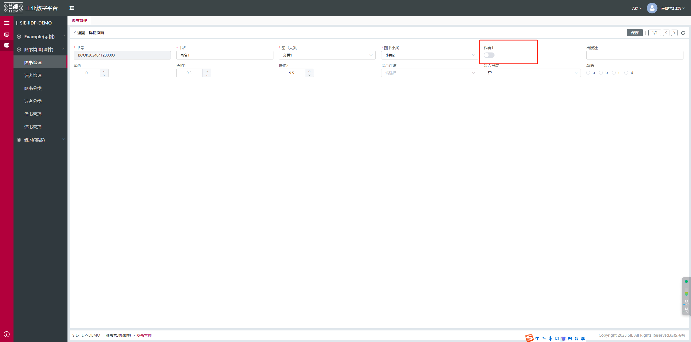
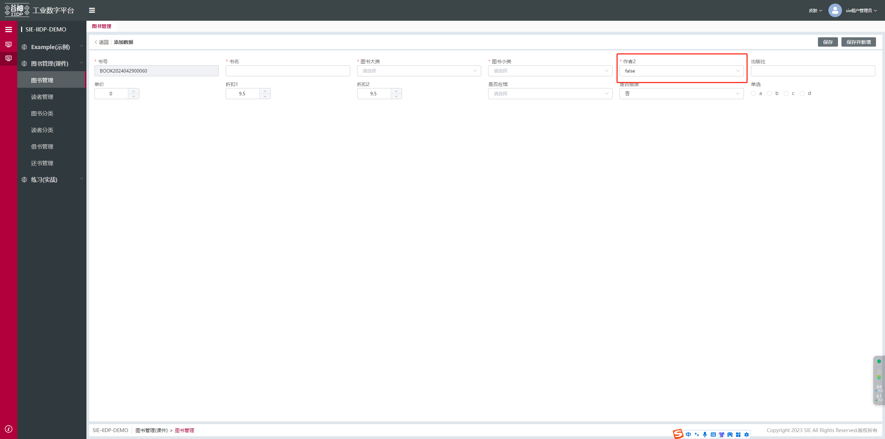

固定显示隐藏

```js
"columns":[
  {
    "name": "prop1",
    "display": false
  }
]

```

固定不显示,表单可以取到该字段数据

```js
"columns":[
  {
    "name": "prop1",
    "custom": true,
    "type": 'hidden'
  }
]

```

````

自定义配置字段是否可清空，能作用在selection manytoone等dataType类型 能出现交叉小图标
```js
"columns":[
  {
    "name": "prop1",
    "custom": true,
    "clearable": true
  }
]

````

## 表单输入框前缀后缀图标

```js
"columns": [
  "name",
  "status",
  {
    "name": "prop1",
    "prefixIcon": "el-input__icon el-icon-date"
  },
  {
    "name": "prop2",
    "suffixIcon": "el-input__icon el-icon-search"
  }
]
```

## 自定义表单项属性

```js
{
  "type": "form",
  "columns": [
    {
      "name": "name",
      "displayName": "角色名称",
      "custom": true
    },
    "status",
    {
      "name": "prop1",
      "required":true
      "custom": true
    },
  ]
}

配置说明：
  custom: true  默认false,配置为true时，视图配置的属性覆盖fields里对应字段定义的属性

注：
修改表单项名称，可配置displayName或text,建议用displayName
```

## 自定义表单项值

```js
{
  "type": "form",
  "transformInitValue": (form)=>{form.code = form.code + '111'; return form},
  "columns": [
    "name",
    "code",
    "status",
  ]
}

配置说明：
  transformInitValue: 对表单数据的处理
  入参form为当前表单数据

注：
 重新赋值后必须retrun form
```

## 表单项设置初始显示值方法

````js
{
  "type": "form",
  "columns": [
    {
      "name": "name",
      "defaultValueFn": (vm)=>{const table = vm.$select('role_menu_table_main_table');val = table.$ds.mainRowTableData.name;return val;}
      //支持 return new Date()直接返回值  也支持使用方法最后返回某个值
    },
    "code",
    "status",
  ]
}

## 表单项是否必填

```js
"columns": [
  "name",
  "status",
  {
    "name": "prop1",
    "required": true,
    "custom": true
  },
]
````

## 是否显示《只看必填项》开关

````js
{
  "type": "form",
  "onlyLookRequired": true, // 默认false
  "columns": [
    ...
  ]
}
````

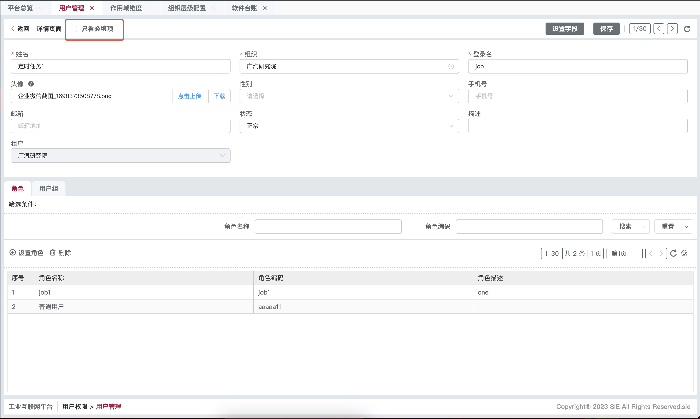
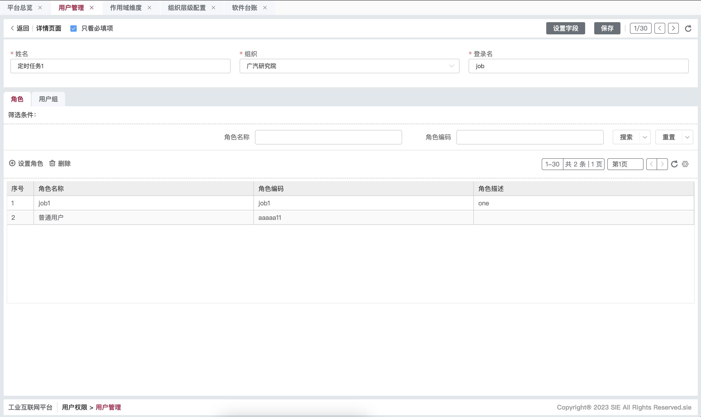

## 修改表单项校验规则

配置 rules

```js
"columns": [
  "name",
  "status",
  {
    "name": "mobile",
    "rules": [
      {
        "required": true,
        "trigger": 'blur',
        "message": '请输入企业名称'
      },
      {
        "validator": (rule, value) => {
          if (rule.value === '') {
            rule.callback(new Error('请输入手机号码'));
          } else if (!/^1[3|4|5|6|7|8|9][0-9]\d{8}$/.test(rule.value)) {
            rule.callback(new Error('请输入正确的手机号码'));
          } else {
            rule.callback();
          }
        },
        "trigger": 'blur'
      }
    ]
  },
]
```

## 取消检查保存的弹框提示

取消表单未保存时操作后的弹框提示，配置 checkSaveToForm: false
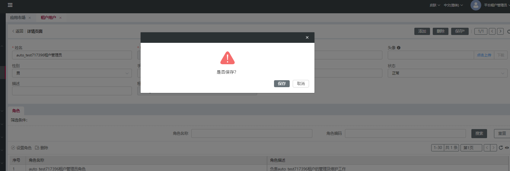

```js
{
  "type": "form",
  "checkSaveToForm": false
  "columns": [
    "name",
    "code",
    "status",
  ]
}

```

## 控制表单项是否放入缓存，跨 tab、menu 时使用同一值

```js
"columns": [
  "name",
  "status",
  {
    "name": "prop1",
    "cache":"cacheName"//String,存放在sessionStorage的key值，例如：cacheName:{prop1:value}
  },
  {
    "name": "prop2",
    "cache":"cacheName"//String,存放在sessionStorage的key值，多个columns有相同的cache，会存放为cacheName:{prop1:value,prop2:value2}
  },

]

```

## 控制详情页 表单项是否可编辑（readOnly）

### 属性绑定主表格的行 id

```js
{
  "name": "display_name",
  "bind_disabled": "${$ds.mainTableRowData.id}"
},


```

### 属性绑定页面的编辑状态

```js
{
  "name": "name",
  "bind_disabled": {
    "path": "$ds.clickType",
    "transform": (params) => {
      return params.self.$ds.clickType != 'add';
      }
  }
},

```

也可以这样写：

```js
{
  "name": "app_ids",
  "bind_disabled": "${$ds.clickType != 'add'}"
},
//控制进入表单的时候可以输入，编辑的时候不可以输入

{"name": "app_ids",
  "bind_disabled": "${$ds.mainTableRowData.id}" //有id就是true，不可编辑，没有id就是false，可以编辑
}


```

### 属性绑定表单其他字段的值

```js
{
  "name": "display_name",
  "bind_disabled": "${$ds.form.xx==='xxx'}"
},


```

## 详情页面是否有编辑按钮

-showEditBtn: 默认为 true

```js
{
  "type": "form",
  "showEditBtn": false,//隐藏编辑按钮，默认为true
  "columns": []
},

```

## 表单项列宽配置

通过 span 属性配置表单项列宽【最佳实践】，搭配 row 属性控制同行排列 

规则：一行总宽为 24，按比例填写 span 值

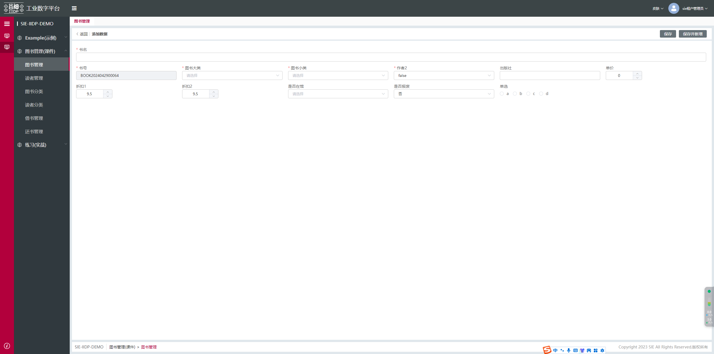

```js
{
  "type": "form",
  "columns": [
    {
      "name": "fieldName",
      "row": 1,        // 相同 row 值的字段排在同一行
      "span": 6,       // 占 24 分之 6，即 1/4 宽
      "minWidth": 300  // 最小宽度（可选）
    }
  ]
}
```

## 表单 tbar 配置

表单 tbar 工具栏配置 除了@defaults 配置 其他跟表格 tbar 配置一致 (t-base 2.4 或以上版本生效)
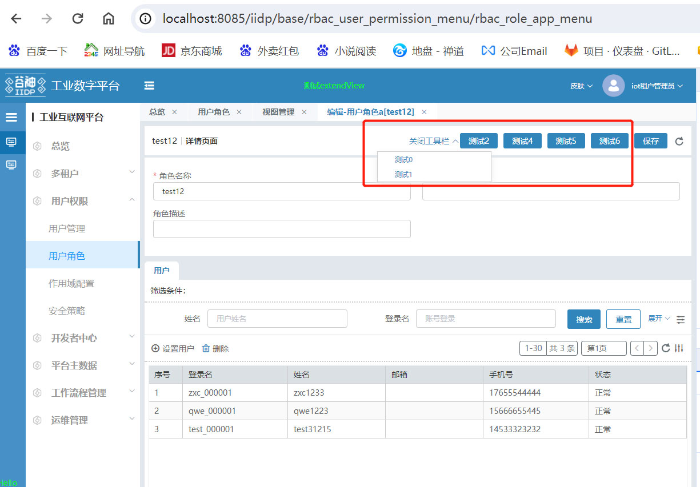

```js
{
  "type": "form",
  "tbar": [
    {
      "name": "测试0",
      "action": "test1",
      "auth": "test1",
      "click": "()=>{console.log('测试0')}"
    }
  ]
}
```

## 表单新增情况先保存主表单配置

表单新增情况先保存主表单再保存子表配置 (t-base 2.5 或以上版本生效)
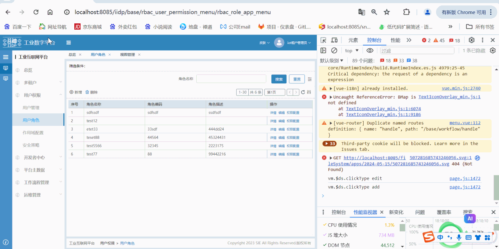

```js
{
  "type": "form",
  "addSaveFormFirst": true // 表单新增情况先保存主表单再保存子表配置
}
```

## 激活所有子表 tab

- 默认不激活所有子表 tab，切换时才激活
- 配置"tabsActiveWork": false 后，激活所有子表 tab

```js
{
  "type": "form",
  "tabsActiveWork": false, // 表单新增情况先保存主表单再保存子表配置
}
```

## tabs 标签

### 1 tabs 添加了一个 icon 图标的配置 可以用 element 的 i 的 class 也可以用 url 图标

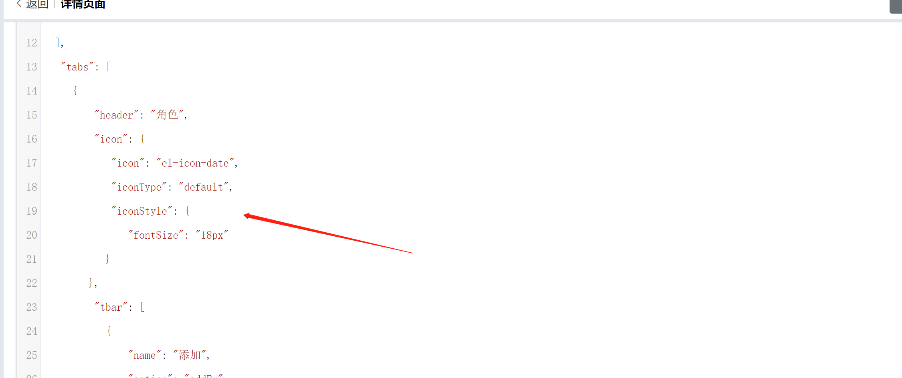

```js
"icon": {
  "icon": "el-icon-date",
  "iconType": "default",
  "iconStyle": {
    "fontSize": "18px"
  }
},
```

### 2 tabs 表格数据配置单独保存以及表格按钮配置是否添加 loading

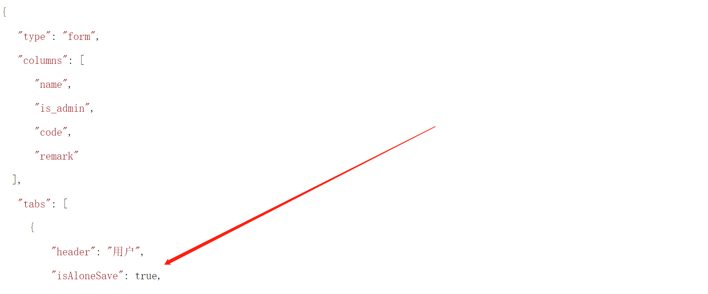

```js
"tabs": [
  {
    "header": "用户",
    "isAloneSave": true,
    "body": {
      "buttons":[
        {
          "name": "编辑",
          "action": "edit",
          "auth": "update",
          "isLoading": true,   //是否添加loading
          "showPopLoading": true  //是否添加弹窗式loading
        }
      ]
    }
  },
],
```

### 3 tabs 可编辑表格-子表 er 关系表配置删除不调接口，只做可视删除


```js
"tabs": [
  {
    "header": "用户",
    "isUiDelete": true, // 删除是否仅可视删除，不调用删除接口，仅支持在下表中使用
    "body": {
      "gridEditMode":{
        "mode": "multipleRow", // multipleRow:多行编辑 singleRow:单行编辑
        // 行内编辑需要用到的类型 如果只修改不新增删除就只写update
        // 存在update： 工具栏会出现一个编辑按钮
        // 存在add且工具栏存在新增按钮： 会把新增按钮替换成新增行按钮
        // 存在delete：点击编辑按钮操作列内会出现删除按钮
        "rowBtns": ["update", "add", "delete"],
        "defaultCancelEdit": true, // 配置上下表格的子表视图,默认进入编辑模式
        "addRowAutoFocus": false // 行内编辑新增行时是否自动获取焦点，默认为true (2.4以上uat版本)
      },
    }
  },
],
```

### 4 tabs 模型和表单相同，用 tabs 拆分显示

配置主表单拆分输入项到 tab  
type="formpart" 与主表单的保存按钮一起保存（ps：上下表不支持）

```js

"tabs": [
    {
        "header": "基础信息",
        "body": {
            "type": "formpart",
            "columns": [
                "isMuseum",
                "isScrap"
            ]
        }
    }
],
```

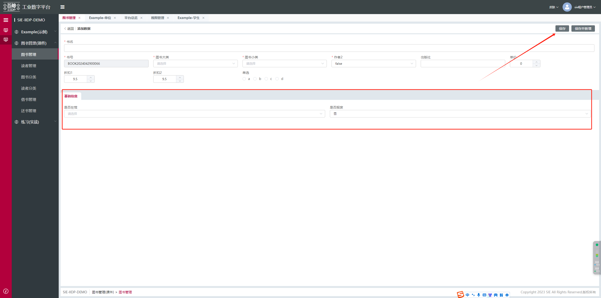

### 5 tabs 配置额外属性 mergeAttrs

配置额外属性到渲染后的 tab 表格前端视图节点，方便配置自定义指令

```js
"tabs": [
  {
    "header": "用户",
    "body": {
      mergeAttrs: {
        "xxx":xxx
      }
    }
  },
],
```

### 6 tabs 按钮弹出的抽屉表单的列配置

form tabs edit columns 如果配置了 edit.columns
则会作用在子表点开的 抽屉表单上列配置
如果没有配置 edit columns 则抽屉表单上的列配置 默认取 子表的列配置

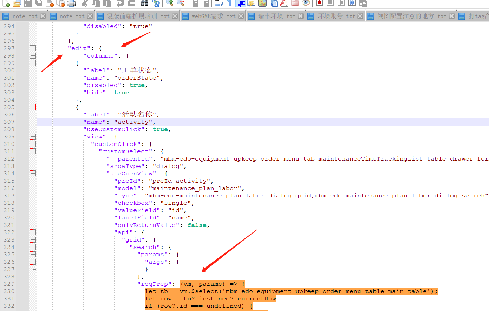

### 7 tabs 动态子表

- hideRelForm: (vm, val)=>{ return true } 隐藏 tabs

- beforeEditMethod: ({ row, rowIndex, column, columnIndex })=>{ return false } 行内编辑动态控制列不可编辑

注：2.4 以上版本

```js
{
  "type": "form"，
  "columns": [
    "itemCode",
    "itemName",
    "unitId"
  ],
  "tabs": [
    {
      "header": "物料属性列表",
      "rowspan": 3,
      "body": {
       "type": "grid,form",
        "model": "example_item_attribute",
        "field": "itemAttributeList",
        // 动态隐藏子表 val是表单数据
        "hideRelForm": (vm, val) => {if (val.itemCode == '123') return true;},
        "gridEditMode": {
          "mode": "multipleRow",
          "rowBtns": [
            "update",
            "add",
            "delete"
          ],
          "defaultCancelEdit": true
        },
        // 行内编辑动态控制可编辑列
        "beforeEditMethod": ({ row, rowIndex, column, columnIndex }) => {if (row.color == 123 && column.field == 'price') { return false;}return true;},
        "columns": [
          {
            "name": "color",
            "rowEditable": true
          },
          {
            "name": "price",
            "rowEditable": true
          },
          {
             "name": "weight",
             // 动态隐藏子表列 val是表单数据
             "hideRelForm": (vm, val) => { if(val.itemCode == '1234') return true},
          }
          "itemAttributeType"
        ]
      }
    }]
},
```

### 8 tabs 的按钮根据主表字段控制禁用状态

- bind_disabled: 返回 true（禁用）或 false（非禁用）
- 注： 上下表模式配置主表格 table 节点 id，主表单模式配置主表单 form 节点 id

```js
{
  "type": "form"，
  "columns": [
    "name",
    "avatar",
    "gender",
    "mobile",
    "email",
  ],
  "tabs": [
    {
      "header": "角色",
      "tbar": [
        {
          "name": "创建",
          "action": "createEr",
          "auth": "create",
          "bind_disabled": {
            "path": "dataSource.mainTableRowData.status",
            "selector": "rbac_user_app_menu_table_main_table", // 上下表模式配置主表格table节点id
            "transform": (params)=>{console.log(params);if(params.value == '1'){return true} else {return false} }
          },
          // "bind_disabled": {
          //   "path": "dataSource.mainTableRowData.status",
          //   "selector": "rbac_user_app_menu_form_main_detail_top_common", // 主表单模式配置主表单form节点id
          //   "transform": (params)=>{console.log(params);if(params.self.$ds.clickType == 'preview'){return true};if(params.value == '1'){return true} else {return false} }
          // }
        },
        {
          "name": "删除",
          "action": "deleteEr",
          "auth": "delete"
        }
      ],
      "body": {
        "type": "app_role_grid,app_role_search,app_role_form",
        "field": "role_ids",
        "columns": [
          "name",
          "code",
          "remark"
        ],
        "buttons": [
          {
            "auth": "update",
            "name": "编辑",
            "action": "edit",
            // "enableCondition": "(row) => { return row[0].isEnable === '0';}"// 根据行数据控制禁用状态
            "enableCondition": "(row,vm) => { const mainForm = vm.$select('rbac_user_app_menu_form_main_detail_top_common').$ds.form;if(mainForm.status == '1'){return true} else {return false}}" // 主表单模式根据主表单字段控制禁用状态
          }
        ]
      }
    }]
},
```

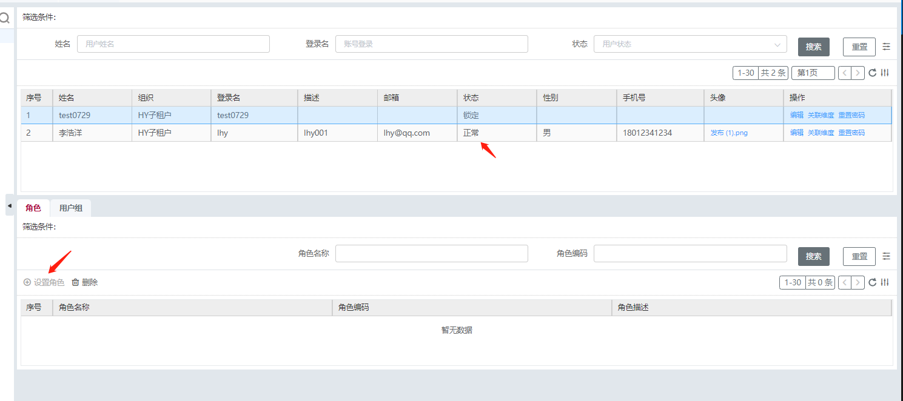
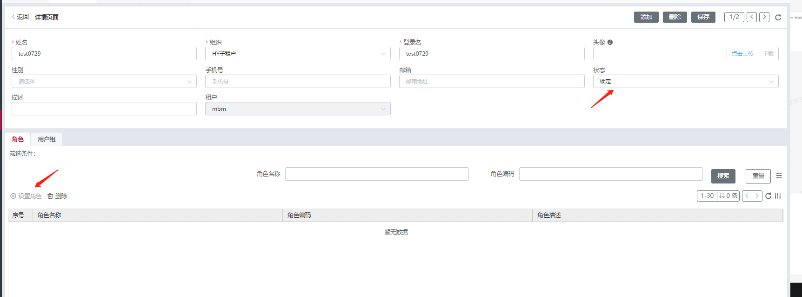

## 主从孙结构表单配置

- layoutType: "drawerTable", 视图类型抽屉孙表  注：2.4 以上版本

- drawerSaveTabs: true 子表抽屉单保存时tabs里的孙表是否一起保存 注：2.7.2 以上版本

主表单配置

```js
{// 物料-主表单
  "type":  "form", // 主表模型名 example_item
  "tabs": [
    {
      "header": "分类维护",// 子表页签名称
      "body": {
        "type": "grid,search", // 子表模型名称 example_item_cate
        "field": "itemCateList",
        "columns": ["cateType","cateCode","cateName"],
      }
    }
  ]
}

```

子表单配置

```js
{// 分类维护 - 子表单
  "type": "form", // 子表模型名称example_item_cate 与主表单中的tabs对应
  "layoutType": "drawerTable", // 视图类型抽屉孙表
  "drawerSaveTabs": true, // 子表抽屉单保存时tabs里的孙表是否一起保存
  "tabs": [
    {
      "header": "物料分类方法",
      "isAloneSave": true,
      "tbar": ["@defaults"],
      "body": {
        "type": "grid,form", // 孙表模型名 example_item_cate_method
        "field": "itemCateMethods",
        "columns": [
          {
            "name": "name",
            "rowEditable": true
          },
          {
            "name": "methodType",
            "rowEditable": true
          },
          {
            "name": "itemCate",
            "rowEditable": true
          }
        ],
        "gridEditMode": {
          "mode": "multipleRow",
          "rowBtns": [
            "update",
            "add",
            "delete"
          ],
          "defaultCancelEdit": true
        }
      }
    },
    {
      "header": "分类步骤维护",
      "isAloneSave": true,
      "tbar": ["@defaults"],
      "body": {
        "type": "grid,form", // 孙表模型名 example_item_cate_step
        "field": "itemCateSteps",
        "columns": [
          {
            "name": "des",
            "rowEditable": true
          },
          {
            "name": "collect",
            "rowEditable": true
          },
          {
            "name": "standard",
            "rowEditable": true
          },
          {
            "name": "itemCate",
            "rowEditable": true
          }
        ],
        "gridEditMode": {
          "mode": "multipleRow",
          "rowBtns": [
            "update",
            "add",
            "delete"
          ],
          "defaultCancelEdit": true
        }
      }
    }
  ]
}
```

主从孙效果如下
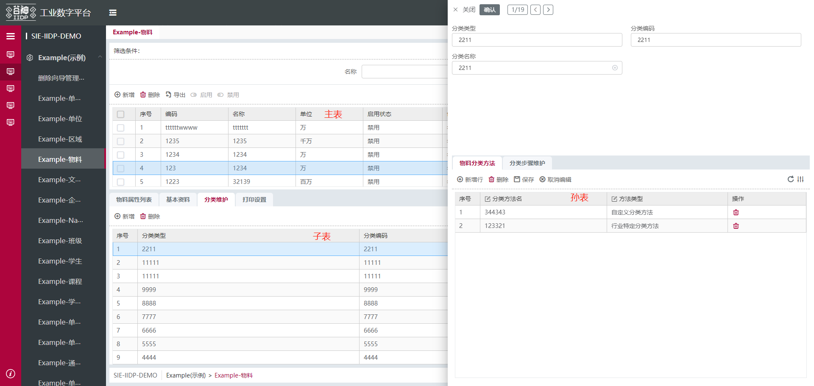

## tab 配置子表或者孙表是否根据条件查询

- tabs 配置"controlTableSearchFn" 方法， return true 表示允许查询，false 表示不查询
-  (vm, row) => 出参： vm当前子表或者孙表id， row 父级当前行数据
- 默认情况下，在 `return false (不查询)` 时，会清空表格数据，配置 `disabledSubTableClearOnSearch: true` 可跳过表格清空逻辑

```js
{
  "type": "form",
  "tabs": [
    {
      "header": "用户",
      "controlTableSearchFn": (vm, row) => { if (row.id == 'xxxx'){return false} else {return true} },
      "disabledSubTableClearOnSearch": true,
      "body": {
        "type": "grid,search",
        "field": "user_ids",
        "columns": [
          "login",
          "name"
        ]
      }
    }
  ]
}
```

## 配置抽屉表单翻页

- 单个视图配置

```js
{
  "type": "form",
  "tabs": [
    {
      "header": "用户",
      "rowspan": 3,
      "tabSearchDisplay": "hidden",//隐藏search
      "body": {
        "type": "grid,search",
        "field": "user_ids",
        "columns": [
          "login",
          "name"
        ],
        "edit": {
           "paging": true
        }
      }
    }
  ]
}
```

- 系统级配置 popDrawerFormPaging: true
  配置在 config\apps.json

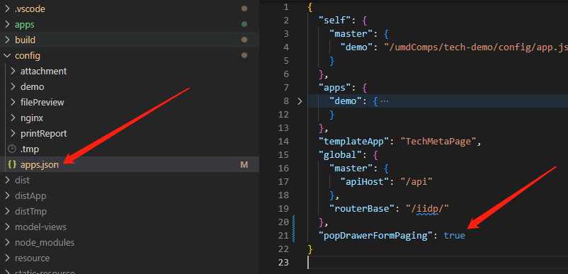

## tab 配置抽屉表单字段 (可选配置)

tab 点开的抽屉表单字段配置 body.edit.columns 若不配置默认取 body.columns

```js
{
  "type": "form",
  "tabs": [
    {
      "header": "用户",
      "rowspan": 3,
      "tabSearchDisplay": "hidden",//隐藏search
      "body": {
        "type": "grid,search",
        "field": "user_ids",
        "columns": [
          "login",
          "name"
        ],
        "edit": {
          "columns": [
              "name"
          ]
        }
      }
    }
  ]
}
```

## tab 点开的抽屉表单顶部 tbar 配置 (可选配置)

tab 点开的抽屉表单顶部 tbar 工具栏配置 除了@defaults 配置 其他跟表格 tbar 配置一致 (t-base 2.4 或以上版本生效)
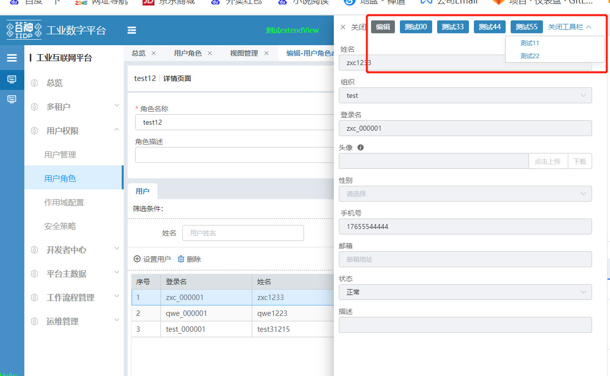

```js
{
  "type": "form",
  "tabs": [
    {
      "header": "用户",
      "rowspan": 3,
      "tabSearchDisplay": "hidden",//隐藏search
      "body": {
        "type": "grid,search",
        "field": "user_ids",
        "columns": [
          "login",
          "name"
        ],
        "edit": {
          "tbar": [
              {
                "name": "测试0",
                "action": "test1",
                "auth": "test1",
                "click": "()=>{console.log('测试0')}"
              }
          ]
        }
      }
    }
  ]
}
```

## tabs 隐藏 search

- tabSearchDisplay: "hidden" tabs 隐藏 search

```js
{
  "type": "form"，
  "tabs": [
    {
      "header": "用户",
      "rowspan": 3,
      "tabSearchDisplay": "hidden",//隐藏search
      "body": {
        "type": "grid,search",
        "field": "user_ids",
        "columns": [
          "login",
          "name"
        ]
      }
    }]
},
```

## er 子表单独保存不拼接主表行数据

- isErAloneSave: true

```js
{
  "type": "form"，
  "tabs": [
    {
      "header": "用户",
      "isErAloneSave":true,//er子表单独保存不拼接主表行数据
      "rowspan": 3,
      "body": {
        "type": "grid,search",
        "field": "user_ids",
        "columns": [
          "login",
          "name"
        ]
      }
    }]
},
```

## 配置表单 label 位置

```js
{
  "type": "form",
  "formConfig": {
    "labelPosition": "left"//不设置默认为top
  },
  "columns": [
    "name",
    "is_admin",
    "code",
    "remark"
  ]
},
```

## 多级联动

```js
{
  "body": {
      "columns": [
          {
              "label": "省",
              "name": "province",
              "widget": "select",
              "linkage": {
                  "params": {},
                  "children": [
                      "city",
                      "area"
                  ]
              }
          },
          {
              "label": "市",
              "name": "city",
              "linkage": {
                  "params": {
                      "provinceId": "${province}"
                  },
                  "children": [
                      "area"
                  ]
              }
          },
          {
              "label": "区",
              "name": "area",
              "linkage": {
                  "params": {
                      "provinceId": "${province}",
                      "cityId": "${city}"
                  }
              }
          }
      ],
      "type": "form"
  },
  "mode": "primary",
  "model": "TestUser",
  "name": "TestUser-表单",
  "type": "form"
},
```

```js
{
  "type": "grid",
  "body": {
    "columns": [
      {
        "label": "部门",
        "name": "department",
        "linkage": {
          "params": {},
          "children": [
            "office"
          ]
        }
      },
      {
        "label": "科室",
        "name": "office",
        "linkage": {
          "params": {
            "department": "${department}"
          }
        }
      },
      {
        "label": "岗位",
        "name": "postId",
        "linkage": {
          "appendParamsFn": (vm) => {//取表格行数据作为传参
            let maintableObj = tech_app.page.getNode('q_team_post_period_menu_table_main_table')
            let rowValue = maintableObj?.instance?.getEditActived();
            if (rowValue?.row) {
                rowValue = rowValue?.row
            }
            if (!rowValue) {
                rowValue = maintableObj?.instance?.boxSelected?.[0];
            }
            let userId = rowValue?.userId?.value||null
            let teamId = rowValue?.teamId?.value||null
            return {teamId,userId}
          },
          "params": {
            "userId": "${userId}",
            "teamId": "${teamId}"
          },
          // "type": 'filter' // 如果有配置这个是入参 filter过滤情况  
          // params对应配置成数组： "params": [["userId", "=", "${userId}"], ["teamId", "=", "${teamId}"]]
        }
      },
      {
        "label": "班组",
        "name": "teamId"
      },
      {
        "label": "班次",
        "name": "classesId"
      },
      {
        "label": "员工",
        "name": "userId"
      }
    ]
  }
},
```

## 配置只提交改变字段

> > > "submitChanged": true 开启提交改变字段，则点保存按钮只校验与提交改变过的字段

```js
{
  "type": "form",
  "submitChanged": true
}
`
```

## 隐藏主表单页面的 tab

```js
{
  "type": "form",
  "formConfig": {
    "labelPosition": "left",//不设置默认为top,
    "hideFormPageTabs": true//配置详情页底部tabs表格是否显示
  },
  "columns": [
    "name",
    "is_admin",
    "code",
    "remark"
  ]
},
```

## 子表自适应高度

- formtabAutoHeight: true, 详情页上表单下 tabs table 子表自适应高度页面不显示外层滚动条

```js
{
  "type": "form",
  "formtabAutoHeight": true,
  "columns": [
    "name",
    "is_admin",
    "code",
    "remark"
  ]
},
```

## 表单字段配置合并显示

- 注：mergeList 中的合并要在外层同步配置

```js
{
  "type": "form",
  "columns": [
    {
      "name": "name",
      "width": "40%",
      "mergeList": [
        {
          "name": "email", // 合并的字段
          "width": "30%"
        },
        {
          "name": "mobile", // 合并的字段
          "width": "30%"
        }
      ]
    },
    "code",
    "avatar",
    "email", // 合并的字段，外层同步配置
    "mobile", // 合并的字段，外层同步配置
  ]
},

```

## 主表单保存后不返回列表

- 主表单保存后默认返回主列表
- 表单视图配置 back: false，保存后会停留在当前主表单并刷新
- 表单视图配置 savedType，保存后会停留在当前主表单并刷新后的状态，默认 preivew，可配置 edit

```js
{
  "type": "form",
  "back": false,
  "savedType": "preivew",
  "columns": [
    "name",
    "is_admin",
    "code",
    "remark"
  ]
},
```

## 配置主表单页标题

- 主表单标题详情状态默认显示'详情页面',新增状态显示'添加数据'

- 表单视图配置 title: 'xxx'，xxx: 优先取表单数据中 xxx 字段对应的值，若表单中无 xxx 字段，标题则显示为'xxx'

```js
{
  "type": "form",
  "title": "name",
  "columns": [
    "name",
    "is_admin",
    "code",
    "remark"
  ]
},
```


## 配置默认进入主表单

- 打开菜单默认进去详情页，（现阶段仅有新增状态）

- 表单视图配置 "firstOpenForm": true 进去详情页

```js
{
  "type": "form",
  "firstOpenForm": true,
  "columns": [
    "name",
    "is_admin",
    "code",
    "remark"
  ]
},
```

## 详情页头部按钮方向配置
- 表单视图配置 "headerButtonsPosition": "left" 所有按钮向左边对齐， 不配置默认是右边对齐

```js
{
  "type": "form",
  "headerButtonsPosition": "left",
  "columns": [
    "name",
    "is_admin",
    "code",
    "remark"
  ]
},
```

## 隐藏详情页头部按钮配置
- 表单视图配置 "hiddenHeaderButons": ["@defaults"] 隐藏所有头部默认按钮
- 也可以配置隐藏指定按钮

```js
{
  "type": "form",
  "hiddenHeaderButons": ["back", "title", "setField","save", "save_add"], // 分别隐藏： 返回、标题、设置字段、保存、保存并新增
  "columns": [
    "name",
    "is_admin",
    "code",
    "remark"
  ]
},
```


## 配置搜索按钮

- 表单视图配置 search: true, 在主表单顶部展示搜索按钮，点击显示弹框，弹框数据为主列表数据，选中数据并确认，可将选中的数据回填到主表单，进行快速编辑

```js
{
  "type": "form",
  "search": true,
  "columns": [
    "name",
    "is_admin",
    "code",
    "remark"
  ]
},
```

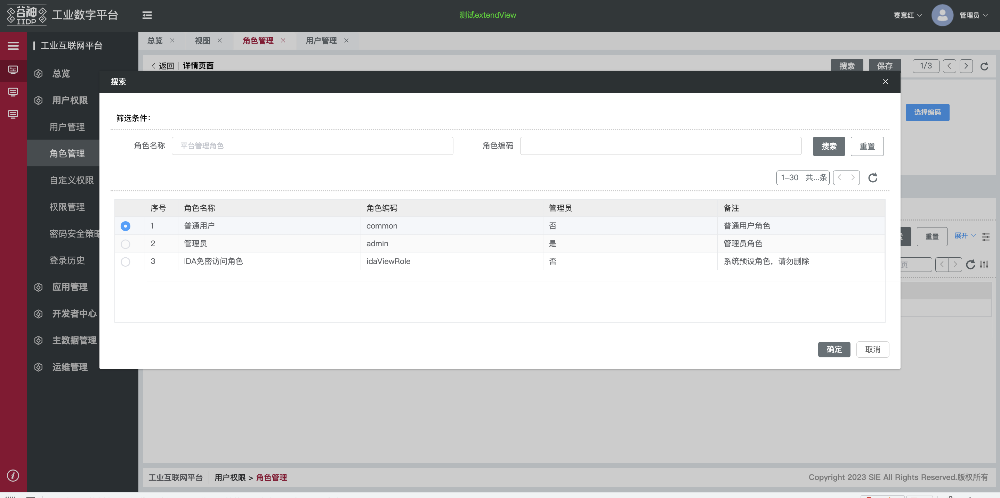

## 表单分组配置

- 表单视图中，表单项配置 groupConf

- 如果不以折叠面板分组，把分组信息和表单左右布局，可配置`"groupType": "outerLabel"`

```js
{
    "mode": "primary",
    "name": "Example文本编辑器-表单",
    "model": "example_text",
    "type": "form",
    "groupType": "outerLabel", // 配置了groupType:outerLabel则分组信息和表单左右布局
    "body": {
    "buttons": [
        "@defaults"
    ],
    "columns": [
    {
        "label": "只读",
        "text": "只读",
        "type": "checkbox",
        "name": "readOnly",
        "custom": true,
        "mergeList": [
            {
                "name": "visible"
            }
        ]
    },
    {
        "label": "可见",
        "type": "checkbox",
        "text": "可见",
        "name": "visible",
        "custom": true
    },
    {
        "displayName": "文本",
        "name": "text1",
        "bind_on_changeHandler": "(params) => {console.log(params);if(!!params && !!params.__row){params.self.$ds.form.unitCode=params.__row.text1;}else{params.self.$ds.form.text1=''}}",
        "groupConf": {
            "name": "文本编辑器",
            "id": "baseInfo1"
        }
    },
    {
        "displayName": "必填文本",
        "name": "text2",
        "groupConf": {
            "name": "文本编辑器",
            "id": "baseInfo1"
        }
    },
    {
        "displayName": "文本只读",
        "name": "text1ReadOnly",
        "disabled": true,
        "groupConf": {
            "name": "文本编辑器",
            "id": "baseInfo1"
        }
    },
    {
        "displayName": "文本Linq只读",
        "name": "textLinqReadOnly",
        "groupConf": {
            "name": "文本编辑器",
            "id": "baseInfo1"
        },
        "bind_disabled": "${$ds.form.readOnly === true}"
    },
    {
        "displayName": "文本Linq可见",
        "name": "textLinqSee",
        "groupConf": {
            "name": "文本编辑器",
            "id": "baseInfo1"
        },
        "bind_display": "${$ds.form.visible === true}"
    },
    {
        "text": "密码",
        "name": "password",
        "groupConf": {
            "name": "密码编辑器",
            "id": "baseInfo2"
        }
    },
    {
        "text": "必填密码",
        "name": "mustPassword",
        "groupConf": {
            "name": "密码编辑器",
            "id": "baseInfo2"
        }
    },
    {
        "text": "密码只读",
        "name": "passwordReadOnly",
        "disabled": true,
        "groupConf": {
            "name": "密码编辑器",
            "id": "baseInfo2"
        }
    },
    {
        "text": "密码Linq只读",
        "name": "passwordLinqReadOnly",
        "groupConf": {
            "name": "密码编辑器",
            "id": "baseInfo2"
        },
        "bind_disabled": "${$ds.form.readOnly === true}"
    },
    {
        "text": "密码Linq可见",
        "name": "passwordLinqSee",
        "groupConf": {
            "name": "密码编辑器",
            "id": "baseInfo2"
        },
        "bind_display": "${$ds.form.visible === true}"
    },
    {
        "displayName": "大文本",
        "name": "bigText",
        "custom": true,
        "type": "textarea",
        "maxlength": 500,
        "groupConf": {
            "name": "大文本编辑器",
            "id": "baseInfo3"
        }
    },
    {
        "displayName": "必填大文本",
        "name": "mustBigText",
        "custom": true,
        "type": "textarea",
        "groupConf": {
            "name": "大文本编辑器",
            "id": "baseInfo3"
        }
    },
    {
        "displayName": "大文本只读",
        "name": "bigTextReadOnly",
        "custom": true,
        "type": "textarea",
        "disabled": true,
        "groupConf": {
            "name": "大文本编辑器",
            "id": "baseInfo3"
        }
    },
    {
        "displayName": "大文本Linq只读",
        "name": "bigTextLinqReadOnly",
        "custom": true,
        "type": "textarea",
        "groupConf": {
            "name": "大文本编辑器",
            "id": "baseInfo3"
        },
        "bind_disabled": "${$ds.form.readOnly === true}"
    },
    {
        "displayName": "大文本Linq可见",
        "name": "bigTextLinqSee",
        "custom": true,
        "type": "textarea",
        "groupConf": {
            "name": "大文本编辑器",
            "id": "baseInfo3"
        },
        "bind_display": "${$ds.form.visible === true}"
    }],
    "tbar": [
        "@defaults"
    ],
    "type": "form"
}
```

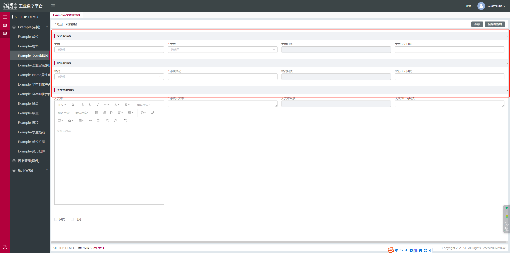
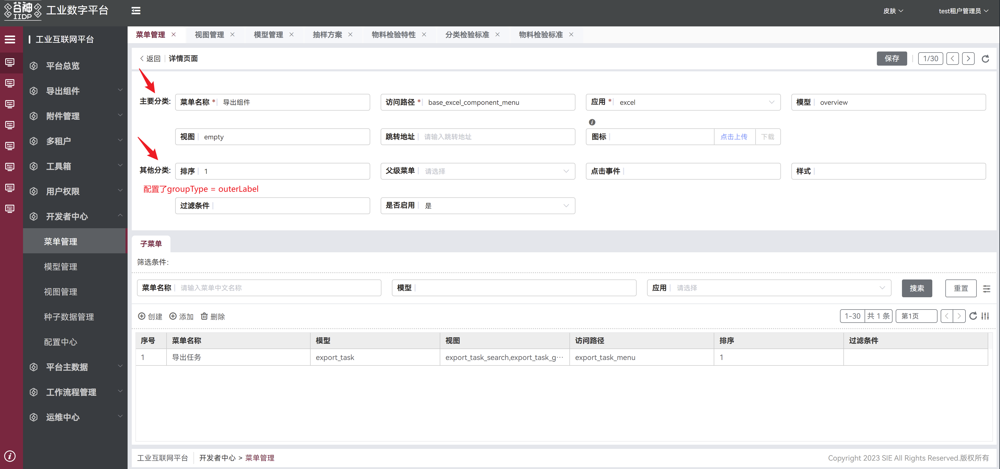

## selection 下拉配置请求钩子方法

- 支持 reqPrep,reqAfter 请求前请求后钩子，除了配置到后端视图也支持单独写前端扩展 reqPrep,reqAfter

```js
{
  "type": "form",
  "search": true,
  "columns": [
    {
      "name": "product", // 字段名
      "custom": true, // 是否定义字段覆盖
      "dataType":"Selection", // Selection 配置
      "reqPrep": "(vm,params)=>{return params;}", // 请求前钩子
	    "reqAfter": "(vm,res)=>{ return res;}" // 请求后钩子
    }
  ],
}
```

## 子表抽屉表单是否显示遮罩层

- 从子表弹出抽屉表单，是否显示遮罩层

- 子表表单视图配置 isShowModal: true

- true: 显示遮罩层 false: 不显示遮罩层

```js
{
  "type": "form",
  "isShowModal": true,
  "columns": [
    "name",
    "is_admin",
    "code",
    "remark"
  ]
}
```

## 配置额外属性 mergeAttrs

配置额外属性到渲染后的表单前端视图节点，方便配置自定义指令

```js
{
  type: "form",
  mergeAttrs: {
    "xxx":xxx
  }
}
```

## 配置额外属性 mergeAttrsOuter(作用在外层节点)

配置额外属性到渲染后的表单前端视图节点，方便配置自定义指令
作用在表单的外层节点，方便统一控制整个详情页

```js
{
  type: "form",
  mergeAttrsOuter: {
    "xxx":xxx
  }
}
```

## 表单项 label 内嵌进控件

- 在表单视图（或搜索视图）配置 **`"innerLabel"：true`** 时表单项会内嵌 label，适用的控件：输入框、下拉框（select lookup lookup-table）、文本域、级联选择器、日期选择器、时间选择器、上传（单个文件）、数字输入框
- **`可在 apps.json 配置 "innerLabel"：true 则开启全局配置, 无需视图再配`**
- **`配置在 columns 里的 innerLabel 优先级更高`**

```js
{
  "type": "form", // 或 search
  "innerLabel": true, // 为true则表单项内嵌label
  "columns": [
    "display_name",
    "model",
    {
      "name": "app_ids",
      "innerLabel": false // 优先级更高 该表单项不内嵌label；设置了`innerLabel：true`后不支持配置labelWidth，由组件内动态计算实现

    }

  ]
}
// apps.json
{
  "self": {xxx},
  "apps": {xxx},
  "templateApp": "TechMetaPage",
  "global": {xxx},
  "innerLabel": true // 为true则表单项内嵌label
}
```

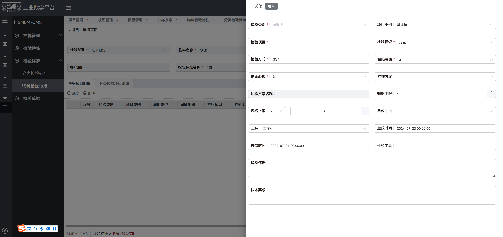

## 打开详情的方式

配置 showType: drawer/dialog 以抽屉或者弹窗的方式打开详情

```js
{
  "type": "form",
  "showType": "drawer",
  "columns": [
    "name",
    "model"
  ]
}
```

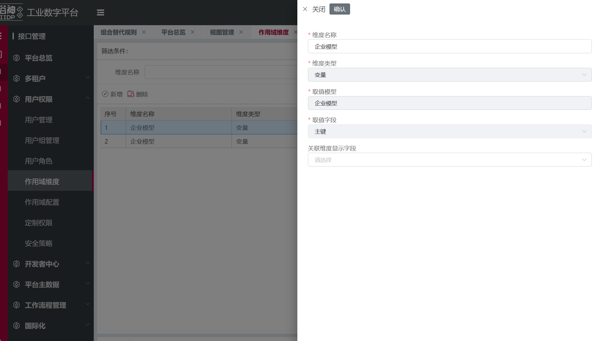


## 等待主表单查询完毕再查询子表

配置 waitMainFormData: true

```js
{
  "type": "form",
  "waitMainFormData": true,
  "columns": [
    "name",
    "model"
  ]
}
```
## 表单项tip提示信息

- tip: '这是一个tip提示信息'
- 支持html标签，eg: `<span style="color:red">这是一个tip提示信息</span><br><span style="color:green">这是一个tip提示信息11</span>`
- 搜索视图也可配置

```js
{
  "type": "form",
  "columns": [
    {
      "name":"name",
      "tip": "这是一个tip提示信息"
    },
    "model"
  ]
}
```
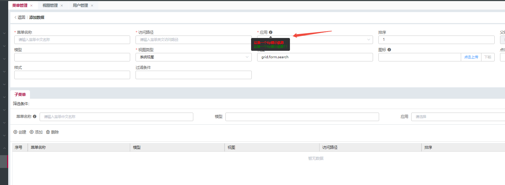


## Attributes

| 属性名                      | 说明                                                                        | 类型    | 必填 | 可选值         | 默认值                                                      |
| --------------------------- | --------------------------------------------------------------------------- | ------- | ---- | -------------- | ----------------------------------------------------------- |
| type                        | 视图类型                                                                    | String  | 是   | from           | -                                                           |
| columns                     | 表单项                                                                      | Array   | 是   | -              | -                                                           |
| tabs                        | 子表项                                                                      | Array   | 否   | -              | -                                                           |
| showEditBtn                 | 详情页面是否有编辑按钮                                                      | Boolean | 否   | -              | true                                                        |
| formConfig>labelPosition    | 配置表单项标题位置[formConfig 配置项](/pages/83734b/#formconfig-attributes) | String  | 否   | right/left/top | top                                                         |
| formConfig>hideFormPageTabs | 配置详情页底部 tabs 表格是否显示                                            | Boolean | 否   | -              | -                                                           |
| formtabAutoHeight           | 详情页子表自适应高度页面不显示外层滚动条                                    | Boolean | 否   | -              | false                                                       |
| back                        | 主表单保存后默认返回列表配 false 保存后会停留在当前主表单并刷新             | Boolean | 否   | -              | true                                                        |
| title                       | 配置主表单页标题                                                            | String  | 否   | -              | 主表单标题详情状态默认显示'详情页面',新增状态显示'添加数据' |
| search                      | 表单视图配置 search: true, 在主表单顶部展示搜索按钮                         | Boolean | 否   | -              | false                                                       |
| isShowModal                 | 从子表弹出抽屉表单，是否显示遮罩层                                          | Boolean | 否   | -              | false                                                       |
| mergeAttrs                  | 配置额外属性                                                                | Object  | 否   | -              | -                                                           |
| layoutType                  | 视图类型抽屉孙表标识                                                        | String  | 否   | drawerTable    | -                                                           |

### columns item Attributes

| 属性名        | 说明                                                       | 类型          | 必填 | 可选值                          | 默认值 |
| ------------- | ---------------------------------------------------------- | ------------- | ---- | ------------------------------- | ------ |
| name          | 表单数据对象                                               | String        | 是   | -                               | -      |
| text          | 表单项标题                                                 | String        | 否   | -                               | -      |
| displayName   | 表单项标题(推荐使用) 需配合 custom:true 使用               | String        | 否   | -                               | -      |
| required      | 表单项被是否校验                                           | Boolean       | 否   | -                               | -      |
| custom        | 为 true 时，视图配置的属性覆盖 fields 里对应字段定义的属性 | Boolean       | 否   | -                               | false  |
| type          | 自定义表单项组件类型，只在 custom：true 时有效             | String        | 否   | -                               | -      |
| display       | 控制表单项显示隐藏                                         | Boolean       | 否   | -                               | -      |
| bind_display  | 动态控制表单项显示隐藏                                     | String        | 否   | -                               | -      |
| clearable     | 自定义配置字段是否可清空，只在 custom：true 时有效         | Boolean       | 否   | -                               | -      |
| prefixIcon    | 表单输入框前缀图标                                         | String        | 否   | -                               | -      |
| suffixIcon    | 表单输入框后缀图标                                         | String        | 否   | -                               | -      |
| rules         | 表单项校验规则                                             | Array         | 否   | -                               | -      |
| cache         | 控制表单项是否放入缓存</br>跨 tab、menu 时使用同一值       | String        | 否   | 存放在 sessionStorage 的 key 值 | -      |
| bind_disabled | 动态控制表单项禁用状态                                     | String/Object | 否   | -                               | -      |
| row           | 行标记,相同 row 会放在相同的行内                           | Number        | 否   | -                               | -      |
| span          | 表单项占据的列数                                           | Number        | 否   | 1 ~ 24                          | -      |
| minWidth      | 最小宽度                                                   | Number        | 否   | -                               | -      |
| linkage       | 多级联动                                                   | Object        | 否   | -                               | -      |
| submitChanged | 开启提交改变字段则点保存按钮只校验与提交改变过的字段       | Boolean       | 否   | -                               | -      |
| mergeList     | 表单字段配置合并显示                                       | Array         | 否   | -                               | -      |
| groupConf     | 表单分组配置 id 一样的合并到一组                           | Object        | 否   | -                               | -      |

### tabs item Attributes

子表部分属性可参照表格视图[Attributes](/pages/57732f/#子表attributes)

| 属性名           | 说明                            | 类型          | 必填 | 可选值                                                           | 默认值 |
| ---------------- | ------------------------------- | ------------- | ---- | ---------------------------------------------------------------- | ------ |
| header           | 子表 tab 标题                   | String        | 是   | from                                                             | -      |
| body             | 参见表格视图的子表属性配置      | Object        | 是   | -                                                                | -      |
| body>type        | 子表包含视图                    | String        | 是   | grid,singleGrid(非 er 关系子表),formpart(主表单拆分),search,form | -      |
| body>field       | 子表对应关联模型                | String/Object | 是   | -                                                                | -      |
| tbar             | 工具条按钮                      | Array         | 是   | -                                                                | -      |
| buttons          | 表格操作列按钮                  | Array         | 是   | -                                                                | -      |
| icon             | 子表 tab 标题图标               | Object        | 否   | -                                                                | -      |
| isAloneSave      | 子表格数据配置单独保存          | Boolean       | 否   | -                                                                | -      |
| mergeAttrs       | 配置额外属性                    | Object        | 否   | -                                                                | -      |
| tabSearchDisplay | tabs 隐藏 search                | String        | 否   | hidden                                                           | -      |
| isErAloneSave    | er 子表单独保存不拼接主表行数据 | Boolean       | 否   | -                                                                | false  |
| edit             | 抽屉表单相关配置                | Object        | 否   | -                                                                | -      |

### tabs item edit Attributes

子表 tabs 抽屉表单相关配置

| 属性名  | 说明                                     | 类型    | 必填 | 可选值 | 默认值 |
| ------- | ---------------------------------------- | ------- | ---- | ------ | ------ |
| columns | 抽屉表单项(不配置则取 tabs 里的 columns) | Array   | 否   | -      | -      |
| paging  | 抽屉表单翻页是否显示                     | Boolean | 否   | -      | -      |

### 表单配置上传组件（或者其他組件）
推荐使用后端模型内定义字段位上传组件（或者其他組件），再通过需求补充其他视图字段的配置。注意：仅前端视图配置修改的话，需要重写上传事件（或者其他事件），且字段在表格内展示的格式也可以