## 菜单复用后端视图

1. 开发者中心 - 菜单 - 新增
2. 填写表单

- 应用、模型、视图（与被复用菜单一致）
- 菜单名（需要保证唯一性，与被复用的菜单不一致）
- 路径 （需要保证唯一性，与被复用的菜单不一致）
- 排序号（需要保证唯一性，与被复用的菜单不一致）

其他配置跟原菜单一样

配置新菜单过滤条件 例子图：
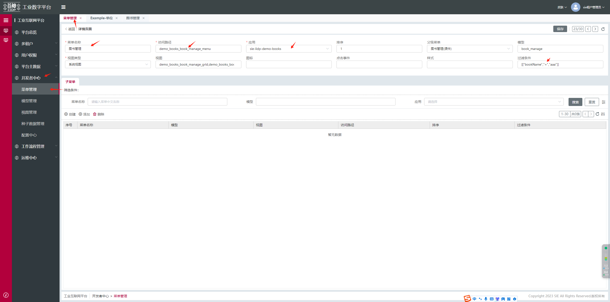

## 菜单定制过滤条件

此功能通常与复用菜单一同使用

#### 所有接口添加统一过滤条件

对该菜单下的所有页面，统一添加过滤条件，例如：`["businesstype", "in", ["3", "4", "6"]]`，该页面的所有接口的`filter`参数中以`&`形式拼接上述配置，例如：

```js
// 菜单配置
{
  "filter": [["businesstype", "in", ["3", "4", "6"]]]
}
```

```js
// 接口调用时
{
  "jsonrpc": "2.0",
  "method": "service",
  "params": {
      "service": "xxxx",//该菜单下的所有接口
      "filter": [
        '&'
        ['id','=','xxx'],//接口自身的filter
        ["businesstype", "in", ["3", "4", "6"]]//菜单配置的filter
      ]
  }
}
```

#### 指定接口添加统一过滤条件

1. 对该菜单下所有接口 `search`、`count`、`lookup`等等，添加自定义的`filter`参数，使用`_self`配置
2. 该配置会叠加菜单的`filter`配置

```js
// 菜单配置
// 给菜单下的所有'lookup'接口添加过滤条件
{
  "filter": [["businesstype", "in", ["3", "4", "6"]]],
  "config": {
    "_self": {
      "lookup": [["test", "=", "3"]]
    }
  }
}
```

```js
// 接口调用时
{
  "jsonrpc": "2.0",
  "method": "service",
  "params": {
      "service": "lookup",
      "filter": [
        '&',
        '&'
        ['id','=','xxx'],//接口自身的filter
        ["businesstype", "in", ["3", "4", "6"]],//菜单配置的filter
        ["test", "=", "3"]//菜单配置的config._self的filter
      ]
  }
}
```

#### 指定字段接口添加滤条件

对某菜单下，某些接口统一添加过滤条件，则配置`config.字段名.service名`过滤条件，通常用在 `form`、`可编辑表格` 的接口

```json
// 菜单配置
{
  "filter": [["businesstype", "in", ["3", "4", "6"]]],
  "config": {
    "businesstype": {
      "lookup": [["businesstype", "in", ["3", "4", "6"]]]
    }
  }
}
```

表单中的`businesstype`字段在调用`lookup`接口的时候会拼接 filter 参数

```js
// 接口调用时
{
  "jsonrpc": "2.0",
  "method": "service",
  "params": {
      "service": "lookup",
      "filter": [
        '&',
        '&'
        ['id','=','xxx'],//接口自身的filter
        ["businesstype", "in", ["3", "4", "6"]],//菜单配置的filter
      ]
  }
}
```

菜单过滤条件 例子图：

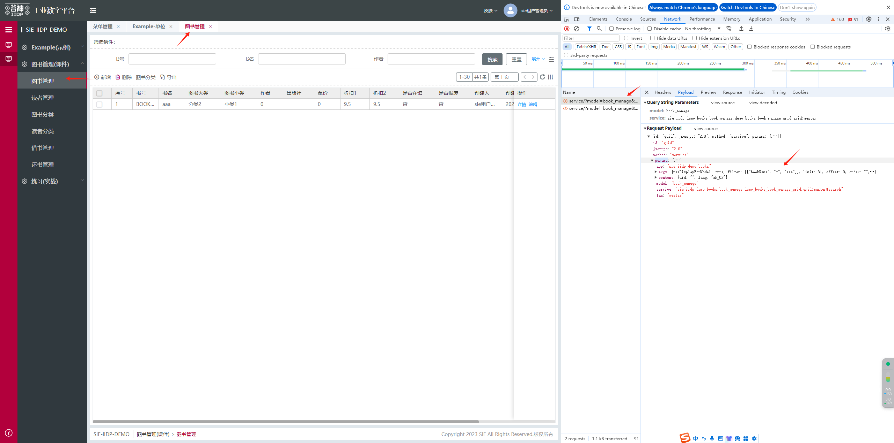

## 搜索菜单配置

- 前端工程项目 config/apps.json 根目录配置 `"showSearch":true`
- 此配置可以跨 app 搜索，整站级别的配置

  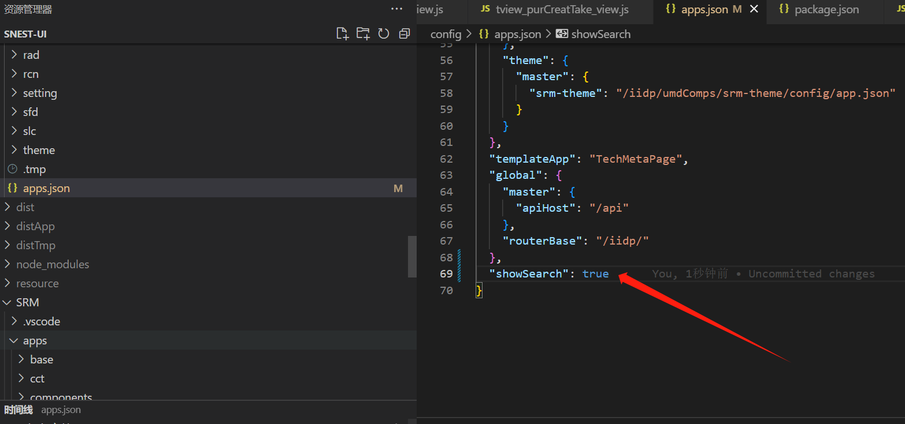
  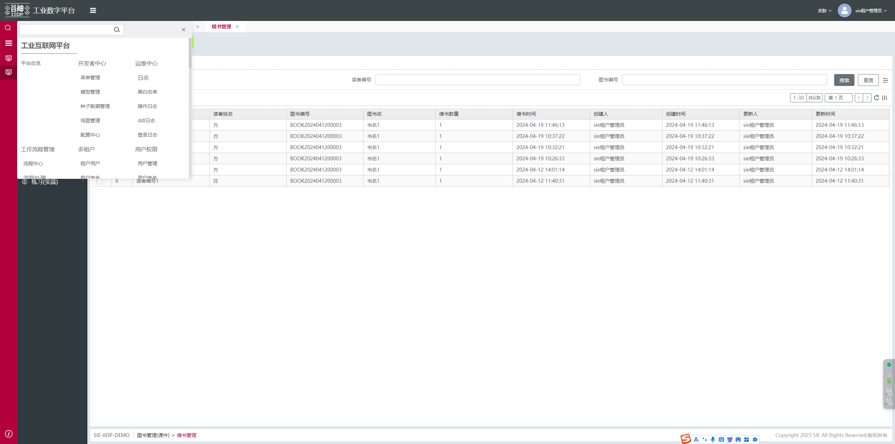

## 悬浮菜单配置

- 前端项目 apps.json 根目录配置 `"collapse": true`
- 此配置会影响所有的 app，整站级别的配置

  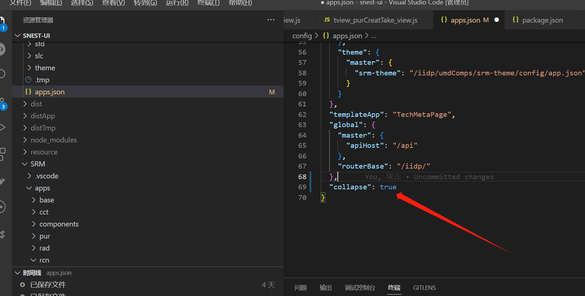
  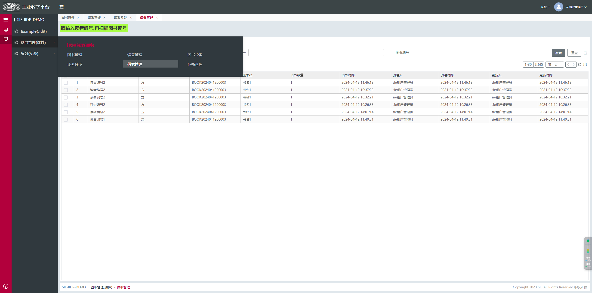

  
## openView默认取消缓存

- 前端项目 apps.json 根目录配置 `"openViewNoCache": true`
- 此配置会影响所有的 app，整站级别的配置

## 主表格高度配置（上下表模式生效）

- 上下表时主表格的高度配置
- 前端项目 apps.json 根目录配置 `"mainTableHeight": 50%`
- 此配置会影响所有的 app，整站级别的配置

## 表格同步勾选配置

- 勾选和高亮蓝色背景选中行同步
- 前端项目 apps.json 根目录配置 `"gridDefaultCheck": "bgSync"`
- 此配置会影响所有的 app，整站级别的配置

## 主表单详情预览状态展示

- 前端项目 apps.json 根目录配置 `"previewForm": true`
- 此配置会影响所有的 app，整站级别的配置
- 表单的某自定义组件 若不显示预览态 则需要配置 previewForm: false
```js
columns: [
  {
    name: 'xx'
    previewForm: false
  }
]
```

## 切换应用取消默认打开第一个菜单

- 前端项目 apps.json 根目录配置 `"notOpenMenuDefault":true`
  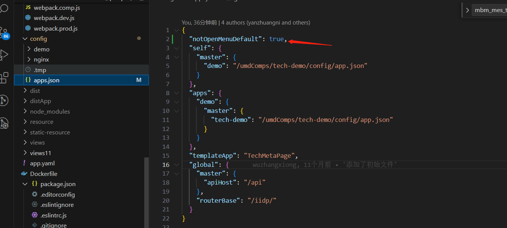


  ## 菜单tab页面切换时，重新加载要切换的tab页面

- 前端项目 apps.json 根目录配置 `"noCacheMenu":['rbac_user_app_menu']`
  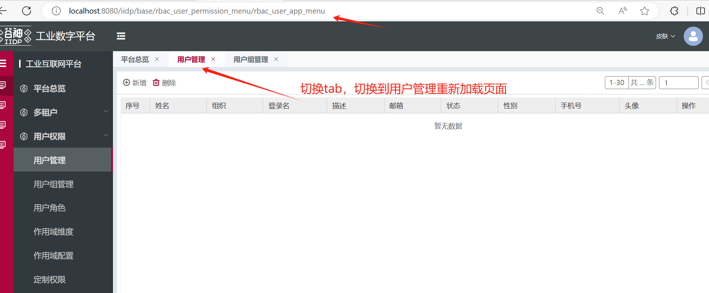

## 菜单类型

菜单中可以配置多种页面类型，视图（view）的配置

| 类型         | 说明                                                                              | 版本   |
| ------------ | --------------------------------------------------------------------------------- | ------ |
| 后端视图别名 | 多个后端视图用`,`隔开，通常是`search`,`grid`,`form`,`tree`的视图                  |        |
| empty        | 空白页面                                                                          |        |
| iframe       | 内嵌页面                                                                          |        |
| \_blank      | 浏览器新标签页、新窗口（需要浏览器的设置）打开 url 页面，配合 url 使用            |        |
| \_self       | 当前页面加载，配合 url 使用                                                       |        |
| \_top        | 最顶级的浏览上下文中打开，配合 url 使用                                           |        |
| \_parent     | 当前浏览环境的父级浏览上下文，如果没有父级框架，行为与 \_self 相同，配合 url 使用 |        |
| wujie        | 微应用，wujie 模式，配合 url 使用                                                 | >2.0.0 |
| custom       | 与后端视图一致，字符串类型，需要把 json 类型的视图转换为字符串填入                |        |

### empty

空白页面
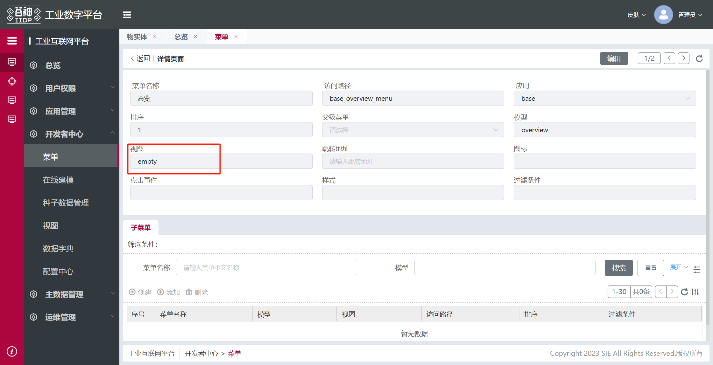
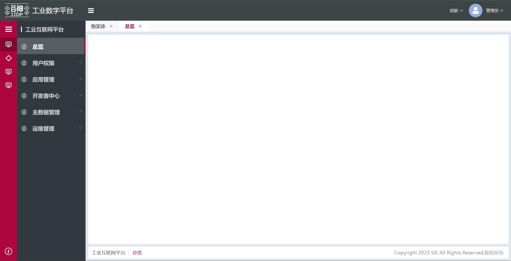

### iframe

内嵌页面
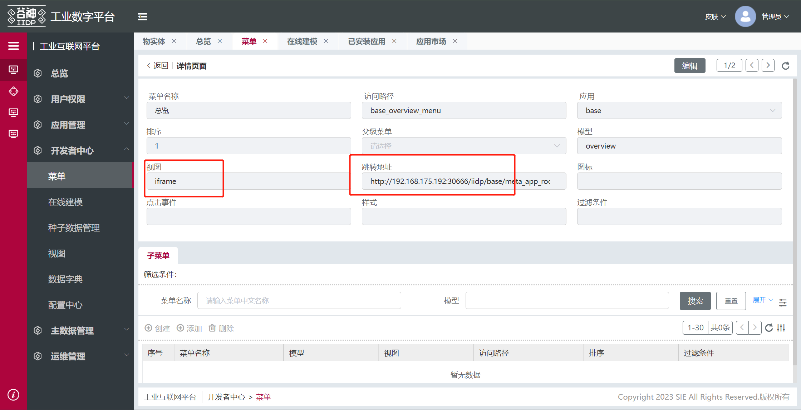
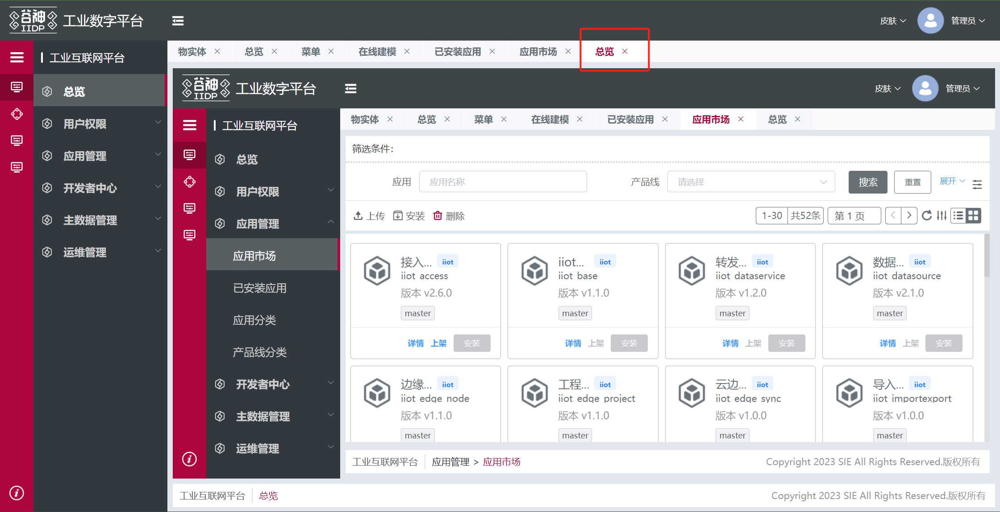

### wujie

1. 带有`http`的完整路径

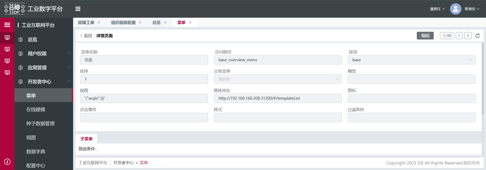
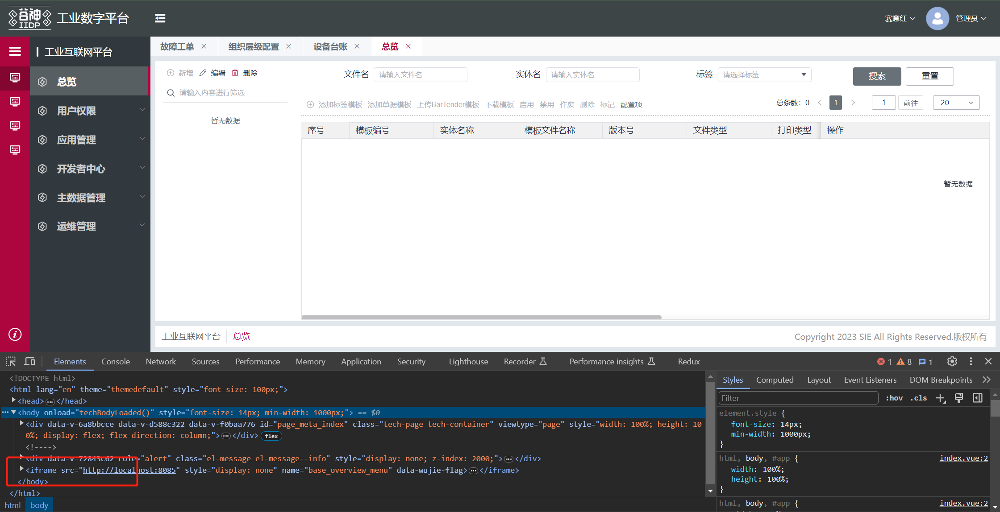

2. 使用动态 host，并且使用 hash 模式拼接路径

- 配置中心中配置 host 前缀，填写`配置值`
  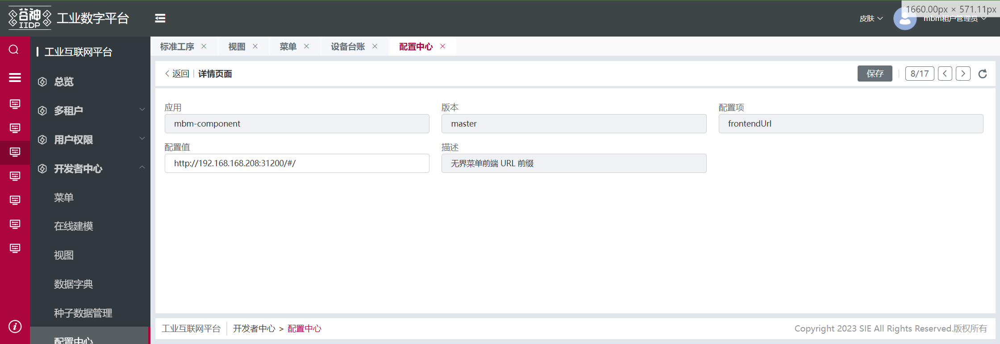

- 菜单中配置`跳转地址`,填写 hash 的内容
  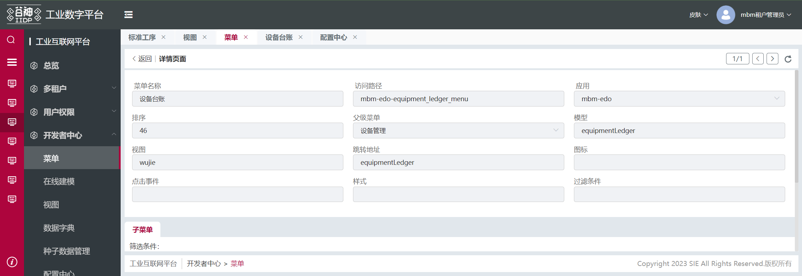
