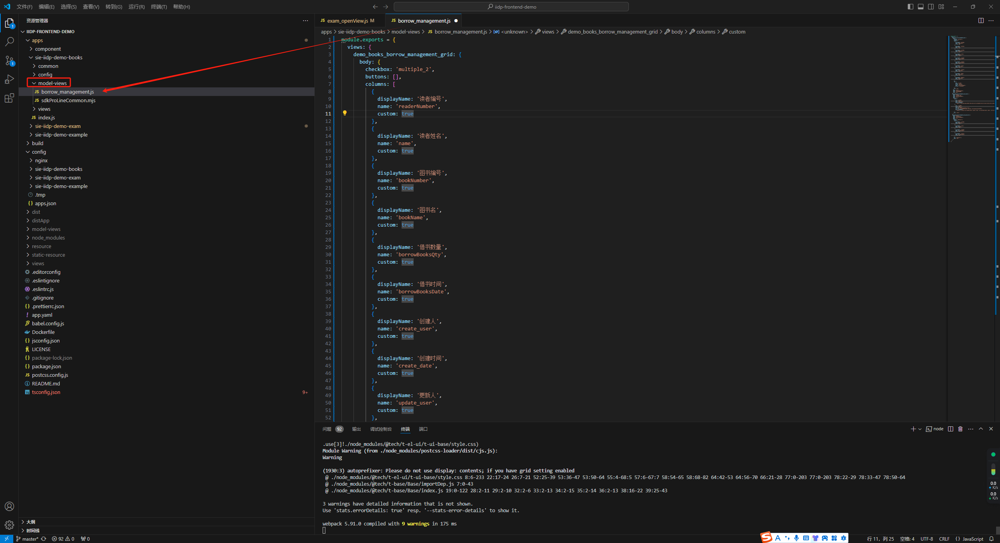
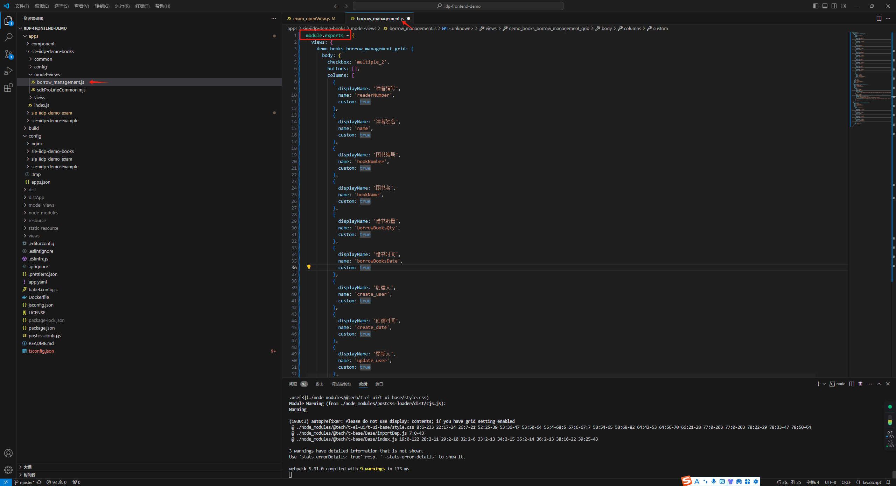
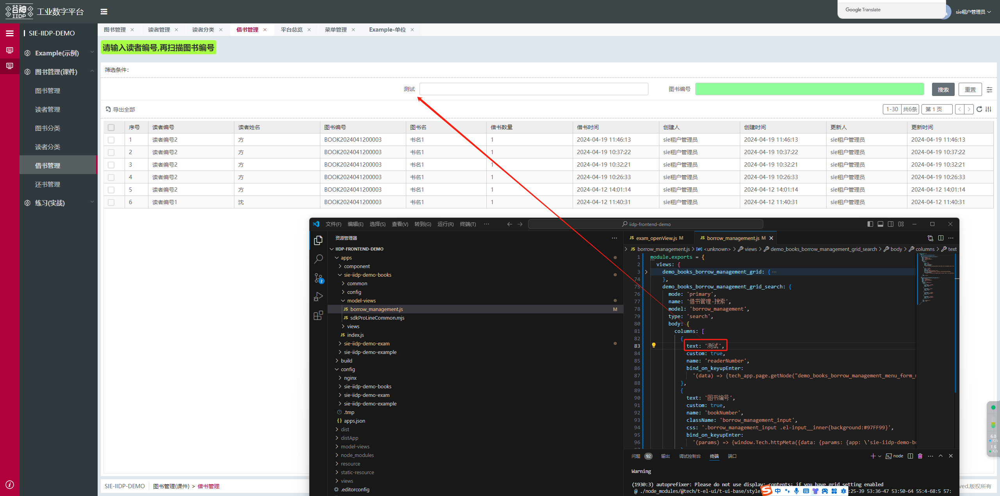
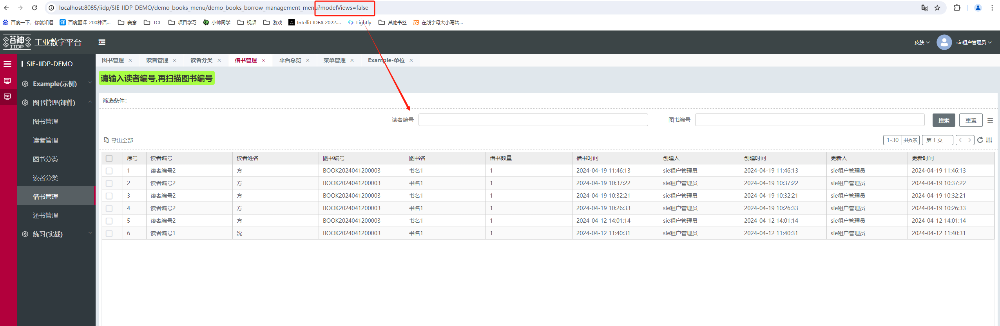
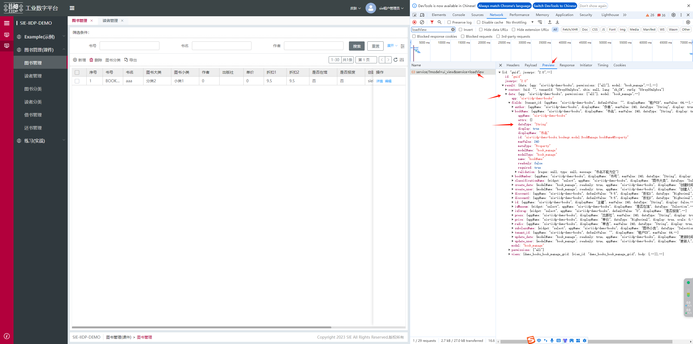
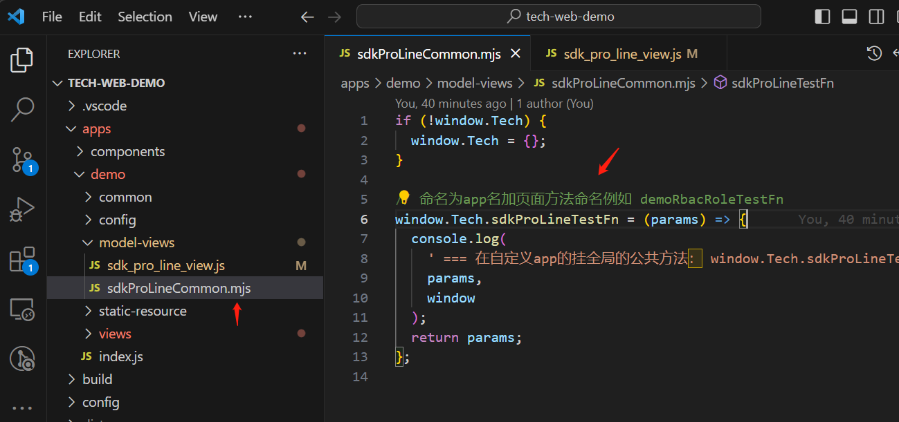
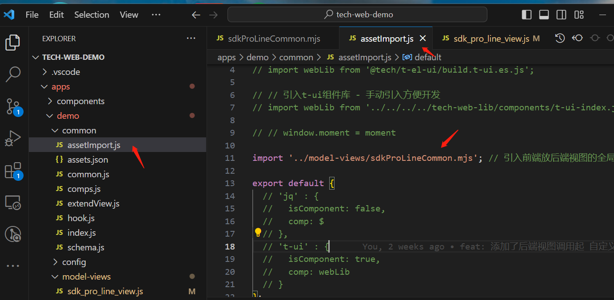
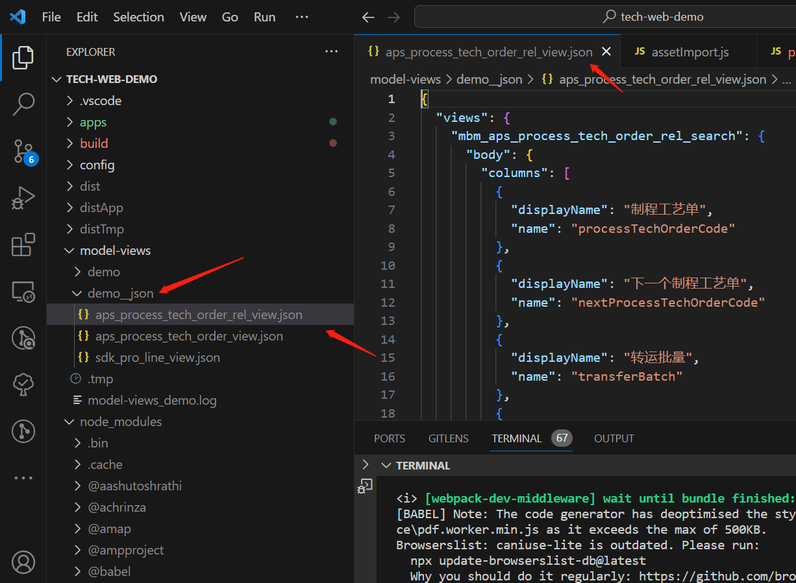
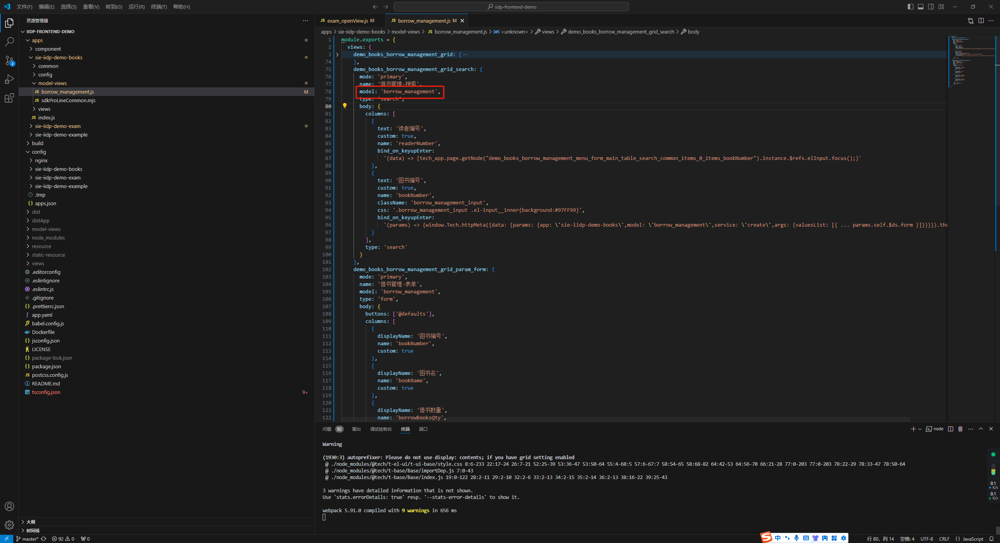
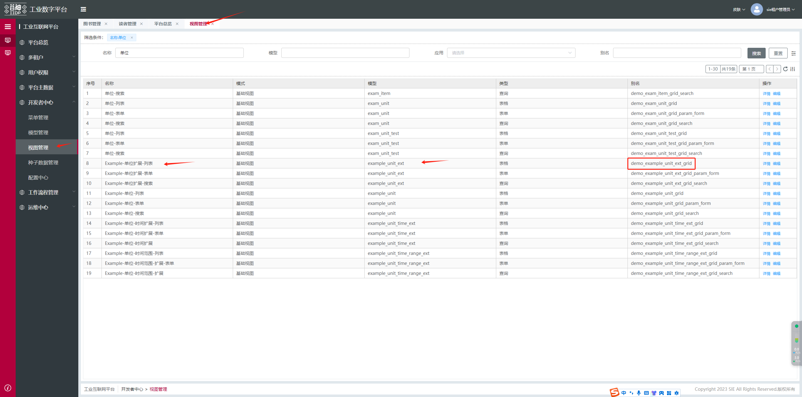

### 1.在后端工程找到对应views/xx视图.json
<font class="can-use-version">对应 package.json t-core 插件 1.0.35 或以上版本</font>

例如：找到views/sdk_pro_line_view.json

**[demo清单](/pages/3a50a2/#_52、后端视图放前端视图demo)**

### 2.把views/xx视图.json 文件拷贝到前端工程 apps/xxapp/

在前端工程 apps/xxapp/ 创建 model-views目录



### 3.修改json文件为js文件

json后缀改成js，
在原来json前面加上 module.exports = {...}


> 若后端工程没有对应json视图文件，也可以直接在前端工程建视图js文件

### 4.热更新启动

重新 npm start
例如 在对应apps/xxapp/model-views/xxx_view.js，
  修改了对应按钮字符串 测试按钮2，页面会热更新马上生效
  

若不使用前端工程的视图需要添加问号参数 ?modelViews=false
则取最新的loadView接口返回的后端视图(可能是之前覆盖到应用市场的最新视图)


### 5.字段属性配置参考
配置视图时候遇到配置字段名等，字段属性配置参考 调试 - 网络 - loadView接口 - fields 里面的字段说明


### 6.封装视图公共方法(提高复用)

在对应文件夹：apps/xxapp/model-views/

创建mjs后缀文件：xxxCommon.mjs
```js
if (!window.Tech) {
  window.Tech = {};
}

// ** 命名为app名+页面方法命名 或 模型名+业务方法名命名例如 sdkProLineTestFn
window.Tech.sdkProLineTestFn = (params) => {
  console.log(
    ' === 在自定义app的挂全局的公共方法： window.Tech.sdkProLineTestFn == ',
    params,
    window
  );
  return params;
};
```
 


### 7.视图公共方法引入
在apps/common/assetImport.js 引入
```js
import '../model-views/sdkProLineCommon.mjs'; 
```


### 8.视图优先级

放前端工程的视图会跟前端的app打包

在上传应用市场时候，覆盖对应的后端视图(若没有对应的后端视图会新建进去)

### 9.开发过程中找最新的视图json文件
<font class="can-use-version">对应 package.json t-build 插件 1.0.9 或以上版本</font>

前端重新npm start，会自动运行js转json文件

在前端根目录/model-views/xxapp__json/里面找到最新转换处理的json文件

若不上传应用市场，可以拿这个文件手动发给对应的后端开发人员


### 10.注意项
视图里面的模型名必须在后端app里面


视图名跟视图配置的别名对应


工程根目录.gitignore添加 /model-views 配置，如果下载最新demo工程则自带这个忽略配置
```
。。。
/model-views
```

