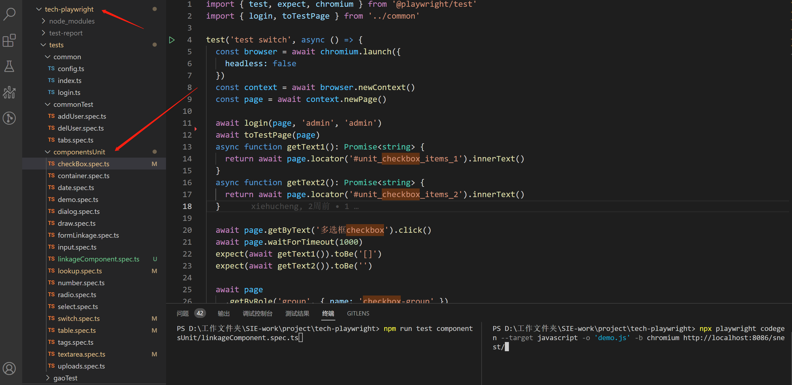
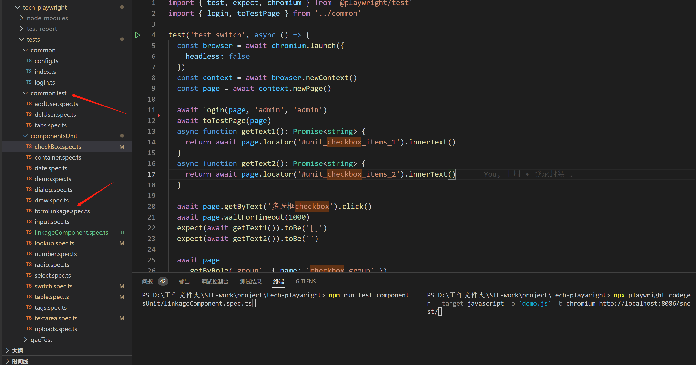
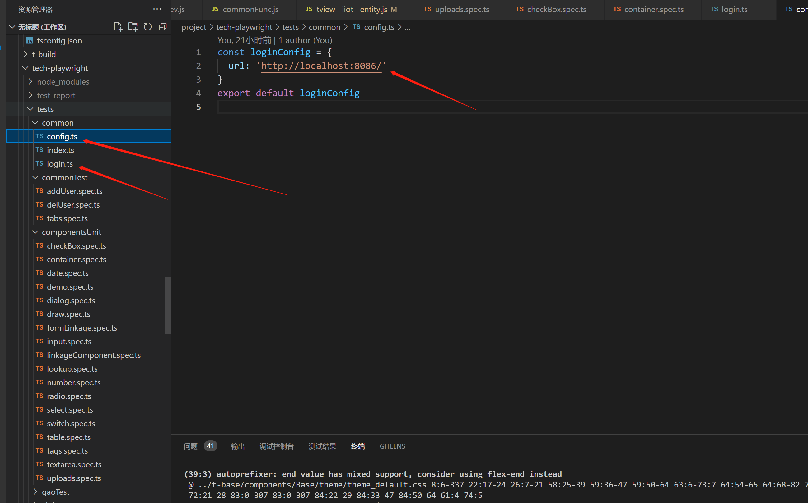
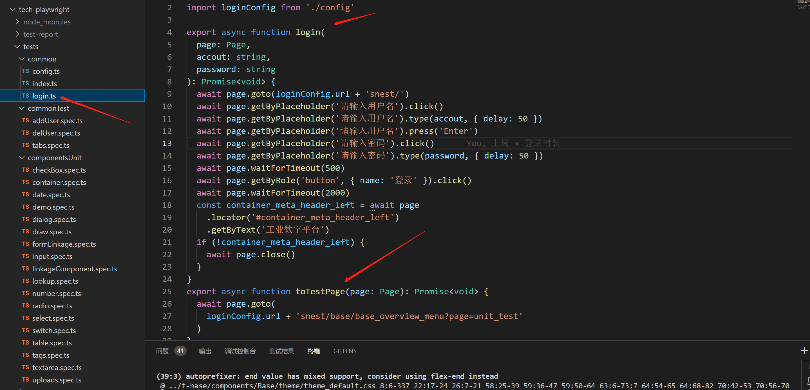

# 组件测试流程

## 组件测试

- 组件测试

```js
// 改bug或者业务开发修改组件代码后
// 去到tech-playwright项目下，先运行组件的测试用例,组件的单元测试用例都是以组件名字命名的

npm run test componentsUnit/select.spec.ts

```



- 表单测试

```js
//大部分组件是可以放到form表单组件内的，所以运行完单组件测试用例需运行一遍表单组件的测试用例

npm run test componentsUnit/formLinkage.spec.ts
```



- 组件联动测试脚本

```js
// 如果你的组件可能会涉及到跟别的组件联动的可能，可以运行联动测试用例
// 目前联动示例有：多下拉框select选择间联动   下拉选择的值控制其他元素的显示与隐藏
// 单选radio控制其他元素的显示与隐藏  和 值等
// 目前联动案例较少，有新的可以现在iidp项目的demo分支的tview_lib_test_container.js文件内添加示例，然后修改
// 测试用例linkageComponent.spec.ts文件  或者联系相关人员添加用例
npm run test componentsUnit/linkageComponent.spec.ts
```

- 运行测试用例的部分封装函数和配置

```js
// login.ts内封装一些通用函数  config放置配置对象
```



